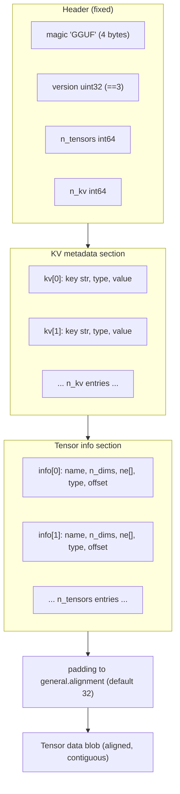
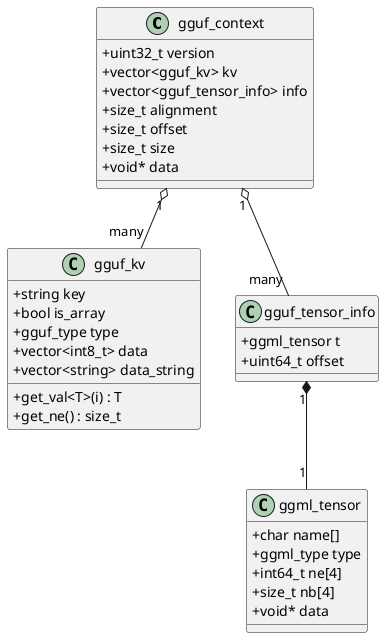
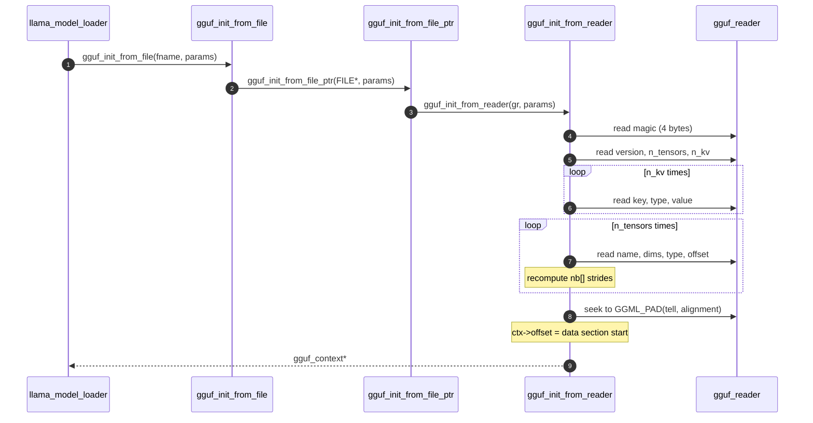
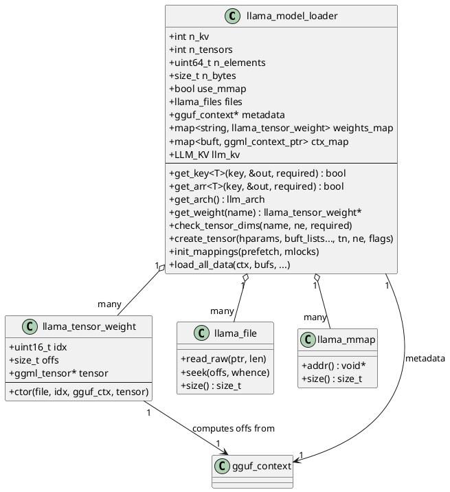
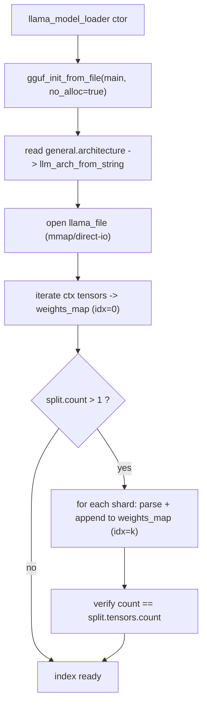
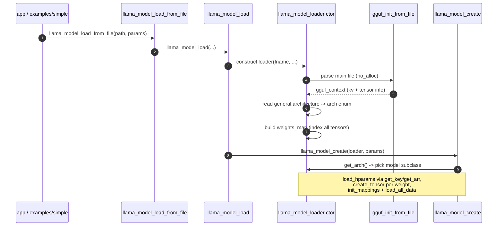

# The GGUF file & the model loader

> Part of the GGUF→cgraph series. Siblings: [README](./README.md) · **01 (this file)** · [02 Architecture registry](./02-architecture-registry.md) · [03 Hparams & tensors](./03-hparams-and-tensors.md) · [04 Graph construction](./04-graph-construction.md) · [05 ggml cgraph](./05-ggml-cgraph.md) · [06 Execution & scheduling](./06-execution-and-scheduling.md) · [07 Simple example walkthrough](./07-simple-example-walkthrough.md)

This is where everything starts. Before a single matmul runs, llama.cpp has to take a `.gguf` file on disk — a flat blob of bytes — and turn it into an in-memory `llama_model` with typed hyperparameters and weight tensors wired up to backend buffers. Two subsystems do this work:

- **GGUF** (`ggml/src/gguf.cpp`, `ggml/include/gguf.h`) — the low-level binary format reader/writer. It knows nothing about transformers; it just parses magic, version, key/value metadata, and tensor descriptors.
- **The model loader** (`src/llama-model-loader.cpp`, `src/llama-model-loader.h`) — the llama-aware layer on top. It opens (possibly split) files, builds a unified tensor index, exposes typed metadata getters, picks the architecture, instantiates `ggml_tensor` objects into backend buffers, and streams the weight data in.

---

## 1. The on-disk GGUF layout

The format is documented verbatim at the top of `ggml/include/gguf.h:1`. The file is strictly sequential: a fixed header, then all KV metadata, then all tensor descriptors, then a padded data blob.



Key facts that the rest of the pipeline depends on:

- **Magic & version.** The magic is the literal string `GGUF` (`#define GGUF_MAGIC "GGUF"`, `ggml/include/gguf.h:41`) and the current version is `3` (`#define GGUF_VERSION 3`, `ggml/include/gguf.h:42`). The reader validates both and even sniffs endianness from the version word (`gguf_init_from_reader` checks `(ctx->version & 0x0000FFFF) == 0` to detect a byte-swapped file, `ggml/src/gguf.cpp:497`).
- **KV pairs** carry everything that is *not* tensor data: hyperparameters, the architecture name, tokenizer tables, chat templates, sampling defaults. Each pair is a key string, a `gguf_type` tag, and either a scalar value or (when the type is `GGUF_TYPE_ARRAY`) an element type + count + packed elements (`ggml/include/gguf.h:8`).
- **Tensor info** describes each weight's *shape and location* but not its bytes: name, number of dims, each dim size, `ggml_type`, and a `uint64_t` offset *relative to the start of the data blob* (`ggml/include/gguf.h:17`).
- **Alignment.** The data section begins padded to `general.alignment` (default `GGUF_DEFAULT_ALIGNMENT == 32`, `ggml/include/gguf.h:46`). Inside the blob every tensor is itself padded to that alignment.

### The type system

The set of storable scalar types is the `gguf_type` enum (`ggml/include/gguf.h:53`), spanning `UINT8`…`FLOAT64`, plus `BOOL`, `STRING`, and the special `ARRAY` wrapper. `gguf_type_size` (`ggml/src/gguf.cpp:126`) maps each to a byte width (and returns `0` for `STRING`, whose length is variable):

```cpp
size_t gguf_type_size(enum gguf_type type) {
    auto it = GGUF_TYPE_SIZE.find(type);
    return it == GGUF_TYPE_SIZE.end() ? 0 : it->second;
}
```

---

## 2. In-memory representation of a parsed file

Once parsed, the whole file lives in a `gguf_context` (`ggml/src/gguf.cpp:217`):

```cpp
struct gguf_context {
    uint32_t version = GGUF_VERSION;

    std::vector<struct gguf_kv>          kv;     // metadata
    std::vector<struct gguf_tensor_info> info;   // tensor descriptors

    size_t alignment = GGUF_DEFAULT_ALIGNMENT;
    size_t offset    = 0;   // offset of `data` from beginning of file
    size_t size      = 0;   // size of `data` in bytes

    void * data = nullptr;
};
```

Two helper structs populate those vectors:

- **`gguf_kv`** (`ggml/src/gguf.cpp:131`) holds one metadata entry. Notice it is a tagged union of two backing stores: a `std::vector<int8_t> data` for numeric/bool scalars and arrays, and a separate `std::vector<std::string> data_string` for string values. `is_array` and `type` describe which is in use. The templated `get_val<T>()` accessor asserts the requested C++ type matches the stored `gguf_type` before returning, so a mismatched read aborts rather than reinterpreting bytes.
- **`gguf_tensor_info`** (`ggml/src/gguf.cpp:212`) is tiny — an embedded `ggml_tensor t` (carrying name, dims, type, and computed strides) plus the `uint64_t offset` into the data blob:

```cpp
struct gguf_tensor_info {
    struct ggml_tensor t; // for holding the equivalent info
    uint64_t offset;      // offset from start of `data`, must be a multiple of `ALIGNMENT`
};
```

The following class diagram ties the format-level objects together.



---

## 3. Parsing a file: `gguf_init_from_*`

The public entry point is `gguf_init_from_file` (`ggml/src/gguf.cpp:979`), which opens the path and hands off to `gguf_init_from_file_ptr` (`ggml/src/gguf.cpp:928`). That wraps the `FILE*` in a callback-based `gguf_reader` (`ggml/src/gguf.cpp:230`) — a small stateful reader that supports both real files and in-memory buffers and tracks the current offset and remaining bytes — then calls the real workhorse, `gguf_init_from_reader` (`ggml/src/gguf.cpp:451`).

`gguf_init_from_reader` walks the layout from §1 in order:

1. **Magic** — read 4 bytes, compare each against `GGUF_MAGIC` (`ggml/src/gguf.cpp:456`).
2. **Header** — read `version`, then `n_tensors`, then `n_kv`, with bounds checks against `SIZE_MAX` so a corrupt count can't overflow allocation math (`ggml/src/gguf.cpp:480`).
3. **KV pairs** — loop `n_kv` times: read key string, type, optional (array-type, count), then the value bytes. Duplicate keys are rejected (`ggml/src/gguf.cpp:543`).
4. **Tensor info** — loop `n_tensors` times: read name, dims, type, offset. For each tensor the reader *recomputes* the row strides `nb[]` from the shape and type rather than trusting the file (`ggml/src/gguf.cpp:727`).
5. **Align & locate the data section** — seek forward to `GGML_PAD(tell, alignment)`; the resulting position becomes `ctx->offset`, the absolute file offset of the data blob (`ggml/src/gguf.cpp:751`).
6. **Validate the blob layout** — accumulate each tensor's padded byte size and assert that each stored `offset` exactly equals the running total, i.e. the blob really is contiguous with per-tensor alignment padding (`ggml/src/gguf.cpp:762`).



The loader always parses with `no_alloc = true` (see §4), so the data blob itself is *not* read here — only the metadata and the per-tensor offsets. The actual weight bytes are pulled later via mmap or file I/O.

---

## 4. The model loader

`llama_model_loader` (`src/llama-model-loader.h:31`) is the bridge from "parsed GGUF context(s)" to "in-memory model". Its important members:

| Member | Purpose |
| --- | --- |
| `llama_files files` | One `llama_file` handle per (split) file. |
| `gguf_context_ptr metadata_ptr` / `metadata` | The parsed metadata for the main file. |
| `std::map<std::string, llama_tensor_weight, weight_name_comparer> weights_map` | The **unified tensor index**: tensor name → location. |
| `std::unordered_map<std::string, llama_model_kv_override> kv_overrides` | Caller-supplied KV overrides. |
| `llama_mmaps mappings` | One `llama_mmap` per file (filled by `init_mappings`). |
| `std::map<buft, ggml_context_ptr> ctx_map` | One ggml context per backend buffer type. |
| `LLM_KV llm_kv` | Holds the detected architecture enum. |

### 4.1 `llama_tensor_weight` — the index entry

Each entry of `weights_map` is a `llama_tensor_weight` (`src/llama-model-loader.h:33`). It records *which file* a tensor lives in (`idx`), the *absolute byte offset* in that file (`offs`), and the `ggml_tensor*` metadata pointer. Crucially, the constructor computes the absolute offset and validates the data is within bounds:

```cpp
llama_tensor_weight(const llama_file * file, uint16_t idx, const struct gguf_context * gguf_ctx, ggml_tensor * tensor) : idx(idx), tensor(tensor) {
    const int tensor_idx = gguf_find_tensor(gguf_ctx, ggml_get_name(tensor));
    if (tensor_idx < 0) {
        throw std::runtime_error(format("tensor '%s' not found in the model", ggml_get_name(tensor)));
    }

    offs = gguf_get_data_offset(gguf_ctx) + gguf_get_tensor_offset(gguf_ctx, tensor_idx);
    if (offs + ggml_nbytes(tensor) < offs || offs + ggml_nbytes(tensor) > file->size()) {
        throw std::runtime_error(format("tensor '%s' data is not within the file bounds, model is corrupted or incomplete", ggml_get_name(tensor)));
    }
}
```

The two pieces that matter: `gguf_get_data_offset` (the file-relative start of the data blob, `ggml/include/gguf.h:96`) plus `gguf_get_tensor_offset` (the tensor's offset *within* that blob, `ggml/include/gguf.h:130`). Sum them and you have the absolute file offset to read from — independent of how the metadata happens to be laid out per split.



### 4.2 The constructor — opening files, indexing, picking the arch

The constructor (`src/llama-model-loader.cpp:511`) does the heavy lifting:

1. **Record KV overrides** supplied by the caller (`src/llama-model-loader.cpp:530`).
2. **Parse the main file** with `gguf_init_from_file(..., {no_alloc=true})` and stash the `gguf_context` (`src/llama-model-loader.cpp:546`).
3. **Detect the architecture immediately** — read `general.architecture` and convert the string to an enum (`src/llama-model-loader.cpp:552`):

```cpp
get_key(llm_kv(LLM_KV_GENERAL_ARCHITECTURE), arch_name, false);
llm_kv = LLM_KV(llm_arch_from_string(arch_name));
```

4. **Open the file handle** as a `llama_file` (honoring direct-I/O vs mmap negotiation) (`src/llama-model-loader.cpp:555`).
5. **Build the unified tensor index.** Iterate every `ggml_tensor` in the parsed context and emplace a `llama_tensor_weight` keyed by name, rejecting duplicate names (`src/llama-model-loader.cpp:575`):

```cpp
for (ggml_tensor * cur = ggml_get_first_tensor(ctx); cur; cur = ggml_get_next_tensor(ctx, cur)) {
    std::string tensor_name = std::string(cur->name);
    if (weights_map.find(tensor_name) != weights_map.end()) {
        throw std::runtime_error(format("invalid model: tensor '%s' is duplicated", ggml_get_name(cur)));
    }
    n_elements += ggml_nelements(cur);
    n_bytes    += ggml_nbytes(cur);
    weights_map.emplace(tensor_name, llama_tensor_weight(files.back().get(), 0, metadata, cur));
}
```

6. **Handle splits.** If `split.count > 1`, the loader generates the split filenames (or validates a caller-supplied list), parses each additional shard with its own `gguf_init_from_file`, and appends its tensors to the *same* `weights_map` — but with the file index field set so the loader knows which file each weight lives in (`src/llama-model-loader.cpp:589`). A final sanity check compares the loaded tensor count against `split.tensors.count` (`src/llama-model-loader.cpp:653`).

The unified index is the key idea: regardless of whether a model is one file or eight shards, downstream code just asks `get_weight("blk.12.attn_q.weight")` and gets back the right `(file idx, offset, ggml metadata)` triple. `get_arch` (`src/llama-model-loader.cpp:826`) later returns the enum stashed in step 3, and that single value drives the entire architecture dispatch covered in [02 Architecture registry](./02-architecture-registry.md).



### 4.3 Typed metadata getters

Raw GGUF access (`gguf_find_key`, `gguf_get_val_*`) is untyped and aborts on a type mismatch. The loader wraps it in templated, override-aware getters.

- **`get_key<T>`** (`src/llama-model-loader.cpp:399`) first checks `kv_overrides` for the key, then delegates to the `GGUFMeta::GKV<T>::set` template, which does `gguf_find_key` + a type-checked value read (`src/llama-model-loader.cpp:260`). It returns `false` (or throws when `required`) if the key is absent.
- **`get_arr<T>`** (`src/llama-model-loader.cpp:299`) reads array-valued KVs into a `std::vector<T>` (or `std::array`). It validates the stored array element type against `T` and special-cases string arrays via `gguf_get_arr_str` (`src/llama-model-loader.cpp:323`); for everything else it bulk-copies from the array's backing data.

This is the layer [03 Hparams & tensors](./03-hparams-and-tensors.md) uses to populate `llama_hparams` (e.g. `n_layer`, `n_embd`, `n_head`).

### 4.4 Validating shapes: `check_tensor_dims` / `require_tensor_meta`

When building a model, the architecture code knows the *expected* shape of every weight. `require_tensor_meta` (`src/llama-model-loader.cpp:855`) looks a tensor up and throws if it's missing. `check_tensor_dims` (`src/llama-model-loader.cpp:863`) goes further: it fetches the metadata and compares each of the four ggml dims against the expected `ne`, throwing a precise "wrong shape; expected X, got Y" error on mismatch. Dimensions beyond the expected list must be `1`. This catches mismatched or corrupt checkpoints before any memory is allocated.

### 4.5 Instantiating tensors: `create_tensor`

`create_tensor` (`src/llama-model-loader.cpp:1046`) is how the architecture code materializes a weight. It does *not* read data — it creates an empty `ggml_tensor` (via `ggml_dup_tensor`) inside the correct backend's context. The decision flow:

1. **Look up metadata** for the tensor name (`get_tensor_meta`). If absent and `TENSOR_NOT_REQUIRED`, return `nullptr`.
2. **Classify the tensor** via `llm_tensor_info_for` into input / output / repeating-layer, which picks one of the candidate `buft_list_*` buffer-type lists (`src/llama-model-loader.cpp:1137`). Tensors flagged `GGML_OP_NONE` or `TENSOR_SKIP` are dropped as unused.
3. **Apply buffer-type overrides** (regex pattern → buft) if the caller supplied any (`src/llama-model-loader.cpp:1157`).
4. **Pick a compatible buffer type** with `select_weight_buft`, which probes whether the backend actually supports the op on this tensor (`src/llama-model-loader.cpp:1184`). When using mmap, host-pinned buffer types are downgraded to plain CPU buffers (`src/llama-model-loader.cpp:1191`).
5. **Get-or-create one ggml context per buffer type** via the `ctx_for_buft` lambda, so all tensors of a given buft share a context (`src/llama-model-loader.cpp:1049`).
6. **Duplicate the metadata tensor** into that context and name it (`src/llama-model-loader.cpp:1276`):

```cpp
struct ggml_tensor * tensor = ggml_dup_tensor(ctx, cur);
ggml_set_name(tensor, ggml_get_name(cur));
```

The `TENSOR_DUPLICATED` flag handles the common case where the token-embedding tensor is reused as the LM head: it is re-classified as `LLM_TENSOR_OUTPUT` and, if already created in the same context, the existing tensor is returned instead of a second copy (`src/llama-model-loader.cpp:1090`, `src/llama-model-loader.cpp:1260`).

### 4.6 Bringing the bytes in: `init_mappings` + `load_all_data`

Creating tensors leaves their `data` pointers unset. Two methods populate them:

- **`init_mappings`** (`src/llama-model-loader.cpp:1334`) — if `use_mmap`, constructs one `llama_mmap` per file (NUMA-aware, optionally prefetched), optionally `mlock`s the pages into RAM, and tallies `size_data` for the progress bar.
- **`load_all_data`** (`src/llama-model-loader.cpp:1407`) — the batch loader. For each tensor it looks up the weight in `weights_map` and then either points `cur->data` directly at `mmap_addr + offs` (zero-copy) or reads from the file into a backend buffer. When not mmapping and the target is a capable GPU, it streams through pinned staging buffers with async uploads and double-buffering (`src/llama-model-loader.cpp:1424`).

The single-tensor variant `load_data_for` (`src/llama-model-loader.cpp:1384`) shows the core read decision compactly:

```cpp
if (use_mmap) {
    const auto & mapping = mappings.at(w.idx);
    if (cur->data == nullptr) {
        cur->data = (uint8_t *)mapping->addr() + w.offs;     // zero-copy: point into the mapping
    } else {
        memcpy(cur->data, (uint8_t *)mapping->addr() + w.offs, ggml_nbytes(cur));
    }
} else {
    GGML_ASSERT(cur->data != nullptr);
    const auto & file = files.at(w.idx);
    file->seek(w.offs, SEEK_SET);                            // explicit read into a backend buffer
    file->read_raw(cur->data, ggml_nbytes(cur));
}
```

Note `w.idx` selecting the right file and `w.offs` being the absolute offset computed back in §4.1 — the unified index pays off here. With `check_tensors` enabled, `ggml_validate_row_data` re-checks each tensor's bytes after loading (`src/llama-model-loader.cpp:1402`).

### 4.7 File & mmap primitives

Underneath sit two RAII wrappers in `src/llama-mmap.*`:

- **`llama_file`** (`src/llama-mmap.h:16`) abstracts platform I/O (POSIX fds / Windows handles / Linux `O_DIRECT`). `read_raw` (`src/llama-mmap.cpp:129`) does the chunked reads (capped per call on Windows), throwing on error.
- **`llama_mmap`** (`src/llama-mmap.h:43`) maps a `llama_file` into the address space (`mmap` / `MapViewOfFile`), with optional prefetch and NUMA interleaving, exposing `addr()` for the zero-copy path above.

---

## 5. End-to-end: from `llama_model_load_from_file` to weights in memory

Putting the whole chapter together as one sequence — this is the front half of the journey detailed fully in [07 Simple example walkthrough](./07-simple-example-walkthrough.md):



The call chain in source terms: `llama_model_load_from_file` (`src/llama.cpp:426`) → `llama_model_load_from_file_impl` (`src/llama.cpp:341`) → `llama_model_load` (`src/llama.cpp:279`) → the `llama_model_loader` constructor (`src/llama-model-loader.cpp:511`) → `gguf_init_from_file` (`ggml/src/gguf.cpp:979`). Architecture selection (`get_arch`) then drives `llama_model_create` (`src/llama-model.cpp:314`), which is the subject of the next file.

---

## Key takeaways

- **GGUF is a flat, strictly-ordered binary**: magic → version → counts → KV metadata → tensor descriptors → aligned data blob. Tensor descriptors store *offsets relative to the blob*, not absolute file offsets.
- **`gguf_init_from_reader` (`ggml/src/gguf.cpp:451`)** is the single parser; it validates magic/version/endianness, reads KV and tensor info, recomputes strides, and locates the aligned data section — but with `no_alloc=true` it never reads the weight bytes.
- **`llama_model_loader` builds a unified tensor index** (`weights_map`, keyed by name) that abstracts over split files, so every weight resolves to a `(file idx, absolute offset, ggml metadata)` triple via `llama_tensor_weight`.
- **Architecture is decided here**, by reading `general.architecture` and running it through `llm_arch_from_string` in the constructor (`src/llama-model-loader.cpp:552`).
- **Typed getters (`get_key` / `get_arr`)** add override support and type-safety over the raw `gguf_get_val_*` API; **`check_tensor_dims`** validates shapes before any allocation.
- **`create_tensor` allocates empty tensors into per-buffer-type ggml contexts**, then **`init_mappings` + `load_all_data`** bring the bytes in — either zero-copy via mmap (`cur->data = addr + offs`) or via explicit `read_raw` into backend buffers, with optional async GPU uploads.

**Next:** [02 Architecture registry →](./02-architecture-registry.md)
