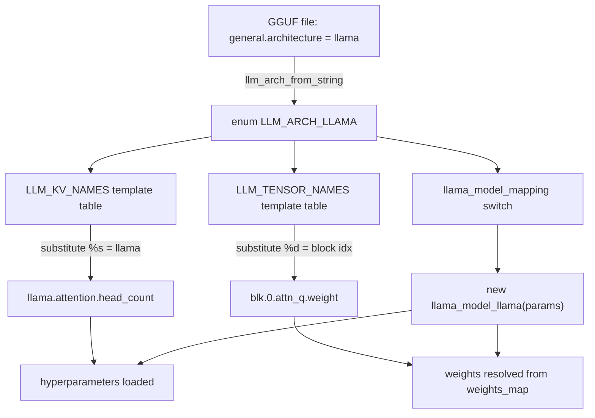
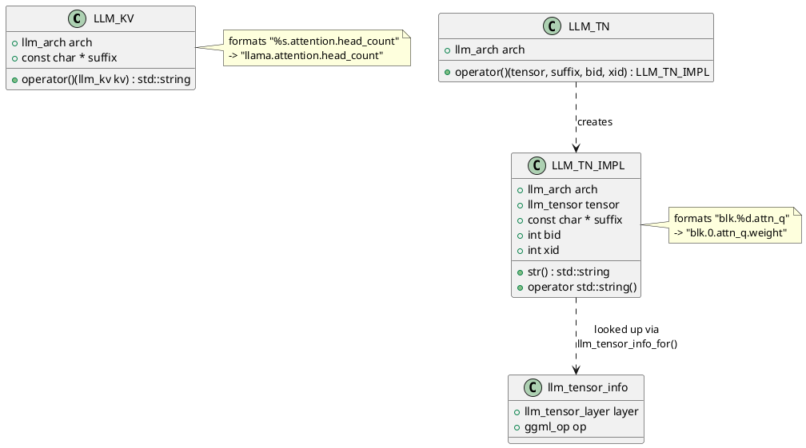
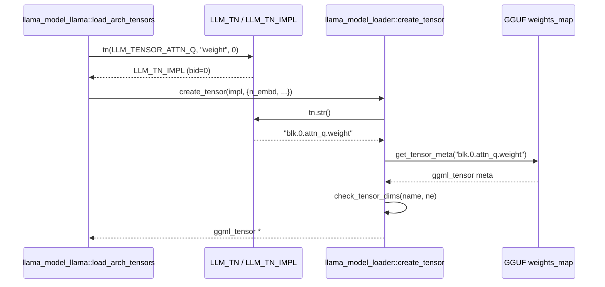
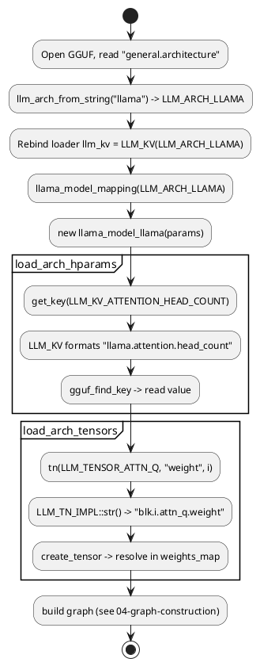

# Predefined architectures: the arch registry

When llama.cpp opens a `.gguf` file, it has nothing but a flat bag of metadata key/value pairs and named tensor blobs. The file does not say "I am a LLaMA model with these layers wired this way." It says `general.architecture = "llama"` and contains tensors named `token_embd.weight`, `blk.0.attn_q.weight`, and so on. The **architecture registry** in `src/llama-arch.h` and `src/llama-arch.cpp` is the lookup machinery that turns that one string into a fully-resolved model: it knows which hyperparameter keys to read, what the tensors should be called, and which C++ subclass to instantiate.

This file is the bridge between the generic GGUF reader (see [01-gguf-and-loading.md](01-gguf-and-loading.md)) and the concrete per-architecture graph builders (see [04-graph-construction.md](04-graph-construction.md)). If you understand this registry, you understand how a string in a file becomes executable tensor math.

## The three registries

Everything in `src/llama-arch.cpp` revolves around three enum-to-string maps. They are independent, but all three are keyed (directly or via substitution) by the architecture.

| Registry | Enum | String table | What it produces |
|---|---|---|---|
| Architectures | `llm_arch` (`src/llama-arch.h:13`) | `LLM_ARCH_NAMES` (`src/llama-arch.cpp:9`) | `LLM_ARCH_LLAMA` ↔ `"llama"` |
| Metadata keys | `llm_kv` (`src/llama-arch.h:146`) | `LLM_KV_NAMES` (`src/llama-arch.cpp:142`) | `"%s.attention.head_count"` template |
| Tensor names | `llm_tensor` (`src/llama-arch.h:357`) | `LLM_TENSOR_NAMES` (`src/llama-arch.cpp:352`) | `"blk.%d.attn_q"` template |

A fourth map, `LLM_TENSOR_INFOS` (`src/llama-arch.cpp:571`), annotates each logical tensor with a *layer class* and a *GGML op* used for buffer-type placement (more below).



### 1. The architecture enum and its names

`llm_arch` is a plain enum of 140+ identifiers, ordered roughly by when each model family was added:

```cpp
enum llm_arch {
    LLM_ARCH_CLIP,
    LLM_ARCH_LLAMA,
    LLM_ARCH_LLAMA4,
    LLM_ARCH_DECI,
    LLM_ARCH_FALCON,
    // ... ~140 more ...
    LLM_ARCH_UNKNOWN,
};
```
(`src/llama-arch.h:13`)

The matching string table is a `std::map<llm_arch, const char *>`:

```cpp
static const std::map<llm_arch, const char *> LLM_ARCH_NAMES = {
    { LLM_ARCH_CLIP,  "clip" },
    { LLM_ARCH_LLAMA, "llama" },
    { LLM_ARCH_LLAMA4, "llama4" },
    // ...
};
```
(`src/llama-arch.cpp:9`)

Two helpers wrap this map. The forward direction, `llm_arch_name` (`src/llama-arch.cpp:822`), is used for logging and error text and returns `"unknown"` if the enum is missing. The reverse direction is the one that matters at load time — `llm_arch_from_string` (`src/llama-arch.cpp:830`) linearly scans the map for a matching string and falls back to `LLM_ARCH_UNKNOWN`:

```cpp
llm_arch llm_arch_from_string(const std::string & name) {
    for (const auto & kv : LLM_ARCH_NAMES) { // NOLINT
        if (kv.second == name) {
            return kv.first;
        }
    }
    return LLM_ARCH_UNKNOWN;
}
```
(`src/llama-arch.cpp:830`)

### 2. Metadata keys: `LLM_KV` and the `%s` template

GGUF metadata keys are namespaced under the architecture string, e.g. `llama.attention.head_count`. Rather than hardcode every key per architecture, the registry stores **templates** with a `%s` placeholder for the arch name:

```cpp
static const std::map<llm_kv, const char *> LLM_KV_NAMES = {
    { LLM_KV_GENERAL_ARCHITECTURE,    "general.architecture" },
    { LLM_KV_ATTENTION_HEAD_COUNT,    "%s.attention.head_count" },
    { LLM_KV_ATTENTION_HEAD_COUNT_KV, "%s.attention.head_count_kv" },
    { LLM_KV_ROPE_FREQ_BASE,          "%s.rope.freq_base" },
    // ...
};
```
(`src/llama-arch.cpp:142`, attention block at `src/llama-arch.cpp:218`)

Note that `general.*` keys have no `%s` — they are global, which is exactly why `general.architecture` can be read *before* the architecture is known.

The `LLM_KV` struct binds an architecture to this table and exposes `operator()` to format a concrete key:

```cpp
struct LLM_KV {
    LLM_KV(llm_arch arch, const char * suffix = nullptr);
    llm_arch arch;
    const char * suffix;
    std::string operator()(llm_kv kv) const;
};
```
(`src/llama-arch.h:574`)

The implementation just runs the template through `format()` (printf-style) with the arch name substituted for `%s`:

```cpp
std::string LLM_KV::operator()(llm_kv kv) const {
    std::string name = ::format(LLM_KV_NAMES.at(kv), LLM_ARCH_NAMES.at(arch));
    if (suffix != nullptr) {
        name += ".";
        name += suffix;
    }
    return name;
}
```
(`src/llama-arch.cpp:785`)

So `LLM_KV(LLM_ARCH_LLAMA)(LLM_KV_ATTENTION_HEAD_COUNT)` returns the string `"llama.attention.head_count"`. That string is then handed to `gguf_find_key` to retrieve the actual value (see the loader path below).

### 3. Tensor names: `LLM_TENSOR`, `LLM_TN`, and the `%d` template

Tensors work the same way, but the templates carry `%d` placeholders for the block index and (for MoE) the expert index instead of `%s`:

```cpp
static const std::map<llm_tensor, const char *> LLM_TENSOR_NAMES = {
    { LLM_TENSOR_TOKEN_EMBD,  "token_embd" },
    { LLM_TENSOR_OUTPUT_NORM, "output_norm" },
    { LLM_TENSOR_OUTPUT,      "output" },
    { LLM_TENSOR_ATTN_NORM,   "blk.%d.attn_norm" },
    { LLM_TENSOR_ATTN_Q,      "blk.%d.attn_q" },
    { LLM_TENSOR_FFN_DOWN,    "blk.%d.ffn_down" },
    { LLM_TENSOR_FFN_GATE_EXP,"blk.%d.ffn_gate.%d" }, // bid, then xid (expert)
    // ...
};
```
(`src/llama-arch.cpp:352`)

Unlike `LLM_KV_NAMES`, this table is **not** keyed by architecture — the same logical tensor name maps to the same GGUF string regardless of model family. Architecture-specific *wiring* (which tensors exist, in what order they are read) lives in each model's `load_arch_tensors`, not in this table.

Two structs collaborate here. `LLM_TN` is a lightweight factory bound to an architecture; calling it builds an `LLM_TN_IMPL` carrying all the formatting inputs:

```cpp
struct LLM_TN {
    LLM_TN(llm_arch arch) : arch(arch) {}
    llm_arch arch;
    LLM_TN_IMPL operator()(llm_tensor tensor, const char * suffix, int bid = -1, int xid = -1) const {
        return LLM_TN_IMPL(arch, tensor, suffix, bid, xid);
    }
    LLM_TN_IMPL operator()(llm_tensor tensor, int bid = -1, int xid = -1) const {
        return LLM_TN_IMPL(arch, tensor, nullptr, bid, xid);
    }
};
```
(`src/llama-arch.h:616`)

`LLM_TN_IMPL::str()` does the actual substitution. The `bid`/`xid` ints are fed through `format()` against the `%d` placeholders; the suffix (`"weight"`, `"bias"`) is appended last:

```cpp
std::string LLM_TN_IMPL::str() const {
    if (LLM_TENSOR_NAMES.find(tensor) == LLM_TENSOR_NAMES.end()) {
        GGML_ABORT("unknown tensor name for tensor id %d", static_cast<int>(tensor));
    }
    std::string name = ::format(LLM_TENSOR_NAMES.at(tensor), bid, xid);
    if (suffix != nullptr) {
        name += ".";
        name += suffix;
    }
    return name;
}
```
(`src/llama-arch.cpp:799`)

`LLM_TN_IMPL` also defines an implicit `operator std::string()` and `==`/`!=` overloads against strings (`src/llama-arch.h:603`), so it can be compared directly with a GGUF tensor name without calling `.str()` explicitly.



## Worked example: producing `"blk.0.attn_q.weight"`

The LLaMA tensor loader binds an `LLM_TN` factory (the `tn` symbol in `LLAMA_LOAD_LOCALS`) and calls `create_tensor`. Inside the per-layer loop, the QKV tensors are created from logical names. Here is the surrounding LLaMA loader code:

```cpp
void llama_model_llama::load_arch_tensors(llama_model_loader &) {
    LLAMA_LOAD_LOCALS;
    tok_embd = create_tensor(tn(LLM_TENSOR_TOKEN_EMBD, "weight"), {n_embd, n_vocab}, 0);
    // ...
    for (int i = 0; i < n_layer; ++i) {
        auto & layer = layers[i];
        layer.attn_norm = create_tensor(tn(LLM_TENSOR_ATTN_NORM, "weight", i), {n_embd}, 0);
        create_tensor_qkv(layer, i, n_embd, n_embd_head_k * n_head, n_embd_k_gqa, n_embd_v_gqa, 0);
        // ...
    }
}
```
(`src/models/llama.cpp:34`)

For block `i = 0`, the attention-Q tensor flows like this:

1. `tn(LLM_TENSOR_ATTN_Q, "weight", 0)` → `LLM_TN::operator()` builds an `LLM_TN_IMPL{arch=LLM_ARCH_LLAMA, tensor=LLM_TENSOR_ATTN_Q, suffix="weight", bid=0, xid=-1}` (`src/llama-arch.h:621`).
2. When `create_tensor` needs the string, it calls `tn.str()` → looks up `LLM_TENSOR_NAMES.at(LLM_TENSOR_ATTN_Q)` = `"blk.%d.attn_q"`, runs `format("blk.%d.attn_q", 0, -1)` = `"blk.0.attn_q"`, then appends `".weight"` → **`"blk.0.attn_q.weight"`** (`src/llama-arch.cpp:799`).
3. `create_tensor` looks that name up in the GGUF (`gguf_find_tensor` / `get_tensor_meta`), validates the dimensions against the `{...}` `ne` list via `check_tensor_dims`, and builds the `ggml_tensor` (`src/llama-model-loader.cpp:1219`, dim check at `src/llama-model-loader.cpp:1268`).



## Resolving a metadata key: `"llama.attention.head_count"`

The hyperparameter path mirrors the tensor path. Each model's `load_arch_hparams` asks the loader for keys by their *logical* `llm_kv` enum:

```cpp
void llama_model_llama::load_arch_hparams(llama_model_loader & ml) {
    uint32_t n_vocab = 0;
    ml.get_key(LLM_KV_VOCAB_SIZE, n_vocab, false) || ml.get_arr_n(LLM_KV_TOKENIZER_LIST, n_vocab, false);
    ml.get_key(LLM_KV_ATTENTION_LAYERNORM_RMS_EPS, hparams.f_norm_rms_eps);
    // ...
}
```
(`src/models/llama.cpp:3`)

`llama_model_loader::get_key(enum llm_kv, ...)` is a thin shim that converts the enum into a formatted key string using the loader's bound `llm_kv` formatter, then delegates to the string-keyed overload:

```cpp
bool llama_model_loader::get_key(enum llm_kv kid, T & result, bool required) {
    return get_key(llm_kv(kid), result, required);
}
```
(`src/llama-model-loader.cpp:415`)

The `llm_kv` member here is an `LLM_KV` instance that was bound to the architecture during loader construction (next section). So `get_key(LLM_KV_ATTENTION_HEAD_COUNT, ...)` formats `"%s.attention.head_count"` with `"llama"`, producing `"llama.attention.head_count"`, then runs `gguf_find_key` against the file's metadata (the pattern is visible in `get_key_or_arr` at `src/llama-model-loader.cpp:483`).

## Wiring it together at load time

The detection happens inside the `llama_model_loader` constructor. It first reads the global `general.architecture` key (which needs no arch prefix), then *rebinds* its `LLM_KV` formatter to the detected architecture so every subsequent `get_key` call is namespaced correctly:

```cpp
get_key(llm_kv(LLM_KV_GENERAL_ARCHITECTURE), arch_name, false);
llm_kv = LLM_KV(llm_arch_from_string(arch_name));
```
(`src/llama-model-loader.cpp:552`)

The detected `llm_arch` then drives the dispatcher `llama_model_mapping`, a giant switch that instantiates the correct subclass:

```cpp
static llama_model * llama_model_mapping(llm_arch arch, const llama_model_params & params) {
    switch (arch) {
        case LLM_ARCH_LLAMA:
            return new llama_model_llama(params);
        case LLM_ARCH_LLAMA4:
            return new llama_model_llama4(params);
        // ... ~140 cases ...
    }
}
```
(`src/llama-model.cpp:38`, called from `src/llama-model.cpp:301`)

That subclass supplies the `load_arch_hparams`, `load_arch_tensors`, and graph-building methods that consume the registry helpers shown above. The end-to-end chain — from the file string to a built graph — is:



## Tensor classification: `LLM_TENSOR_INFOS`

There is one more registry worth knowing. `LLM_TENSOR_INFOS` (`src/llama-arch.cpp:571`) maps each logical tensor to a `llm_tensor_info` describing *where* it lives and *how* it is consumed:

```cpp
struct llm_tensor_info {
    llm_tensor_layer layer; // INPUT / REPEATING / OUTPUT
    ggml_op op;             // GGML_OP_MUL_MAT, GGML_OP_GET_ROWS, ...
};
```
(`src/llama-arch.h:631`)

```cpp
static const std::map<llm_tensor, llm_tensor_info> LLM_TENSOR_INFOS = {
    {LLM_TENSOR_TOKEN_EMBD, {LLM_TENSOR_LAYER_INPUT,     GGML_OP_GET_ROWS}},
    {LLM_TENSOR_OUTPUT,     {LLM_TENSOR_LAYER_OUTPUT,    GGML_OP_MUL_MAT}},
    {LLM_TENSOR_ATTN_Q,     {LLM_TENSOR_LAYER_REPEATING, GGML_OP_MUL_MAT}},
    // ...
};
```
(`src/llama-arch.cpp:571`)

The `layer` field uses the `llm_tensor_layer` enum (`src/llama-arch.h:568`): `INPUT` (embeddings), `REPEATING` (per-block weights), and `OUTPUT` (final norm/projection). During `create_tensor`, the loader looks this up via `llm_tensor_info_for` (`src/llama-arch.cpp:840`) and uses the layer class to pick a buffer-type list — input/output tensors go to dedicated buffers while repeating ones are placed per layer (`src/llama-model-loader.cpp:1097`, layer branch at `src/llama-model-loader.cpp:1127`). The `op` field records the GGML operation that will consume the tensor, which feeds buffer-type compatibility checks. This is where the static registry hands off to the dynamic scheduling concerns covered in [06-execution-and-scheduling.md](06-execution-and-scheduling.md).

## Architecture classification helpers

A few predicate functions read the `llm_arch` enum to steer graph construction. `llm_arch_is_recurrent` (`src/llama-arch.cpp:844`) returns true for Mamba/RWKV families; `llm_arch_is_hybrid` (`src/llama-arch.cpp:858`) flags models that interleave attention and SSM layers (Jamba, Falcon-H1). These decide which graph-building strategy a model uses and which cache type it needs — see [04-graph-construction.md](04-graph-construction.md).

## Key takeaways

- The registry turns one string (`general.architecture`) into a fully wired model via three independent enum↔string maps in `src/llama-arch.cpp`.
- `LLM_KV` formats `%s`-templated **metadata keys** (`"llama.attention.head_count"`); `LLM_TN`/`LLM_TN_IMPL` format `%d`-templated **tensor names** (`"blk.0.attn_q.weight"`). Both are just `printf`-style substitution over a lookup table.
- `LLM_KV_NAMES` is namespaced per-architecture via `%s`; `LLM_TENSOR_NAMES` is **not** keyed by architecture — model-specific wiring lives in each subclass's `load_arch_tensors`, not the table.
- `llm_arch_from_string` (`src/llama-arch.cpp:830`) detects the architecture; the loader rebinds its `LLM_KV` formatter (`src/llama-model-loader.cpp:552`); `llama_model_mapping` (`src/llama-model.cpp:38`) dispatches to the correct C++ subclass.
- `LLM_TENSOR_INFOS` (`src/llama-arch.cpp:571`) tags each tensor with a layer class and GGML op, which `create_tensor` uses for buffer-type placement — the link from the static registry to runtime scheduling.

---
Next: [03-hparams-and-tensors.md](03-hparams-and-tensors.md) digs into how the loaded hyperparameters populate `llama_hparams` and how tensors land in memory. Prev: [01-gguf-and-loading.md](01-gguf-and-loading.md).
