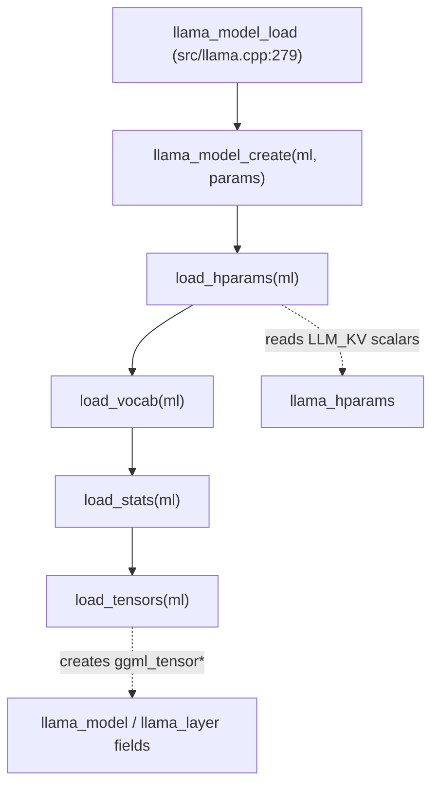
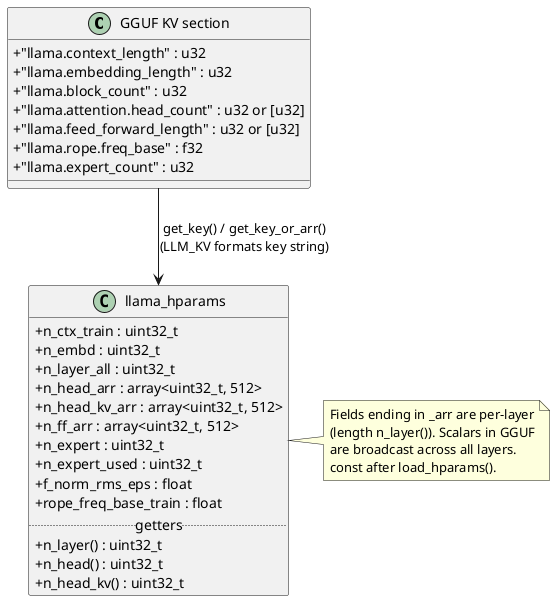
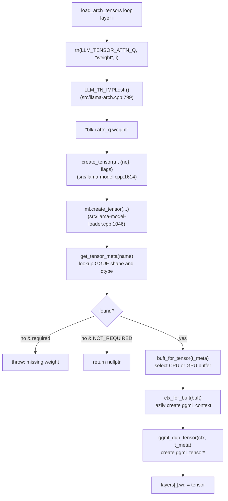
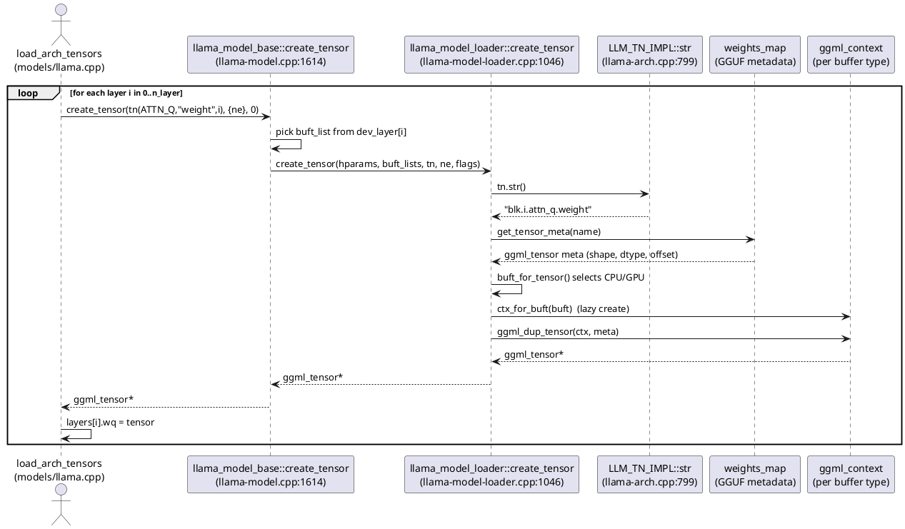
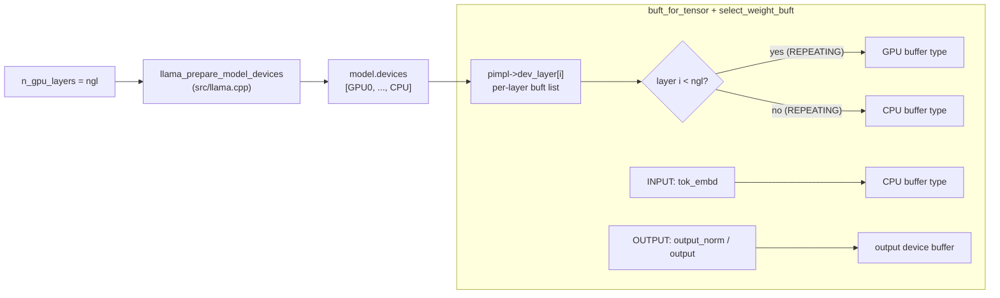
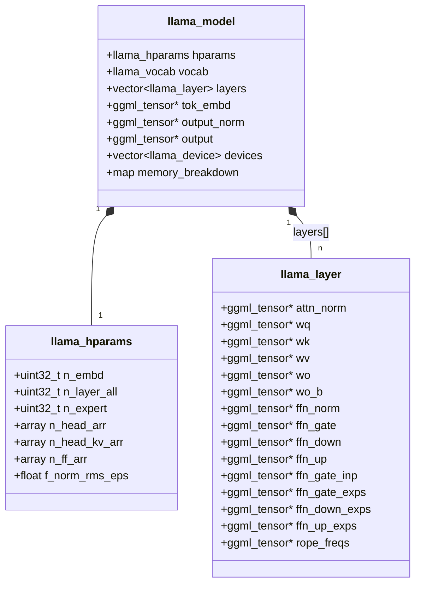

# Hyperparameters & Weight Tensors

This chapter covers the second half of model loading: turning the GGUF metadata and tensor blob (parsed in [01-gguf-and-loading.md](01-gguf-and-loading.md)) into a fully populated in-memory `llama_model`. Two things happen here:

1. **Hyperparameters** — scalar/array metadata (context length, head counts, RoPE params, expert counts) is read from GGUF via architecture-keyed `LLM_KV` strings into the `llama_hparams` struct.
2. **Weight tensors** — the architecture's `LLM_TN` formatter generates canonical tensor names (`blk.0.attn_q.weight`), `create_tensor()` looks each up in GGUF, instantiates a `ggml_tensor *` in a per-buffer-type `ggml_context`, and assigns it to a field on `llama_model` or `llama_layer`.

Both steps depend on the architecture registry from [02-architecture-registry.md](02-architecture-registry.md): `LLM_KV` and `LLM_TN` are the formatters that turn arch-generic enums into the concrete strings stored in the file.

## Where this sits in the pipeline

The orchestration entry point `llama_model_load` (src/llama.cpp:279) calls four model methods in strict order after the loader and arch-specific subclass are created:



`load_hparams` must run first because tensor shapes are computed from hparams (e.g. `n_embd`, `n_ff`, `n_head`). Hparams are effectively const after this step; mutable inference state (KV cache, activations) lives in `llama_context`, not in `llama_model`.

## Part 1 — Loading hyperparameters

`llama_model_base::load_hparams` (src/llama-model.cpp:1017) reads the architecture-generic metadata that every model shares, then delegates to the per-arch override.

### Scalar keys via `get_key`

Each scalar field maps to one `LLM_KV` enum. The loader's `get_key(LLM_KV, field, required)` formats the key string (substituting the arch name, e.g. `llama.context_length`) and looks it up in the GGUF KV map:

```cpp
ml.get_key(LLM_KV_CONTEXT_LENGTH,          hparams.n_ctx_train);
ml.get_key(LLM_KV_EMBEDDING_LENGTH,        hparams.n_embd);
ml.get_key(LLM_KV_EMBEDDING_LENGTH_OUT,    hparams.n_embd_out_impl, false);
ml.get_key(LLM_KV_ATTENTION_CAUSAL,        hparams.causal_attn,     false);
ml.get_key(LLM_KV_POOLING_TYPE,            hparams.pooling_type,    false);
ml.get_key(LLM_KV_BLOCK_COUNT,             hparams.n_layer_all);
ml.get_key(LLM_KV_EXPERT_COUNT,            hparams.n_expert,        false);
ml.get_key(LLM_KV_EXPERT_USED_COUNT,       hparams.n_expert_used,   false);
ml.get_key(LLM_KV_EXPERT_GROUP_COUNT,      hparams.n_expert_groups, false);
```
*(src/llama-model.cpp:1040-1050)*

The third argument is `required`. When `false`, a missing key leaves the field at its struct default instead of throwing — that is how optional features (pooling type, experts, biases) degrade gracefully across architectures.

### Per-layer arrays via `get_key_or_arr`

Head counts and feed-forward widths can vary per layer, so they are stored as `std::array<uint32_t, LLAMA_MAX_LAYERS>` (declared at src/llama-hparams.h:80-82). `get_key_or_arr` accepts either a single scalar (broadcast to all layers) or an explicit array of length `n_layer()`:

```cpp
std::fill(hparams.n_head_arr.begin(),    hparams.n_head_arr.end(),    0);
std::fill(hparams.n_head_kv_arr.begin(), hparams.n_head_kv_arr.end(), 0);
std::fill(hparams.n_ff_arr.begin(),      hparams.n_ff_arr.end(),      0);

ml.get_key_or_arr(LLM_KV_FEED_FORWARD_LENGTH,  hparams.n_ff_arr,   hparams.n_layer(), false);
ml.get_key_or_arr(LLM_KV_ATTENTION_HEAD_COUNT, hparams.n_head_arr, hparams.n_layer(), false);
hparams.n_head_kv_arr = hparams.n_head_arr;
ml.get_key_or_arr(LLM_KV_ATTENTION_HEAD_COUNT_KV, hparams.n_head_kv_arr, hparams.n_layer(), false);
```
*(src/llama-model.cpp:1100-1109)*

Note the GQA defaulting trick: `n_head_kv_arr` is seeded from `n_head_arr` before reading the KV-head key, so a model with no separate KV-head metadata falls back to full multi-head attention.

### Arch-specific delegation

After the generic block, `load_hparams` calls the virtual `load_arch_hparams(ml)`, overridden per architecture. For Llama, `llama_model_llama::load_arch_hparams` (src/models/llama.cpp:3) reads the RMS-norm epsilon and infers the model type label from the layer/expert counts:

```cpp
ml.get_key(LLM_KV_ATTENTION_LAYERNORM_RMS_EPS, hparams.f_norm_rms_eps);

if (hparams.n_expert == 8) {
    switch (hparams.n_layer()) {
        case 32: type = LLM_TYPE_8x7B; break;
        case 56: type = LLM_TYPE_8x22B; break;
        default: type = LLM_TYPE_UNKNOWN;
    }
} else {
    switch (hparams.n_layer()) {
        case 32: type = n_vocab == 49152 ? LLM_TYPE_3B : (n_vocab < 40000 ? LLM_TYPE_7B : LLM_TYPE_8B); break;
        case 80: type = hparams.n_head() == hparams.n_head_kv() ? LLM_TYPE_65B : LLM_TYPE_70B; break;
        // ...
    }
}
```
*(src/models/llama.cpp:3-32)*

The `type` field is purely descriptive (used for logging and `llama_model_desc`); it does not drive any shape decisions — those all come from the numeric hparams.

The relationship between the GGUF KV section and the `llama_hparams` struct:



## Part 2 — Loading weight tensors

`llama_model_base::load_tensors` (src/llama-model.cpp:1203) is the orchestrator. It:

1. Builds the per-device buffer-type lists (CPU, input, output, and one per-layer list keyed by `n_gpu_layers`).
2. Resizes `layers` to `n_layer_all`.
3. Calls the virtual `load_arch_tensors(ml)` to populate every `ggml_tensor *` field.
4. Allocates backend buffers and brings tensor data into memory via `init_mappings` + `load_all_data`.

### From tensor name to struct field

`load_arch_tensors` is where logical tensor identifiers become populated struct fields. Each call is `field = create_tensor(tn(LLM_TENSOR_*, "weight", layer_idx), {shape...}, flags)`. Here is the Llama loop:

```cpp
void llama_model_llama::load_arch_tensors(llama_model_loader &) {
    LLAMA_LOAD_LOCALS;

    tok_embd = create_tensor(tn(LLM_TENSOR_TOKEN_EMBD, "weight"), {n_embd, n_vocab}, 0);

    output_norm = create_tensor(tn(LLM_TENSOR_OUTPUT_NORM, "weight"), {n_embd}, 0);
    output      = create_tensor(tn(LLM_TENSOR_OUTPUT,      "weight"), {n_embd, n_vocab}, TENSOR_NOT_REQUIRED);
    if (output == NULL) {
        output = create_tensor(tn(LLM_TENSOR_TOKEN_EMBD, "weight"), {n_embd, n_vocab}, TENSOR_DUPLICATED);
    }

    for (int i = 0; i < n_layer; ++i) {
        auto & layer = layers[i];
        layer.attn_norm = create_tensor(tn(LLM_TENSOR_ATTN_NORM, "weight", i), {n_embd}, 0);
        create_tensor_qkv(layer, i, n_embd, n_embd_head_k * n_head, n_embd_k_gqa, n_embd_v_gqa, 0);
        layer.wo = create_tensor(tn(LLM_TENSOR_ATTN_OUT, "weight", i), {n_embd_head_k * n_head, n_embd}, 0);
        layer.ffn_norm = create_tensor(tn(LLM_TENSOR_FFN_NORM, "weight", i), {n_embd}, 0);
        layer.ffn_gate = create_tensor(tn(LLM_TENSOR_FFN_GATE, "weight", i), {n_embd,   n_ff}, 0);
        layer.ffn_down = create_tensor(tn(LLM_TENSOR_FFN_DOWN, "weight", i), {  n_ff, n_embd}, 0);
        layer.ffn_up   = create_tensor(tn(LLM_TENSOR_FFN_UP,   "weight", i), {n_embd,   n_ff}, 0);
    }
}
```
*(src/models/llama.cpp:34-91, condensed)*

A few things worth pointing out from the real source:

- **Output tying.** If `LLM_TENSOR_OUTPUT` is absent, the model reuses `tok_embd` as the output projection via the `TENSOR_DUPLICATED` flag (src/models/llama.cpp:44-46) — no second allocation.
- **Optional biases.** `layer.wo_b`, `ffn_gate_b`, etc. are created with `TENSOR_NOT_REQUIRED` so they silently resolve to `nullptr` when the file has no bias tensors (src/models/llama.cpp:57, 75-77).
- **RoPE factor sharing.** `rope_long`/`rope_short`/`rope_freqs` are created per-layer, but for `i != 0` the flags add `TENSOR_DUPLICATED`, so layers 1..N-1 alias layer 0's tensor instead of re-allocating (src/models/llama.cpp:62-67).
- **MoE branch.** When `n_expert != 0`, the dense `ffn_gate/up/down` are replaced by the routed `ffn_gate_inp` + 3D expert tensors `ffn_*_exps`, with an extra shared-expert path for Granite-style models (src/models/llama.cpp:78-90).

### How `tn(...)` produces the GGUF name

`tn` is the `LLM_TN` factory bound to the model's architecture; calling it builds an `LLM_TN_IMPL`. Resolving it to a string happens in `LLM_TN_IMPL::str` (src/llama-arch.cpp:799):

```cpp
std::string LLM_TN_IMPL::str() const {
    if (LLM_TENSOR_NAMES.find(tensor) == LLM_TENSOR_NAMES.end()) {
        GGML_ABORT("unknown tensor name for tensor id %d", static_cast<int>(tensor));
    }
    std::string name = ::format(LLM_TENSOR_NAMES.at(tensor), bid, xid);
    if (suffix != nullptr) {
        name += ".";
        name += suffix;
    }
    return name;
}
```

`LLM_TENSOR_NAMES` (src/llama-arch.cpp:352) holds the `printf`-style templates: `LLM_TENSOR_ATTN_Q` → `"blk.%d.attn_q"`. So `tn(LLM_TENSOR_ATTN_Q, "weight", 0).str()` produces `blk.0.attn_q.weight` — exactly the key stored in the GGUF `weights_map`.

### The full discovery flow for one tensor



### Inside `ml.create_tensor`

The low-level instantiation (src/llama-model-loader.cpp:1046) does name resolution, buffer selection, dimension validation, and finally the `ggml_dup_tensor` that materializes the tensor object (its data pointer is filled later):

```cpp
ggml_tensor * t_meta = get_tensor_meta(tn.str().c_str());
ggml_backend_buffer_type_t buft = buft_for_tensor(t_meta);
if (buft == nullptr) {
    return nullptr;
}
ggml_context * ctx = ctx_for_buft(buft);

if (flags & TENSOR_DUPLICATED) {
    ggml_tensor * t = ggml_get_tensor(ctx, tn.str().c_str());
    if (t) {
        return t;                 // reuse an already-created tensor (e.g. tied output)
    }
}

const struct ggml_tensor * cur = check_tensor_dims(tn.str(), ne, !(flags & TENSOR_NOT_REQUIRED));
if (cur == NULL) {
    return NULL;                  // optional tensor absent -> nullptr
}

struct ggml_tensor * tensor = ggml_dup_tensor(ctx, cur);
ggml_set_name(tensor, ggml_get_name(cur));
return tensor;
```
*(src/llama-model-loader.cpp:1252-1286, condensed)*

`check_tensor_dims` (src/llama-model-loader.cpp:863) enforces that the `ne` shape the architecture expects matches the shape recorded in GGUF — a mismatch is a hard error, which is how a malformed or wrong-arch file is caught early.

### The two-layer `create_tensor` indirection

There are two functions named `create_tensor`. The model-level wrapper `llama_model_base::create_tensor` (src/llama-model.cpp:1614) exists so that `load_arch_tensors` can call `create_tensor(tn, ne, flags)` without manually threading the buffer-type lists; it picks the per-layer buffer list from `pimpl->dev_layer[tn.bid]` and forwards to the loader-level `llama_model_loader::create_tensor`:



## Part 3 — Buffer placement and GPU offload

`create_tensor` does not just create a bare `ggml_tensor`; it places it in a `ggml_context` tied to a specific **buffer type** (`ggml_backend_buffer_type_t`), which determines where the weight ultimately lives (system RAM vs a particular GPU's VRAM).

### Classification drives placement

Every logical tensor carries an `llm_tensor_info` (src/llama-arch.h:631) that records its layer class:

- `LLM_TENSOR_LAYER_INPUT` — embeddings; kept on the input buffer (typically CPU).
- `LLM_TENSOR_LAYER_REPEATING` — per-block weights; placed on the device assigned to that layer.
- `LLM_TENSOR_LAYER_OUTPUT` — final norm/projection; placed on the output device.

`buft_for_tensor` (src/llama-model-loader.cpp:1079) reads this classification plus the operation info to pick a buffer-type list, and `select_weight_buft` walks that list (GPU types first, CPU as fallback) honoring tensor size, quantization, and op support.

### `n_gpu_layers` decides the CPU/GPU boundary

Before tensors are created, `llama_prepare_model_devices` (src/llama.cpp) builds `model->devices` from `params.n_gpu_layers` and backend availability. The per-layer buffer list `pimpl->dev_layer[i]` then points repeating layers `i` either at a GPU device (when `i` is within the offloaded range) or at CPU. Input/output tensors stay on CPU to minimize host↔device transfer at the graph's boundaries.

In the `simple` example, this is the single knob the user sets:

```cpp
llama_model_params model_params = llama_model_default_params();
model_params.n_gpu_layers = ngl;

llama_model * model = llama_model_load_from_file(model_path.c_str(), model_params);
```
*(examples/simple/simple.cpp:86-90)*



### Bringing data into the buffers

Tensor *objects* exist after `load_arch_tensors`, but their `data` pointers are still empty. `load_tensors` finishes the job:

1. `init_mappings` (src/llama-model-loader.cpp:1334) memory-maps each source file (or prepares buffered reads).
2. Backend buffers are allocated for each `ggml_context` (one per buffer type).
3. `load_all_data` (src/llama-model-loader.cpp:1407) iterates the context tensors, looks each up in `weights_map` to get `{file_idx, offset}`, and either points `cur->data` straight at the mmap address (zero-copy, CPU path) or reads/uploads the bytes into the backend buffer (GPU path).

The `weights_map` entry — `llama_tensor_weight` (src/llama-model-loader.h:33) holding `idx`, `offs`, and the `ggml_tensor*` — is the bridge that ties a created tensor back to its byte range on disk. With `use_mmap` and a CPU buffer, no copy happens at all; GPU buffer types require an explicit read+upload.

## Resulting object graph

After `load_tensors` returns, the model is a tree of `ggml_tensor*` pointers reachable from `llama_model`. These are exactly the pointers the graph builder dereferences in [04-graph-construction.md](04-graph-construction.md).



`llama_layer` is index-agnostic: a layer's position is determined only by its slot in the `layers` vector, while the tensor *name* it carries was fixed by `tn.bid` at creation time (src/models/llama.cpp:48-91). The struct actually has 100+ fields (src/llama-model.h:223) to cover every architecture; any given model populates only the subset its `load_arch_tensors` touches and leaves the rest `nullptr`.

## Gotchas to remember

- **`TENSOR_DUPLICATED`** reuses an existing tensor by name rather than allocating — used for tied embeddings/output and for shared RoPE-factor tensors across layers (src/llama-model-loader.cpp:1260; src/models/llama.cpp:62-67).
- **`TENSOR_NOT_REQUIRED`** lets a missing tensor resolve to `nullptr` instead of throwing — the mechanism behind optional biases and arch-conditional weights (src/llama-model-loader.cpp:1225-1230).
- **Missing *required* weights throw**, aborting the load — a wrong-architecture or truncated file fails fast in `check_tensor_dims` / `require_tensor_meta`.
- **`n_head` / `n_head_kv` default uniform** but per-layer arrays may override; the GQA default copies `n_head_arr` into `n_head_kv_arr` before reading the KV-head key (src/llama-model.cpp:1100-1109).
- **mmap vs read** is decided per tensor: CPU buffers can map the GGUF file directly (zero-copy), but most GPU buffer types require an explicit read + upload (src/llama-model.cpp:1513-1557).
- **Hparams are const after load**; the graph builder reads them but never mutates them — runtime state belongs to `llama_context`.

## Key takeaways

- `load_hparams` (src/llama-model.cpp:1017) reads GGUF scalars/arrays via `LLM_KV`-formatted keys into `llama_hparams`; the per-arch `load_arch_hparams` override fills in the rest.
- `load_tensors` (src/llama-model.cpp:1203) drives `load_arch_tensors`, which assigns one `ggml_tensor*` per weight to a `llama_model`/`llama_layer` field.
- `tn(...)` + `LLM_TN_IMPL::str` (src/llama-arch.cpp:799) turn a logical `LLM_TENSOR_*` enum into the canonical GGUF name like `blk.0.attn_q.weight`.
- `ml.create_tensor` (src/llama-model-loader.cpp:1046) resolves that name to GGUF metadata, validates dimensions, selects a buffer type, and `ggml_dup_tensor`s the tensor into a per-buft `ggml_context`.
- `n_gpu_layers` plus tensor layer-classification (`INPUT`/`REPEATING`/`OUTPUT`) determines the CPU/GPU boundary; `load_all_data` then mmaps or reads the bytes into the chosen backend buffers.
- The output is a tree of `ggml_tensor*` pointers hanging off `llama_model` — the exact inputs consumed by graph construction in [04-graph-construction.md](04-graph-construction.md).
