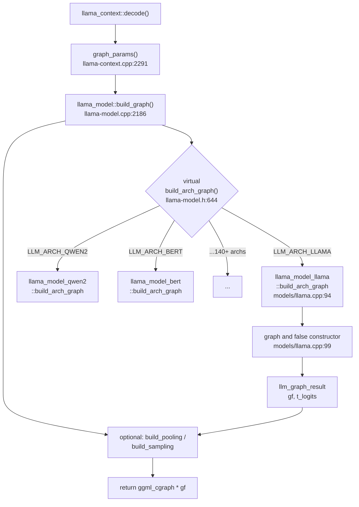
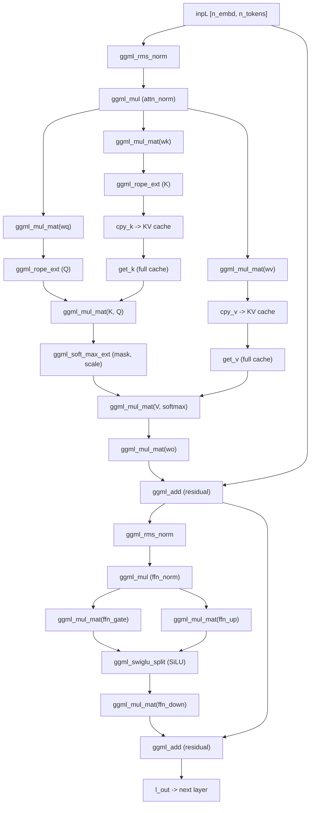
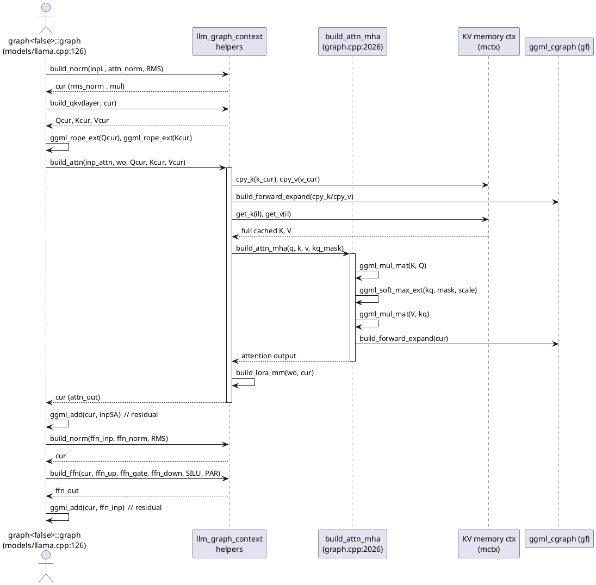
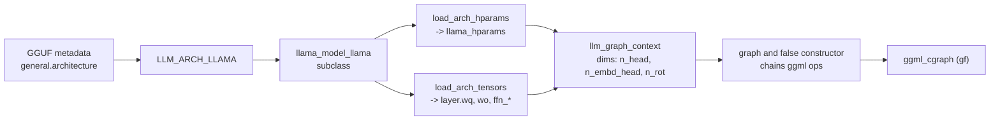

# Constructing the computation graph

This is the centerpiece of the GGUF -> cgraph pipeline. By the time we reach this stage, the model is fully loaded: hyperparameters live in `llama_hparams` and every weight is a `ggml_tensor *` hanging off a `llama_layer` or `llama_model` field (see [03-hparams-and-tensors.md](03-hparams-and-tensors.md)). What we do *not* yet have is a plan for computing logits from a batch of tokens. That plan is the **computation graph** — a `ggml_cgraph` of operation nodes (`ggml_mul_mat`, `ggml_rms_norm`, `ggml_rope_ext`, `ggml_soft_max_ext`, ...) describing every arithmetic step of a forward pass.

This file walks the construction of that graph: the dispatch from `llama_model::build_graph` down to a per-architecture builder, the `llm_graph_context` helper API those builders use, and a concrete op-by-op trace of one LLaMA transformer block.

## Where graph construction sits

`llama_context::decode()` builds a fresh graph (or reuses a cached one) for each batch. It first packages everything the builder needs into an `llm_graph_params` via `llama_context::graph_params` (src/llama-context.cpp:2291), then calls into the model:

```
llama_context::decode()
  -> llama_context::graph_params()        (src/llama-context.cpp:2291)
  -> llama_model::build_graph(params)      (src/llama-model.cpp:2186)
       -> build_arch_graph(params)         (virtual, src/llama-model.h:644)
  -> llama_context::graph_compute()        (src/llama-context.cpp:2315)
       -> ggml_backend_sched_graph_compute_async(sched, gf)
```

The graph is data only — no math runs here. Execution and scheduling happen later (see [06-execution-and-scheduling.md](06-execution-and-scheduling.md)). The structures in flight are:

| Struct | Location | Role |
| --- | --- | --- |
| `llm_graph_params` | src/llama-graph.h:588 | Inputs: arch, hparams, cparams, ubatch, scheduler, KV memory context, callbacks. |
| `llm_graph_context` | src/llama-graph.h:778 | The builder context. Holds `ctx0` (the `ggml_context`), `gf` (the `ggml_cgraph`), all the layer dims, and the helper methods. |
| `llm_graph_result` | src/llama-graph.h:696 | Output: the finished `gf` plus `t_logits` / `t_embd` and the list of input descriptors for reuse. |

## Dispatch: `build_graph` -> `build_arch_graph`

`llama_model::build_graph` (src/llama-model.cpp:2186) is the public entry point. It calls the virtual `build_arch_graph` to produce an architecture-specific `llm_graph_context` subclass, then bolts on optional pooling (embedding models), backend sampling, and dense output layers before finalizing the `llm_graph_result`.

`build_arch_graph` is pure virtual (src/llama-model.h:644). Each architecture subclass — `llama_model_llama`, `llama_model_qwen2`, `llama_model_bert`, and ~140 others — overrides it. The same enum-driven registry that picked the subclass at load time (`llama_model_mapping`, see [02-architecture-registry.md](02-architecture-registry.md)) thus also selects the graph builder, because the override is resolved through the subclass vtable.

For LLaMA, the override is a one-liner that constructs a templated graph object (src/models/llama.cpp:94):

```cpp
std::unique_ptr<llm_graph_context> llama_model_llama::build_arch_graph(const llm_graph_params & params) const {
    return std::make_unique<graph<false>>(*this, params);
}
```

The `<false>` template argument is the `embed` flag: `false` builds a causal LM that ends in logits; `true` builds an embedding model that ends in pooled embeddings and uses non-cache attention. The constructor `llama_model_llama::graph<embed>::graph` (src/models/llama.cpp:99) is where the whole layer stack is assembled.



## The `llm_graph_context` helper API

Architecture builders almost never call `ggml_*` ops directly for the common pieces. Instead they call helper methods on `llm_graph_context`, each of which chains the right ggml ops and records debugging names via the `cb(...)` callback. The important ones:

| Helper | Location | Builds |
| --- | --- | --- |
| `build_inp_embd` | src/llama-graph.cpp:1793 | Embedding lookup: `ggml_get_rows(tok_embd, tokens)` or raw `ubatch.embd`. |
| `build_inp_pos` | src/llama-graph.cpp:1882 | Position index tensor for RoPE. |
| `build_attn_inp_kv` | src/llama-graph.cpp:2263 | KV-cache attention input descriptor (indices + mask). |
| `build_norm` | src/llama-graph.cpp:1117 | `ggml_rms_norm` / `ggml_norm` / `ggml_group_norm` plus optional weight/bias. |
| `build_qkv` | src/llama-graph.cpp:1153 | Q/K/V projections (fused `wqkv` or separate `wq`/`wk`/`wv`), reshaped per head. |
| `build_attn` (KV) | src/llama-graph.cpp:2271 | Cache write/read + MHA + output projection. |
| `build_attn_mha` | src/llama-graph.cpp:2026 | Core scaled-dot-product attention (or flash attention). |
| `build_ffn` | src/llama-graph.cpp:1230 | Dense MLP: up / gate / activation / down. |
| `build_moe_ffn` | src/llama-graph.cpp:1394 | Mixture-of-Experts MLP. |
| `build_lora_mm` | src/llama-graph.cpp:1058 | `ggml_mul_mat(w, x)` with LoRA deltas folded in. |

`build_lora_mm` is the workhorse: every weight projection goes through it so LoRA adapters apply uniformly. The pattern is `ggml_mul_mat(w, cur)` followed by adapter corrections `ggml_mul_mat(lw->b, ggml_mul_mat(lw->a, cur))` scaled by the adapter strength.

### Input descriptors and graph reuse

Input tensors (token ids, positions, KV indices, attention masks) are created as `ggml_set_input` tensors and wrapped in descriptor objects — `llm_graph_input_embd` (src/llama-graph.h:111), `llm_graph_input_attn_kv` (src/llama-graph.h:305), etc. Each descriptor is registered into `llm_graph_result::inputs` via `res->add_input(...)`. This separation is what lets a graph be reused across batches: the op *topology* stays fixed while `set_inputs(ubatch)` repopulates the leaf tensors each step.

## Op-by-op trace of one LLaMA layer

Now the concrete part. The constructor at src/models/llama.cpp:99 sets up the inputs, then loops `n_layer` times. Each iteration builds one transformer block. Here is the loop body, lightly trimmed.

### Setup before the loop

```cpp
inpL = build_inp_embd(model.tok_embd);          // [n_embd, n_tokens]
ggml_tensor * inp_pos = build_inp_pos();         // positions for RoPE
inp_attn = build_attn_inp_kv();                  // KV-cache indices + mask
const float kq_scale = hparams.f_attention_scale == 0.0f
                     ? 1.0f/sqrtf(float(n_embd_head)) : hparams.f_attention_scale;
```

`inpL` is the running hidden state. `build_inp_embd` emits `ggml_get_rows` against the `token_embd` weight to turn token ids into `[n_embd, n_tokens]`.

### Attention sub-block (src/models/llama.cpp:126-171)

```cpp
ggml_tensor * inpSA = inpL;                       // save residual

// 1. pre-attention RMSNorm
cur = build_norm(inpL, model.layers[il].attn_norm, NULL, LLM_NORM_RMS, il);

// 2. Q/K/V projections (mul_mat against wq/wk/wv), reshaped per head
auto [Qcur, Kcur, Vcur] = build_qkv(model.layers[il], cur, n_embd_head, n_head, n_head_kv, il);

// 3. RoPE on Q and K
Qcur = ggml_rope_ext(ctx0, Qcur, inp_pos, rope_factors, n_rot, rope_type, ...);
Kcur = ggml_rope_ext(ctx0, Kcur, inp_pos, rope_factors, n_rot, rope_type, ...);

// 4. attention + output projection
cur = build_attn(inp_attn,
        model.layers[il].wo, model.layers[il].wo_b, model.layers[il].wo_s,
        Qcur, Kcur, Vcur, nullptr, nullptr, nullptr, kq_scale, il);
```

`build_norm` (src/llama-graph.cpp:1117) emits `ggml_rms_norm(cur, f_norm_rms_eps)` then `ggml_mul(cur, attn_norm)`. `build_qkv` emits one `ggml_mul_mat` per projection (via `build_lora_mm`). `ggml_rope_ext` rotates the query/key vectors by position.

Inside `build_attn` (src/llama-graph.cpp:2271) the KV cache is touched. K and V for the current tokens are written into the cache, then the *full* cached K/V are read back for the matmul:

```cpp
ggml_build_forward_expand(gf, mctx_cur->cpy_k(ctx0, k_cur, k_idxs, il));   // store K
ggml_build_forward_expand(gf, mctx_cur->cpy_v(ctx0, v_cur, v_idxs, il));   // store V
ggml_tensor * k = mctx_cur->get_k(ctx0, il);                              // read K
ggml_tensor * v = mctx_cur->get_v(ctx0, il);                              // read V
ggml_tensor * cur = build_attn_mha(q, k, v, kq_b, kq_mask, sinks, v_mla, kq_scale, il);
```

`build_attn_mha` (src/llama-graph.cpp:2026) is the actual scaled-dot-product attention (non-flash path shown):

```cpp
ggml_tensor * kq  = ggml_mul_mat(ctx0, k, q);                       // K^T Q  -> scores
ggml_mul_mat_set_prec(kq, GGML_PREC_F32);
kq = ggml_soft_max_ext(ctx0, kq, kq_mask, kq_scale, hparams.f_max_alibi_bias);  // softmax + scale + mask
ggml_tensor * kqv = ggml_mul_mat(ctx0, v, kq);                      // weighted sum of V
cur = ggml_permute(ctx0, kqv, 0, 2, 1, 3);
cur = ggml_cont_2d(ctx0, cur, ...);                                 // -> [n_embd, n_tokens]
ggml_build_forward_expand(gf, cur);
```

Back in `build_attn`, the output projection `ggml_mul_mat(wo, cur)` (via `build_lora_mm`, src/llama-graph.cpp:2335) brings the heads back to `[n_embd, n_tokens]`. The attention sub-block ends with the residual add (src/models/llama.cpp:176):

```cpp
ggml_tensor * ffn_inp = ggml_add(ctx0, cur, inpSA);   // residual connection
```

### FFN sub-block (src/models/llama.cpp:180-218)

For dense (non-MoE) LLaMA, `ffn_gate_inp == nullptr`, so we take the `build_ffn` path:

```cpp
cur = build_norm(ffn_inp, model.layers[il].ffn_norm, NULL, LLM_NORM_RMS, il);  // pre-FFN RMSNorm
cur = build_ffn(cur,
        model.layers[il].ffn_up,   ...,
        model.layers[il].ffn_gate, ...,
        model.layers[il].ffn_down, ...,
        NULL, LLM_FFN_SILU, LLM_FFN_PAR, il);
cur = ggml_add(ctx0, cur, ffn_inp);   // second residual
```

`build_ffn` (src/llama-graph.cpp:1230) with `LLM_FFN_SILU` + `LLM_FFN_PAR` emits the SwiGLU MLP: `ggml_mul_mat(ffn_up, x)` and `ggml_mul_mat(ffn_gate, x)` in parallel, fused into `ggml_swiglu_split(gate, up)` (which applies SiLU to the gate and multiplies, src/llama-graph.cpp:1309), then `ggml_mul_mat(ffn_down, ...)` (src/llama-graph.cpp:1371). A control-vector hook `build_cvec` closes the iteration, and `inpL = cur` feeds the next layer.

### After the loop: output norm and logits (src/models/llama.cpp:229-244)

```cpp
cur = build_norm(cur, model.output_norm, NULL, LLM_NORM_RMS, -1);   // final RMSNorm
res->t_embd = cur;
if constexpr (!embed) {
    cur = build_lora_mm(model.output, cur, model.output_s);          // lm_head -> [n_vocab, n_tokens]
    res->t_logits = cur;
}
ggml_build_forward_expand(gf, cur);                                  // register final node into cgraph
```

That last `ggml_build_forward_expand(gf, cur)` is the moment the entire graph becomes "real": it walks the dependency chain backwards from the logits tensor and adds every reachable op node into `gf`, the `ggml_cgraph`. See [05-ggml-cgraph.md](05-ggml-cgraph.md) for what that node array looks like in memory.

### The data-flow DAG of one layer

These are the actual ggml ops, in dependency order, for a single dense LLaMA block:



### Helper call sequence for one layer

This sequence diagram shows the *control flow* between the architecture builder and the `llm_graph_context` helpers as one layer is assembled (KV cache interaction highlighted).



## MoE variant

If `model.layers[il].ffn_gate_inp != nullptr` (e.g. Mixtral, the LLaMA `8x7B`/`8x22B` types detected at src/models/llama.cpp:9-14), the FFN branch instead calls `build_moe_ffn` (src/llama-graph.cpp:1394, src/models/llama.cpp:201). That helper runs a gating projection, softmaxes the expert logits, selects the top-`n_expert_used` experts, applies their up/gate/down projections, and combines the outputs weighted by gate probabilities. The surrounding norm and residual structure is identical to the dense path.

## How the architecture map drives all of this

The graph is fully parameterized by data established upstream:



The hparams set loop counts and tensor shapes (`n_layer`, `n_head`, `n_embd_head`, `n_rot`); the loaded tensors are the weights fed into `ggml_mul_mat`. The builder is just glue that wires them together into a DAG. Nothing about the math is hardcoded per-model file — it is all driven by the registry from [02-architecture-registry.md](02-architecture-registry.md) and the loaded state from [03-hparams-and-tensors.md](03-hparams-and-tensors.md). See [07-simple-example-walkthrough.md](07-simple-example-walkthrough.md) for an end-to-end trace tying these together.

## Key takeaways

- `llama_model::build_graph` (src/llama-model.cpp:2186) dispatches through virtual `build_arch_graph` (src/llama-model.h:644) to a per-architecture builder; LLaMA's lives at src/models/llama.cpp:94 and constructs a templated `graph<embed>` object.
- The builder uses `llm_graph_context` helpers (`build_norm`, `build_qkv`, `build_attn`, `build_ffn`, `build_moe_ffn`, `build_lora_mm`) rather than raw ggml ops for common structure; each helper chains the appropriate `ggml_*` nodes.
- One dense LLaMA block is: RMSNorm -> Q/K/V `ggml_mul_mat` -> `ggml_rope_ext` -> KV cache write/read -> `ggml_mul_mat(K,Q)` -> `ggml_soft_max_ext` -> `ggml_mul_mat(V,·)` -> output `ggml_mul_mat(wo)` -> residual `ggml_add` -> FFN RMSNorm -> SwiGLU (`ggml_swiglu_split`) -> `ggml_mul_mat(ffn_down)` -> residual `ggml_add`.
- The forward pass ends with a final RMSNorm and the lm_head projection `build_lora_mm(model.output, cur)`, producing `res->t_logits`.
- `ggml_build_forward_expand(gf, cur)` (src/models/llama.cpp:244, and inside `build_attn_mha` at src/llama-graph.cpp:2156) is what actually registers ops into the `ggml_cgraph`; until then the ops are just allocated tensors in `ctx0`.
- Input leaf tensors are wrapped in descriptors registered in `llm_graph_result::inputs`, enabling graph topology reuse across batches while only re-feeding the leaves.
