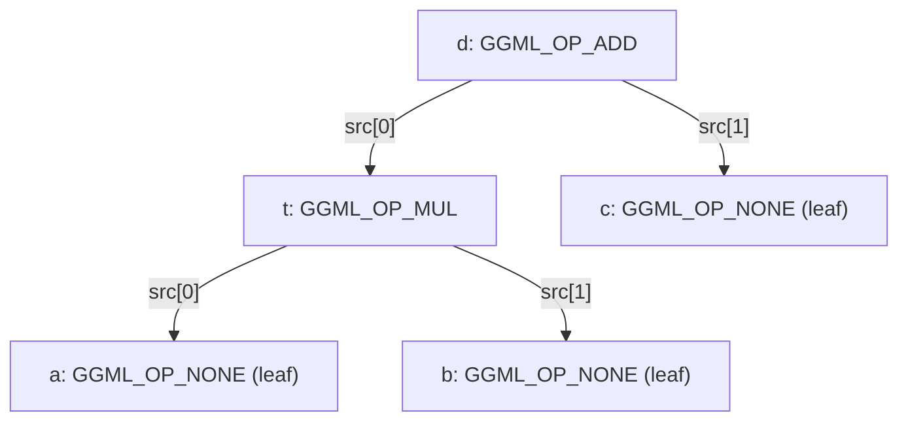
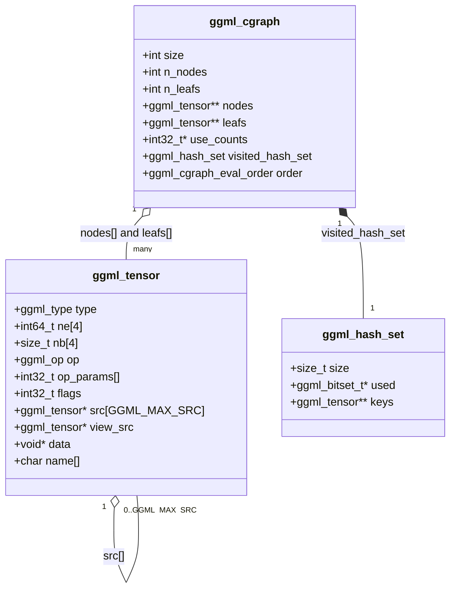
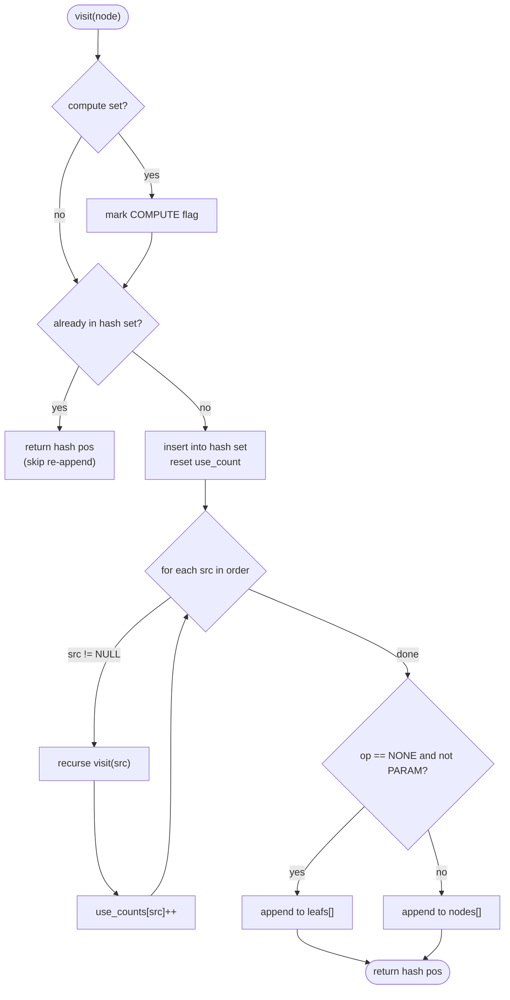
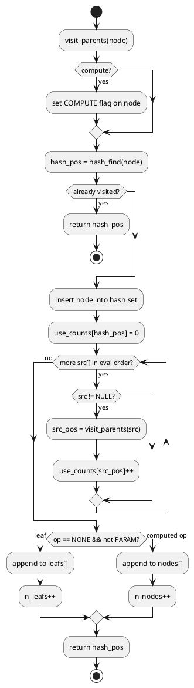
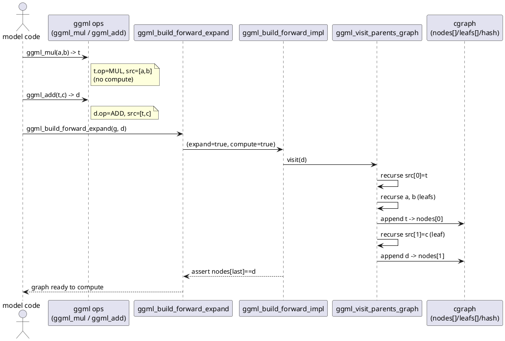
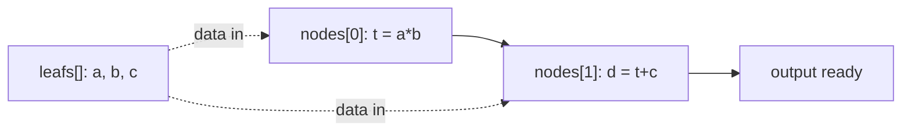

# ggml Tensors and the cgraph

This file is the heart of the GGUF->cgraph pipeline: it explains the two data
structures that everything else in llama.cpp builds on. The
[architecture code](04-graph-construction.md) you saw earlier ultimately just
calls `ggml_*` operator functions, and those functions build an implicit
expression DAG out of `struct ggml_tensor`. A `struct ggml_cgraph` then turns
that DAG into a flat, topologically ordered array of nodes that the
[backend scheduler](06-execution-and-scheduling.md) can execute.

If you only read one page to understand "how does a chain of `ggml_mul_mat` /
`ggml_add` calls become something runnable?", this is it.

---

## 1. `struct ggml_tensor` — value *and* computation in one struct

A ggml tensor is more than a buffer of numbers. It carries both the *data* (its
type, shape, strides, and a pointer to memory) and the *computation* that
produces it (an operation tag plus pointers to its operand tensors). That dual
role is what lets ggml build an expression graph lazily, without a separate
"node" type.

Here is the full definition, `struct ggml_tensor` (ggml/include/ggml.h:666-698):

```cpp
struct ggml_tensor {
    enum ggml_type type;

    struct ggml_backend_buffer * buffer;

    int64_t ne[GGML_MAX_DIMS]; // number of elements
    size_t  nb[GGML_MAX_DIMS]; // stride in bytes:
                               // nb[0] = ggml_type_size(type)
                               // nb[1] = nb[0]   * (ne[0] / ggml_blck_size(type)) + padding
                               // nb[i] = nb[i-1] * ne[i-1]

    // compute data
    enum ggml_op op;

    // op params - allocated as int32_t for alignment
    int32_t op_params[GGML_MAX_OP_PARAMS / sizeof(int32_t)];

    int32_t flags;

    struct ggml_tensor * src[GGML_MAX_SRC];

    // source tensor and offset for views
    struct ggml_tensor * view_src;
    size_t               view_offs;

    void * data;

    char name[GGML_MAX_NAME];

    void * extra; // extra things e.g. for ggml-cuda.cu

    char padding[8];
};
```

The fields that matter for graph construction:

| Field | Role |
|-------|------|
| `type` | Element type (`GGML_TYPE_F32`, quantized types, etc.). |
| `ne[4]` | Number of elements per dimension (the logical shape). |
| `nb[4]` | Stride **in bytes** per dimension. `nb[0]` is the element size; higher strides are cumulative. Non-contiguous strides are how views and transposes work without copying. |
| `op` | The operation that produces this tensor. `GGML_OP_NONE` means it is a leaf (an input, weight, or constant). `GGML_OP_ADD`, `GGML_OP_MUL_MAT`, etc. mean it is a computed node. |
| `op_params[]` | Small scalar parameters baked into the op (e.g. axis, epsilon, scale). |
| `src[GGML_MAX_SRC]` | Pointers to operand tensors. This is the **edge set** of the DAG: `src[0]`, `src[1]`, ... are the inputs this op consumes. |
| `view_src` / `view_offs` | If set, this tensor aliases another tensor's data at a byte offset (a view, e.g. a reshape or a slice). |
| `data` | Pointer to the actual bytes (filled in once memory is allocated by a backend). |
| `flags` | Bit flags such as `GGML_TENSOR_FLAG_PARAM` (trainable) and `GGML_TENSOR_FLAG_COMPUTE` (this node must be computed). |

The strides are computed once at tensor creation in
`ggml_new_tensor_impl` (ggml/src/ggml.c:1727):

```cpp
result->nb[0] = ggml_type_size(type);
result->nb[1] = result->nb[0]*(result->ne[0]/ggml_blck_size(type));
for (int i = 2; i < GGML_MAX_DIMS; i++) {
    result->nb[i] = result->nb[i - 1]*result->ne[i - 1];
}
```

A freshly created tensor is always a leaf: `ggml_new_tensor_impl` initializes
`op = GGML_OP_NONE` and `src = { NULL }` (ggml/src/ggml.c:1770-1785). It becomes
a *node* only when an operator function overwrites its `op` and links its
`src[]`.

---

## 2. Operators build an expression tree — they do not compute

This is the single most important mental shift coming from eager frameworks.
Calling `ggml_add(ctx, a, b)` does **not** add anything. It allocates a *result*
tensor shaped like `a`, tags it with the op, and wires up the operands. Look at
`ggml_add_impl` (ggml/src/ggml.c:2019):

```cpp
static struct ggml_tensor * ggml_add_impl(
        struct ggml_context * ctx,
        struct ggml_tensor  * a,
        struct ggml_tensor  * b,
        bool                  inplace) {
    GGML_ASSERT(ggml_can_repeat(b, a));

    struct ggml_tensor * result = inplace ? ggml_view_tensor(ctx, a) : ggml_dup_tensor(ctx, a);

    result->op     = GGML_OP_ADD;
    result->src[0] = a;
    result->src[1] = b;

    return result;
}
```

`ggml_add` (ggml/src/ggml.c:2035) is just the non-inplace wrapper. Every binary
and unary operator follows this exact pattern: allocate a result tensor, set
`result->op`, point `result->src[i]` at the operands, return. No arithmetic
happens; only pointers are recorded.

Because each result tensor *points back* at its operands through `src[]`,
chaining operator calls builds a directed acyclic graph (DAG) in memory, rooted
at the final output and with leaves at the original inputs and weights. Shared
subexpressions become shared pointers — the same tensor can appear in multiple
`src[]` slots.

### Worked example: `d = (a*b) + c`

```cpp
struct ggml_tensor * a = ggml_new_tensor_1d(ctx, GGML_TYPE_F32, N); // leaf
struct ggml_tensor * b = ggml_new_tensor_1d(ctx, GGML_TYPE_F32, N); // leaf
struct ggml_tensor * c = ggml_new_tensor_1d(ctx, GGML_TYPE_F32, N); // leaf

struct ggml_tensor * t = ggml_mul(ctx, a, b);   // t.op=MUL, src=[a,b]
struct ggml_tensor * d = ggml_add(ctx, t, c);   // d.op=ADD, src=[t,c]
```

After these calls, nothing has been computed. What exists is an expression tree
of `ggml_tensor` structs linked by `src[]`:



The arrows are `src[]` pointers — they point from a result *toward* its inputs.
To actually compute `d`, you must evaluate it bottom-up: first `t = a*b`, then
`d = t + c`. Producing that bottom-up order is exactly what the cgraph does.

---

## 3. `struct ggml_cgraph` — the executable schedule

The expression tree tells you the dependencies but not the order. The
computation graph linearizes it. Here is
`struct ggml_cgraph` (ggml/src/ggml-impl.h:329-347):

```cpp
struct ggml_cgraph {
    int size;    // maximum number of nodes/leafs/grads/grad_accs
    int n_nodes; // number of nodes currently in use
    int n_leafs; // number of leafs currently in use

    struct ggml_tensor ** nodes;     // tensors with data that can change if the graph is evaluated
    struct ggml_tensor ** grads;     // the outputs of these tensors are the gradients of the nodes
    struct ggml_tensor ** grad_accs; // accumulators for node gradients
    struct ggml_tensor ** leafs;     // tensors with constant data
    int32_t             * use_counts;// number of uses of each tensor, indexed by hash table slot

    struct ggml_hash_set visited_hash_set;

    enum ggml_cgraph_eval_order order;

    // an optional identifier ...
    uint64_t uid;
};
```

Key arrays:

- **`nodes[]`** — operation tensors (`op != GGML_OP_NONE`) in **topological
  execution order**. Iterating `nodes[0..n_nodes)` and computing each one in turn
  is guaranteed to have every operand ready by the time it is reached. This is
  the schedule.
- **`leafs[]`** — leaf tensors (inputs, weights, constants) that are *not*
  computed but are referenced by nodes.
- **`use_counts[]`** — reference count per tensor, indexed by hash slot. Used by
  the [allocator](06-execution-and-scheduling.md) to know when a buffer can be
  freed/reused.
- **`visited_hash_set`** — a `struct ggml_hash_set` used during construction to
  ensure each tensor is added exactly once, even when shared by many parents.

### The hash set

`struct ggml_hash_set` (ggml/src/ggml-impl.h:226-230) is a flat,
linear-probing table keyed on the tensor *pointer*:

```cpp
struct ggml_hash_set {
    size_t size;
    ggml_bitset_t * used;       // whether or not the keys are in use i.e. set
    struct ggml_tensor ** keys; // actual tensors in the set
};
```

The hash is literally the pointer shifted right by 4 bits (alignment guarantees
the low bits are zero), see `ggml_hash` (ggml/src/ggml-impl.h:254).
`ggml_hash_find` (ggml/src/ggml-impl.h:259) and
`ggml_hash_insert` (ggml/src/ggml-impl.h:279) do the probing. The graph
allocates the table at `size * 2` slots so it can hold both nodes and leafs, see
`ggml_new_graph_custom` (ggml/src/ggml.c:7095).

### Class diagram



A cgraph is allocated empty by `ggml_new_graph` /
`ggml_new_graph_custom` (ggml/src/ggml.c:7095-7142); the default size is
`GGML_DEFAULT_GRAPH_SIZE`. It starts with `n_nodes = 0` and `n_leafs = 0` and is
filled in by the forward-expand pass below.

---

## 4. `ggml_build_forward_expand` — turning the tree into an ordered array

The public entry point is tiny —
`ggml_build_forward_expand` (ggml/src/ggml.c:6959):

```cpp
void ggml_build_forward_expand(struct ggml_cgraph * cgraph, struct ggml_tensor * tensor) {
    ggml_build_forward_impl(cgraph, tensor, true, true);
}
```

`ggml_build_forward_impl` (ggml/src/ggml.c:6926) records the current node
count, kicks off the recursive visit, then asserts that the very last node
appended is the output `tensor` you passed in (a sanity check that the root sits
at the top of the topological order):

```cpp
const int n_old = cgraph->n_nodes;

ggml_visit_parents_graph(cgraph, tensor, compute);

const int n_new = cgraph->n_nodes - n_old;
...
if (n_new > 0) {
    // the last added node should always be starting point
    GGML_ASSERT(cgraph->nodes[cgraph->n_nodes - 1] == tensor);
}
```

Note that expand is *additive*: you can call `ggml_build_forward_expand`
multiple times against the same cgraph (for multiple outputs), and each call
appends whatever new nodes it discovers without disturbing the existing schedule.

### The recursive visitor

All the real work is in
`ggml_visit_parents_graph` (ggml/src/ggml.c:6858). It is a classic
depth-first, post-order traversal: a node is appended to the graph **only after
all of its sources have been appended**, which is precisely what produces a
topological order.

The algorithm, step by step:

1. If `compute`, set the `GGML_TENSOR_FLAG_COMPUTE` flag on the node
   (ggml/src/ggml.c:6859-6861).
2. Look the node up in `visited_hash_set`. If it is already marked used, this is
   a shared subexpression we have already added — return immediately without
   re-appending (ggml/src/ggml.c:6866-6880). This dedup is what keeps a DAG from
   being expanded into an exponential tree.
3. Otherwise mark it visited, reset its `use_counts` slot to 0
   (ggml/src/ggml.c:6883-6885).
4. **Recurse into every `src[]` first**, in `LEFT_TO_RIGHT` or `RIGHT_TO_LEFT`
   order per `cgraph->order`, and bump the use count of each operand
   (ggml/src/ggml.c:6887-6900):

   ```cpp
   for (int i = 0; i < GGML_MAX_SRC; ++i) {
       const int k =
           (cgraph->order == GGML_CGRAPH_EVAL_ORDER_LEFT_TO_RIGHT) ? i :
           (cgraph->order == GGML_CGRAPH_EVAL_ORDER_RIGHT_TO_LEFT) ? (GGML_MAX_SRC-1-i) :
           i;

       struct ggml_tensor * src = node->src[k];
       if (src) {
           const size_t src_hash_pos = ggml_visit_parents_graph(cgraph, src, compute);
           cgraph->use_counts[src_hash_pos]++;
       }
   }
   ```

5. Only **after** the recursion returns, classify and append this node
   (ggml/src/ggml.c:6902-6921):
   - If `op == GGML_OP_NONE` and it is **not** a `PARAM`, it is a leaf
     (constant/input/weight) -> append to `leafs[]`.
   - Otherwise it is a computed op (or a trainable parameter) -> append to
     `nodes[]`.

```cpp
if (node->op == GGML_OP_NONE && !(node->flags & GGML_TENSOR_FLAG_PARAM)) {
    // reached a leaf node ...
    cgraph->leafs[cgraph->n_leafs] = node;
    cgraph->n_leafs++;
} else {
    cgraph->nodes[cgraph->n_nodes] = node;
    cgraph->n_nodes++;
}
```

Because the append happens *after* visiting children, every operand of a node
already occupies a lower index in `nodes[]` (or is a leaf). Iterating `nodes[]`
front-to-back is therefore a valid execution order.

### Flowchart of the visit



### Running the example through the visitor

Recall `d = (a*b) + c`, built as `t = mul(a,b)` then `d = add(t,c)`. Calling
`ggml_build_forward_expand(g, d)` triggers
`visit(d)`. With `LEFT_TO_RIGHT` order the recursion unfolds as:

```
visit(d)               # ADD, not yet seen -> recurse into src[]
  visit(t)             # src[0] of d -> MUL, not seen -> recurse
    visit(a)           # src[0] of t -> leaf -> append to leafs[0]
    visit(b)           # src[1] of t -> leaf -> append to leafs[1]
  append t  -> nodes[0]   # both srcs of t done
  visit(c)             # src[1] of d -> leaf -> append to leafs[2]
append d   -> nodes[1]     # both srcs of d done
```

Result:

| `leafs[]` | `nodes[]` (execution order) |
|-----------|-----------------------------|
| `[a, b, c]` | `[t, d]` |

`t` (the multiply) lands at `nodes[0]`, `d` (the add) at `nodes[1]`. The
scheduler can now blindly walk `nodes[]`: compute `t = a*b`, then `d = t + c`.
The DAG has become a flat, dependency-respecting array. The `GGML_ASSERT` in
`ggml_build_forward_impl` confirms `nodes[n_nodes-1] == d`, i.e. the requested
output is last.

### PlantUML: the recursion as an activity diagram



### PlantUML: build pipeline as a sequence



---

## 5. `ggml_graph_compute` at a high level

Once `nodes[]` is populated and memory is allocated, execution is conceptually
a single loop over the schedule. The CPU backend entry point is
`ggml_graph_compute` (ggml/src/ggml-cpu/ggml-cpu.c:3303). It takes the cgraph
plus a `ggml_cplan` (work-buffer size and thread count) and, for each node in
`nodes[0..n_nodes)`, dispatches to that node's operation kernel using the node's
`op`, `op_params[]`, and `src[]` operands as inputs and the node's own `data`
buffer as output. Because the array is topologically sorted, every operand a
node reads has already been produced by an earlier node (or is a leaf with data
already present).



In the real pipeline you rarely call `ggml_graph_compute` directly. The
[backend scheduler](06-execution-and-scheduling.md)
(`ggml_backend_sched`) walks the same `nodes[]` array but additionally assigns
each node to a backend (CPU, Metal, CUDA, ...), inserts copies across device
boundaries, and manages buffer allocation via the `use_counts[]` recorded during
the visit. The cgraph produced here is the contract between graph *construction*
and graph *execution*: construction guarantees topological order and dedup;
execution just consumes the array.

---

## How this connects to the rest of the pipeline

- The [architecture graph builders](04-graph-construction.md) call the `ggml_*`
  operator functions described in section 2 to assemble the per-architecture
  forward expression, then hand the output tensor(s) to
  `ggml_build_forward_expand`.
- The leaf tensors in `leafs[]` are largely the weights loaded from the
  [GGUF file](01-gguf-and-loading.md) plus the input/KV tensors.
- The ordered `nodes[]` array is consumed by
  [execution and scheduling](06-execution-and-scheduling.md).
- See the [end-to-end walkthrough](07-simple-example-walkthrough.md) for a
  single concrete trace from file to logits.

---

## Key takeaways

- A `struct ggml_tensor` encodes both **data** (`type`, `ne[]`, `nb[]`, `data`)
  and **computation** (`op`, `op_params[]`, `src[]`); a fresh tensor is a leaf
  with `op == GGML_OP_NONE`, see `ggml_new_tensor_impl` (ggml/src/ggml.c:1727).
- Operator functions like `ggml_add` (ggml/src/ggml.c:2035) do **not** compute —
  they allocate a result tensor, set its `op`, and link `src[]`, building an
  implicit expression **DAG** in memory.
- `struct ggml_cgraph` (ggml/src/ggml-impl.h:329) holds the linearized graph:
  `nodes[]` (ops in topological order), `leafs[]` (constants/inputs), a
  `use_counts[]` array, and a `visited_hash_set` for dedup.
- `ggml_build_forward_expand` (ggml/src/ggml.c:6959) ->
  `ggml_visit_parents_graph` (ggml/src/ggml.c:6858) does a post-order DFS:
  recurse into `src[]` first, then append the node — guaranteeing every operand
  precedes its consumer in `nodes[]`.
- The `visited_hash_set` (pointer-keyed, linear probing) ensures each shared
  tensor is appended exactly once, turning a DAG into a clean ordered array
  rather than an exploded tree.
- `ggml_graph_compute` (ggml/src/ggml-cpu/ggml-cpu.c:3303) and the backend
  scheduler simply iterate `nodes[]` front-to-back; the topological order built
  here is what makes that single pass correct.
