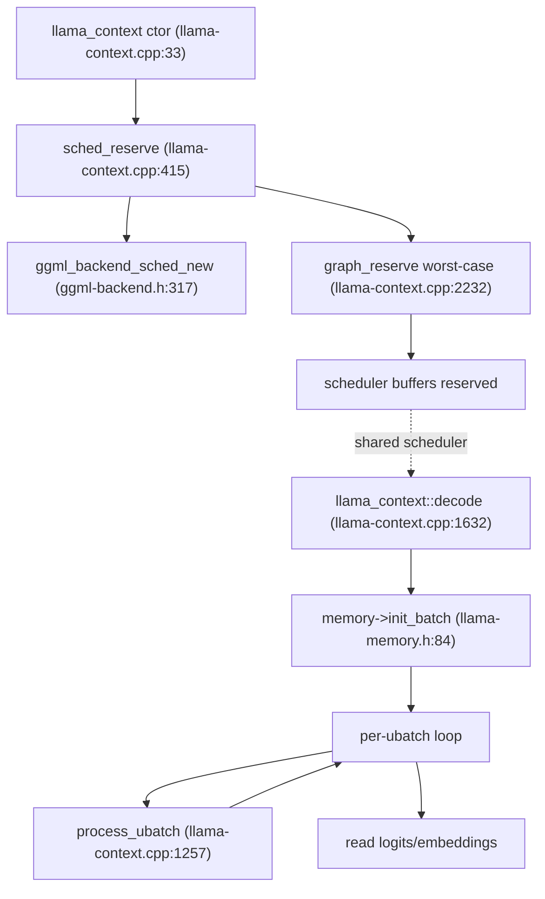
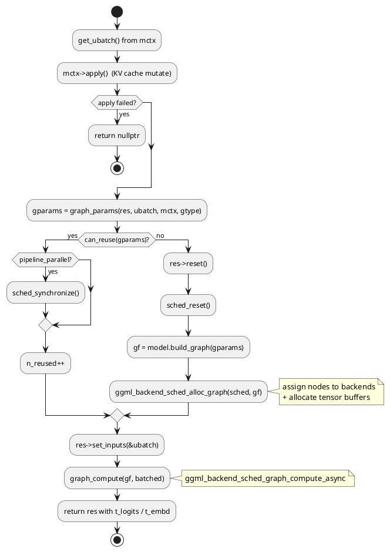
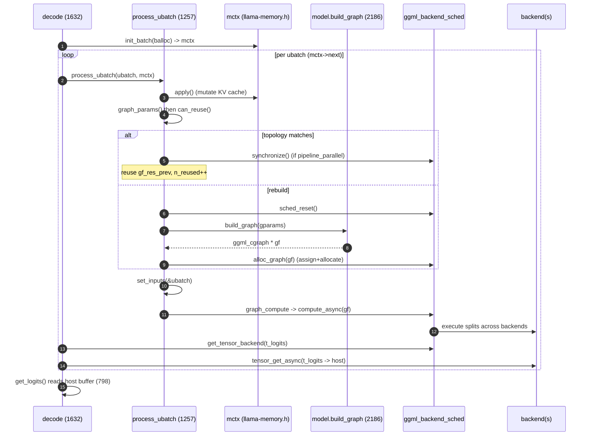
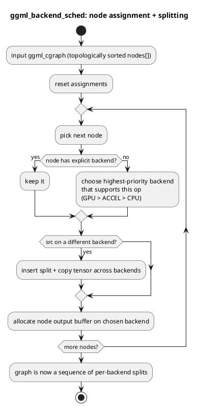
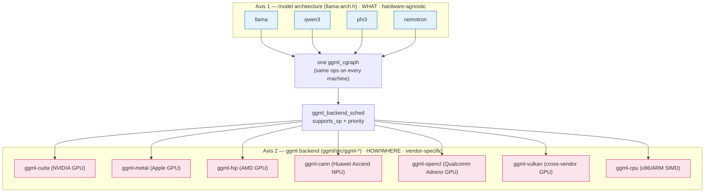
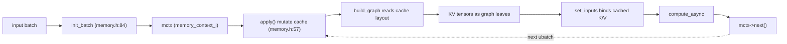

# Allocation, scheduling & execution

This file is the payoff of the GGUF→cgraph pipeline. The earlier files showed how a model is loaded ([01-gguf-and-loading.md](01-gguf-and-loading.md)), how its architecture and hyper-parameters are resolved ([02-architecture-registry.md](02-architecture-registry.md), [03-hparams-and-tensors.md](03-hparams-and-tensors.md)), how a per-token computation graph is *constructed* ([04-graph-construction.md](04-graph-construction.md)), and how that graph is represented as a `ggml_cgraph` ([05-ggml-cgraph.md](05-ggml-cgraph.md)). Here we close the loop: given a constructed graph, how does `llama_context` **allocate** tensor memory across backends, **schedule** nodes onto devices, **execute** the DAG, and **read back** logits — and how does it reuse graphs and KV-cache memory across tokens to keep the decode hot path fast.

The central object is `llama_context` (`src/llama-context.h:41`). It owns the scheduler, the backends, the KV-cache/memory module, and the host-side output buffers. Everything below hangs off it.

---

## 1. The big picture: reserve once, decode many

There are two distinct phases:

1. **Context init (one-time, worst-case)** — In the constructor `llama_context::llama_context` (`src/llama-context.cpp:33`), the context builds backends and output buffers, then calls `llama_context::sched_reserve` (`src/llama-context.cpp:415`). This creates the `ggml_backend_sched_t` scheduler and *reserves* compute buffers by building the largest graph the context could ever need (a "worst-case" graph with dummy inputs). After this, no large allocations should happen on the hot path.

2. **Per-decode (repeated, hot path)** — `llama_context::decode` (`src/llama-context.cpp:1632`) splits each input batch into micro-batches (ubatches), and for each ubatch calls `llama_context::process_ubatch` (`src/llama-context.cpp:1257`) which either reuses the previous graph or builds a fresh one, allocates it, sets inputs, computes, and reads outputs.



The scheduler created in `sched_reserve` is **shared** across every subsequent `build_graph` / `alloc_graph` call. Reserving worst-case sizes up front means later allocations fit inside buffers the scheduler already owns.

---

## 2. Reserving the worst-case graph at init

`sched_reserve` is guarded by a `sched_need_reserve` flag, so it is idempotent and only re-runs when topology might have changed (LoRA changes, sampler changes, Flash-Attention auto-resolution). It picks the largest plausible ubatch and asks the model how many graph nodes that implies:

```cpp
void llama_context::sched_reserve() {
    if (!sched_need_reserve) {
        return;
    }
    sched_need_reserve = false;
    LLAMA_LOG_INFO("%s: reserving ...\n", __func__);
    synchronize();
    const int64_t t_start_us = ggml_time_us();
    const uint32_t n_seqs   = cparams.n_seq_max;
    const uint32_t n_tokens = std::min(cparams.n_ctx, cparams.n_ubatch);
    const size_t max_nodes  = this->graph_max_nodes(n_tokens);
    gf_res_prev.reset(new llm_graph_result(max_nodes));
    gf_res_reserve.reset(new llm_graph_result(max_nodes));
    sched.reset(ggml_backend_sched_new(backend_ptrs.data(), backend_buft.data(),
        backend_ptrs.size(), max_nodes, cparams.pipeline_parallel, cparams.op_offload));
    // ... init memory module, resolve Flash Attention, then graph_reserve(...)
```
*(`src/llama-context.cpp:415`)*

Two things are pre-allocated here that matter for the hot path:

- **`gf_res_prev` and `gf_res_reserve`** — two `llm_graph_result` containers (`src/llama-graph.h:696`), each sized for `max_nodes`. `gf_res_prev` holds the *previous* decode's graph so it can be reused; `gf_res_reserve` is the scratch container used during reservation. Pre-sizing them avoids reallocating result/graph storage during decode.
- **The scheduler itself** via `ggml_backend_sched_new` (`ggml/include/ggml-backend.h:317`), wired with every backend (`backend_ptrs`), its buffer types (`backend_buft`), `max_nodes` capacity, the `pipeline_parallel` flag, and the `op_offload` flag.

The actual buffer sizing is done by `llama_context::graph_reserve` (`src/llama-context.cpp:2232`), which builds a graph from a *dummy* ubatch and either just splits it (`split_only=true`) or fully reserves per-backend buffer sizes. Because the graph it builds is the largest one possible, every real decode graph will fit.

> Gotcha: `sched_reserve` calls `synchronize()` first — you cannot resize scheduler buffers while a previous async compute is in flight. And it must be re-run whenever graph topology could change (LoRA, samplers, flash-attn resolution); otherwise the reserved buffers may be too small for a newly-shaped graph.

---

## 3. The decode entry point and the ubatch loop

`llama_context::decode` (`src/llama-context.cpp:1632`) is the public per-step driver. Its skeleton:

1. Allocate the incoming batch into the batch allocator (`balloc->init(...)`).
2. Hand the batch to the memory module: `memory->init_batch` (`src/llama-memory.h:84`) splits it into ubatches and reserves KV-cache slots, returning a stateful `llama_memory_context_i` (`src/llama-memory.h:49`).
3. Loop over ubatches via `mctx->get_ubatch()` / `mctx->next()`, calling `process_ubatch` for each.
4. After each ubatch computes, asynchronously copy logits/embeddings from device to host buffers.

```cpp
// memory init + ubatch loop (paraphrased from src/llama-context.cpp:1722-1854)
mctx = memory->init_batch(*balloc, cparams.n_ubatch, output_all);
if (!mctx || mctx->get_status() != LLAMA_MEMORY_STATUS_SUCCESS) { /* handle failure */ }
do {
    const auto & ubatch = mctx->get_ubatch();
    ggml_status status;
    const auto * res = process_ubatch(ubatch, ctx_type_to_graph_type(...), mctx.get(), status);
    if (!res) { /* rollback memory: seq_rm from pos_min */ }

    // extract logits asynchronously
    if (logits.data && t_logits && n_outputs > 0) {
        ggml_backend_t backend_res = ggml_backend_sched_get_tensor_backend(sched.get(), t_logits);
        float * logits_out = logits.data + n_outputs_prev*n_vocab;
        ggml_backend_tensor_get_async(backend_res, t_logits, logits_out, /*...*/);
    }
    // extract embeddings similarly (handling pooling: NONE/MEAN/CLS/LAST/RANK)
    n_outputs_prev += n_outputs;
} while (mctx->next());
```

The loop accumulates `n_outputs_prev` and `n_tokens_prev` so that a logical batch split across several ubatches lands in the right slice of the contiguous host buffer. The output read uses `ggml_backend_sched_get_tensor_backend` to discover *which* backend the scheduler placed `t_logits` on, then copies from that device.

> Gotcha: a single logical batch can be split into multiple ubatches purely because of KV-cache capacity. The memory context is stateful — you must consume each ubatch via `next()` and check `get_status()` before proceeding. On failure mid-loop, decode rolls back the cache for the affected sequences (`memory->seq_rm`).

---

## 4. The per-ubatch core: reuse, build, allocate, compute

`process_ubatch` (`src/llama-context.cpp:1257`) is where allocation, scheduling, and execution actually happen. It is worth reading in full:

```cpp
llm_graph_result * llama_context::process_ubatch(const llama_ubatch & ubatch,
        llm_graph_type gtype, llama_memory_context_i * mctx, ggml_status & ret) {
    if (mctx && !mctx->apply()) {              // (1) mutate KV cache for this ubatch
        ret = GGML_STATUS_FAILED;
        return nullptr;
    }
    auto * res = gf_res_prev.get();
    auto * gf  = res->get_gf();
    const auto gparams = graph_params(res, ubatch, mctx, gtype);   // (2) describe topology

    if (!graph_reuse_disable && res->can_reuse(gparams)) {         // (3) reuse path
        if (cparams.pipeline_parallel) {
            ggml_backend_sched_synchronize(sched.get());
        }
        n_reused++;
    } else {                                                       // (4) rebuild path
        res->reset();
        ggml_backend_sched_reset(sched.get());
        ggml_backend_sched_set_eval_callback(sched.get(), /*...*/);
        gf = model.build_graph(gparams);                           //     construct cgraph
        if (!gf || !ggml_backend_sched_alloc_graph(sched.get(), gf)) {  // assign + allocate
            ret = GGML_STATUS_ALLOC_FAILED;
            return nullptr;
        }
    }

    res->set_inputs(&ubatch);                                      // (5) bind input data
    const auto status = graph_compute(res->get_gf(), ubatch.n_tokens > 1); // (6) execute async
    if (status != GGML_STATUS_SUCCESS) { ret = status; return nullptr; }

    ret = GGML_STATUS_SUCCESS;
    return res;
}
```
*(`src/llama-context.cpp:1257`)*

Walking the six numbered steps:

1. **Apply memory state** — `mctx->apply()` (`src/llama-memory.h:57`) mutates the KV cache for *this* ubatch: it performs slot assignment, shifts, and copies needed before the graph runs. This must happen before allocation because the cache layout informs the graph's view tensors.
2. **Describe topology** — `llama_context::graph_params` (`src/llama-context.cpp:2291`) packs the current state (ubatch shape, `cparams`, `sched`, adapters, memory context, sampler configs) into an `llm_graph_params` (`src/llama-graph.h:588`). These parameters *uniquely determine the graph topology*.
3. **Reuse check** — `llm_graph_result::can_reuse` (`src/llama-graph.h:723`) compares the new `gparams` against the ones baked into `gf_res_prev`. If they match, the previously-built-and-allocated graph is reused verbatim — no `build_graph`, no `alloc_graph`.
4. **Rebuild** — Otherwise reset the result and the scheduler, then call `llama_model::build_graph` (`src/llama-model.cpp:2186`) to construct a fresh `ggml_cgraph`, and `ggml_backend_sched_alloc_graph` to assign nodes to backends and allocate their tensors.
5. **Set inputs** — `llm_graph_result::set_inputs` (`src/llama-graph.h:715`) binds token ids, positions, sequence ids, and cached KV values into the graph's input tensors. This runs on *both* paths — even a reused graph needs fresh input data for the new tokens.
6. **Compute** — `llama_context::graph_compute` (`src/llama-context.cpp:2315`) launches asynchronous execution.



> Key distinction: `ggml_backend_sched_alloc_graph` does **not** run the graph. It only assigns each node to a backend and allocates the tensor buffers. Execution is a separate call (step 6). Allocation happens at line 1300; execution at line 2334.

---

## 5. Graph and result reuse across tokens

The single biggest hot-path optimization is *not rebuilding the graph every token*. During autoregressive generation, consecutive ubatches usually have identical topology (one new token, same context config), so the previously built and allocated graph can be reused — only the input tensor *contents* change.

The decision lives in `llm_graph_result::can_reuse` (`src/llama-graph.h:723`), which delegates to `llm_graph_params::allow_reuse` (`src/llama-graph.h:631`):

```cpp
bool allow_reuse(const llm_graph_params & other) const {
    bool can_reuse_ubatch =
        ubatch.equal_seqs() == other.ubatch.equal_seqs() &&
        ubatch.n_tokens     == other.ubatch.n_tokens     &&
        ubatch.n_seq_tokens == other.ubatch.n_seq_tokens &&
        ubatch.n_seqs       == other.ubatch.n_seqs       &&
        ubatch.n_seqs_unq   == other.ubatch.n_seqs_unq   &&
        ((!ubatch.token && !other.ubatch.token) ||
         (!ubatch.embd  && !other.ubatch.embd)  ||
         (ubatch.token && other.ubatch.token && ubatch.embd && other.ubatch.embd));
    // ... if equal_seqs, also compare seq_id_unq[] ...
    if (!can_reuse_ubatch) return false;
    if (n_outputs != other.n_outputs) return false;
    if (!samplers_equal(samplers, other.samplers)) return false;
    return cparams.embeddings  == other.cparams.embeddings &&
           cparams.causal_attn == other.cparams.causal_attn && /* ... */;
}
```
*(`src/llama-graph.h:631`)*

The reuse test is **topology-based**: it compares ubatch shape (`n_tokens`, `n_seqs`, `n_seq_tokens`, `n_seqs_unq`), `n_outputs`, attention/embedding config, sampler state, and adapter state. It deliberately does **not** require identical token ids or positions — those are data, not topology, and get rebound via `set_inputs`. When reuse succeeds, `process_ubatch` skips `build_graph` and `alloc_graph` entirely and just increments `n_reused`.

> Gotcha: because reuse is topology-only, a graph reused for new tokens is correct precisely because `set_inputs` re-binds the new token ids, positions, and KV-cache views every time. The graph structure is identical; only the leaf data differs. Under `pipeline_parallel`, the previous async compute may still be reading the old input tensors, so reuse must `ggml_backend_sched_synchronize` before overwriting inputs (line 1277-1279).



---

## 6. The scheduler: assigning nodes to backends and splitting

`ggml_backend_sched` (opaque in `ggml/include/ggml-backend.h`) is the component that turns a device-agnostic `ggml_cgraph` into work distributed across heterogeneous backends (GPU, ACCEL, CPU). Three calls matter:

- **`ggml_backend_sched_new`** (`ggml/include/ggml-backend.h:317`) — constructs the scheduler over an ordered list of backends and their buffer types, with `max_nodes` capacity. `parallel=true` enables pipeline parallelism; `op_offload=true` lets it offload individual ops to whichever backend can run them. Backend *order* in the array encodes priority.
- **`ggml_backend_sched_alloc_graph`** — walks the graph's nodes, decides which backend each node runs on (respecting backend priority and op support), inserts **splits** at backend boundaries (where a tensor must be copied from one device to another), and allocates each node's output buffer on the chosen backend.
- **`ggml_backend_sched_graph_compute_async`** — executes the splits in dependency order, performing inter-backend data transfers where the graph crosses device boundaries, and returns `GGML_STATUS_SUCCESS` on success.



A useful mental model: `alloc_graph` produces a partition of `cgraph->nodes[]` into contiguous "splits", each split owned by one backend, with copy operations stitched between splits. `compute_async` then runs split 0 on its backend, copies its outputs to the next backend's memory if needed, runs split 1, and so on. With `pipeline_parallel`, multiple splits can be in flight at once.

`llama_context::graph_compute` (`src/llama-context.cpp:2315`) wraps the compute call, but first it sets per-backend thread counts (using `n_threads_batch` for multi-token ubatches and `n_threads` for single-token decode) and the CPU threadpool:

```cpp
ggml_status llama_context::graph_compute(ggml_cgraph * gf, bool batched) {
    int n_threads        = batched ? cparams.n_threads_batch : cparams.n_threads;
    ggml_threadpool_t tp = batched ? threadpool_batch        : threadpool;
    if (backend_cpu != nullptr) { /* set CPU threadpool via reg proc address */ }
    for (const auto & set_n_threads_fn : set_n_threads_fns) {
        set_n_threads_fn.second(set_n_threads_fn.first, n_threads);
    }
    auto status = ggml_backend_sched_graph_compute_async(sched.get(), gf);
    // ...
    return status;
}
```
*(`src/llama-context.cpp:2315`)*

---

## 7. Architecture vs. backend: two orthogonal axes

A frequent point of confusion: **does the predefined architecture pick the hardware?** Is there an "NVIDIA llama" or a "Qualcomm qwen"? No. The architecture and the hardware backend are *completely decoupled* axes, and the scheduler in Section 6 is exactly the seam where they meet.

- **Axis 1 — model architecture** (`LLM_ARCH_*`, `LLM_ARCH_NAMES` at `src/llama-arch.cpp:9`): answers **what** to compute. The ~140 names are all *model families* — `llama`, `qwen3`, `phi3`, `gemma3`, `deepseek2`, `nemotron`, … None encodes a vendor or chip. The per-architecture builder ([04-graph-construction.md](04-graph-construction.md)) emits a `ggml_cgraph` of device-agnostic ops (`ggml_mul_mat`, `ggml_rope_ext`, `ggml_soft_max_ext`).
- **Axis 2 — ggml backend** (`ggml/src/ggml-{cuda,metal,vulkan,sycl,cann,hip,musa,opencl,webgpu,cpu}`): answers **how/where** to compute. Each backend implements the *same* ggml op set behind one interface — `ggml_backend_supports_op` (`ggml/include/ggml-backend.h:108`) — and is classified by device type `GGML_BACKEND_DEVICE_TYPE_{CPU,GPU,IGPU,ACCEL}` (`ggml/include/ggml-backend.h:136`).

The same `llama` graph is built **identically** regardless of hardware; `ggml_backend_sched_alloc_graph` then assigns each node to a device whose `supports_op` returns true, and that device's kernels run it. A `qwen3` GGUF runs the same architecture graph on an NVIDIA GPU, an Apple GPU, or a Huawei NPU — only the per-op kernel implementation differs.



### Backend → hardware map

| ggml backend | Target hardware | Selected by |
| --- | --- | --- |
| `ggml-cuda` | NVIDIA GPU | build flag `GGML_CUDA`, runtime device enumeration |
| `ggml-hip` | AMD GPU (ROCm) | `GGML_HIP` |
| `ggml-metal` | Apple GPU (M-series / iGPU) | `GGML_METAL` |
| `ggml-sycl` | Intel GPU (oneAPI) | `GGML_SYCL` |
| `ggml-vulkan` | Cross-vendor GPU (NVIDIA/AMD/Intel/Adreno/Mali) | `GGML_VULKAN` |
| `ggml-cann` | Huawei Ascend **NPU** | `GGML_CANN` |
| `ggml-opencl` | Qualcomm Adreno GPU (mobile) | `GGML_OPENCL` |
| `ggml-musa` | Moore Threads GPU | `GGML_MUSA` |
| `ggml-webgpu` | Browser / WebGPU | `GGML_WEBGPU` |
| `ggml-cpu` | x86 (AVX/AVX-512), ARM (NEON/SVE) | always available |

None of these is chosen in `llama-arch.cpp`. The backend is selected at **build time** (CMake `option(GGML_* ...)`) and **runtime** (device enumeration + the scheduler), never at the architecture level.

### The names that look vendor-specific but aren't

Some arch names *look* like hardware but name the org that **trained the weights**, not the silicon they must run on:

| Arch name | Reality |
| --- | --- |
| `nemotron`, `nemotron_h` | NVIDIA-*trained* model family. Runs unchanged on Apple, AMD, or CPU. |
| `grok` | xAI's model lineage. |
| `phi*` / `qwen*` / `gemma*` | Microsoft / Alibaba / Google model families — origin of the weights, not a target chip. |

### NPU / TPU specifically

- **NPU:** supported as a *backend*, not an arch — `ggml-cann` targets Huawei Ascend NPUs; Qualcomm's path is `ggml-opencl` on Adreno GPUs. The model architecture is untouched either way.
- **TPU:** there is no Google-TPU backend in llama.cpp (TPUs are XLA/JAX-oriented), so the question does not arise.

The takeaway: the real space is the **matrix** `{model architecture} × {ggml backend}`. Section 6's scheduler is what makes the product work — it takes one hardware-agnostic graph and dispatches its nodes to whatever vendor kernels are present.

> This raises a deeper question: don't different vendors need different *ops, partitioning, and memory layouts* — i.e. different topologies? They do, but llama.cpp absorbs that across four layers (only one of which changes the node list), all keyed on op *capability* rather than vendor name. That is its own chapter: see [08-hardware-divergence.md](08-hardware-divergence.md).

---

## 8. KV-cache memory participation

The KV cache is not a side table the graph reads from — it is woven into the graph itself, and the memory module mediates that. The interface is `llama_memory_context_i` (`src/llama-memory.h:49`):

- **`init_batch`** (`src/llama-memory.h:84`) — called once per `decode`, it splits the batch into ubatches *and* reserves KV-cache slots for them, returning the stateful context.
- **`apply`** (`src/llama-memory.h:57`) — called once per ubatch inside `process_ubatch`, it mutates the cache: assigns slots, performs defragmentation shifts, and copies. After `apply`, the cache layout is fixed for this ubatch.
- **`next`** / **`get_ubatch`** / **`get_status`** — drive the loop and report success/failure.

Crucially, the same `mctx` is passed into `graph_params` and therefore into `model.build_graph`. The graph builder reads the cache's current layout (slot offsets, sizes) to construct the attention tensors — the KV-cache tensors become *leaf inputs* in the cgraph, and `set_inputs` binds the cached K/V values into them. So the cache participates in three places: (a) it's mutated by `apply` before the graph, (b) its layout shapes the graph topology at build time, and (c) its data is bound as inputs before compute. Because cache layout is part of topology, a change in cache occupancy can defeat graph reuse.



---

## 9. Reading the outputs

After `compute_async` launches, decode immediately issues asynchronous device→host copies of the result tensors:

- `ggml_backend_sched_get_tensor_backend(sched, t_logits)` finds the backend that holds the logits tensor.
- `ggml_backend_tensor_get_async(backend, t_logits, logits_out, ...)` (`src/llama-context.cpp:1852`) copies logits into the host `logits` buffer at the correct offset.
- The same pattern at `src/llama-context.cpp:1872` copies embeddings into the host `embd` buffer, handling pooling modes `NONE`/`MEAN`/`CLS`/`LAST`/`RANK`.

When the caller later invokes `llama_context::get_logits` (`src/llama-context.cpp:798`) or `llama_context::get_embeddings` (`src/llama-context.cpp:853`), it gets a pointer into the host buffer, after an `output_reorder()` that puts rows back in the user's batch order. By then the async copy is guaranteed complete (synchronization happens implicitly through the scheduler's ordering and the reorder step).

> Gotcha: both the compute and the output copies are *async*. `get_logits()` assumes the copy has finished — correctness relies on the implicit synchronization performed before the host buffer is read, not on an explicit per-call sync.

For an end-to-end trace of a single `llama_decode` call from `simple.cpp`, see [07-simple-example-walkthrough.md](07-simple-example-walkthrough.md).

---

## Key takeaways

- **Reserve once, decode many.** `sched_reserve` (`src/llama-context.cpp:415`) builds a worst-case graph at init so the hot path never allocates large buffers; the scheduler and `gf_res_prev`/`gf_res_reserve` containers are shared across all decodes.
- **`process_ubatch` is the core loop body** (`src/llama-context.cpp:1257`): apply memory → check reuse → (build + alloc if needed) → set inputs → compute async.
- **Allocation and execution are separate.** `ggml_backend_sched_alloc_graph` only assigns nodes to backends and allocates tensors (line 1300); `ggml_backend_sched_graph_compute_async` runs them (line 2334).
- **Graph reuse is topology-based.** `llm_graph_params::allow_reuse` (`src/llama-graph.h:631`) compares ubatch shape, output count, attention/embedding config, sampler and adapter state — not token data — so consecutive single-token decodes reuse the same allocated graph and only rebind inputs.
- **The scheduler partitions the cgraph into per-backend splits** by priority (GPU > ACCEL > CPU), inserting cross-device copies and (optionally) pipelining them.
- **Architecture and backend are orthogonal axes.** `LLM_ARCH_*` (`src/llama-arch.cpp:9`) is hardware-agnostic — there is no "NVIDIA llama" or "Qualcomm qwen"; vendor specificity lives entirely in the ggml backends (`ggml-cuda`, `ggml-metal`, `ggml-cann` NPU, `ggml-opencl` Adreno, …), each implementing the same op set behind `ggml_backend_supports_op` (`ggml/include/ggml-backend.h:108`). The same graph runs on any backend; names like `nemotron`/`grok` denote the *training org*, not target silicon.
- **The KV cache is part of the graph.** `mctx->apply()` mutates it before build, its layout shapes graph topology, and `set_inputs` binds cached K/V as leaf inputs — so cache changes can invalidate graph reuse.
- **Outputs are read back asynchronously** via `ggml_backend_tensor_get_async`; `get_logits`/`get_embeddings` return host buffers after an implicit sync and a row reorder.
