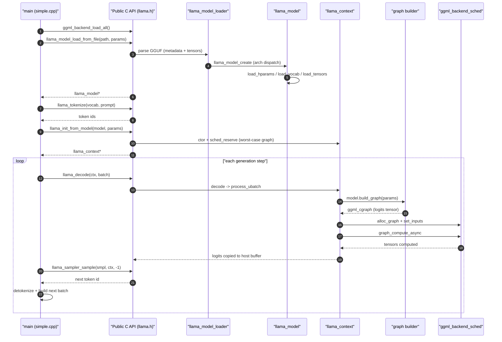
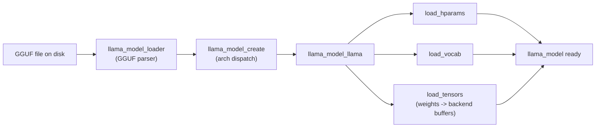
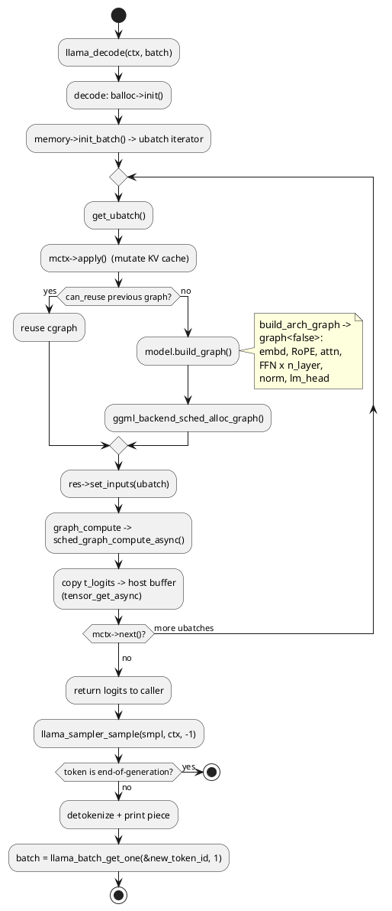

# End-to-end walkthrough: `examples/simple`

This is the capstone of the series. Everything covered in the sibling files — [GGUF loading](01-gguf-and-loading.md), the [architecture registry](02-architecture-registry.md), [hparams and tensors](03-hparams-and-tensors.md), [graph construction](04-graph-construction.md), the [cgraph data structure](05-ggml-cgraph.md), and [execution and scheduling](06-execution-and-scheduling.md) — converges here, in a single ~220-line program: `main` (examples/simple/simple.cpp:14).

`examples/simple/simple.cpp` is the smallest complete inference program in the tree. It loads a GGUF model, tokenizes a prompt, runs a greedy generation loop, and prints text. It touches only the **public C API** declared in `include/llama.h`, never the internals. Our job in this file is to trace each public call down into the machinery the other files describe.

If you read only one file in this series to understand how the pieces fit together, read this one.

---

## The whole program at altitude

Here is the entire control flow, stripped of argument parsing and error handling, in the order `main` executes it:

```cpp
ggml_backend_load_all();                                              // 1. backends
llama_model * model = llama_model_load_from_file(path, model_params); // 2. load
const llama_vocab * vocab = llama_model_get_vocab(model);
int n_prompt = -llama_tokenize(vocab, prompt, ..., NULL, 0, ...);     // 3a. count
llama_tokenize(vocab, prompt, ..., prompt_tokens.data(), ...);        // 3b. tokenize
llama_context * ctx = llama_init_from_model(model, ctx_params);       // 4. context
llama_sampler * smpl = /* greedy chain */;                            // 5. sampler
llama_batch batch = llama_batch_get_one(prompt_tokens.data(), n);     // 6. batch

for (int n_pos = 0; n_pos + batch.n_tokens < n_prompt + n_predict;) { // 7. loop
    llama_decode(ctx, batch);                                         //    decode
    n_pos += batch.n_tokens;
    new_token_id = llama_sampler_sample(smpl, ctx, -1);               //    sample
    if (llama_vocab_is_eog(vocab, new_token_id)) break;
    /* detokenize + print */
    batch = llama_batch_get_one(&new_token_id, 1);                    //    next batch
}

llama_sampler_free(smpl); llama_free(ctx); llama_model_free(model);   // 8. teardown
```

Each numbered step maps to a subsystem. The diagram below shows the full descent from `main` down through the public API into the loader, model, context, graph, and ggml backend, and back up to logits.



---

## Step 1 — Backend initialization

```cpp
ggml_backend_load_all();
```

`simple.cpp` calls `ggml_backend_load_all()` (examples/simple/simple.cpp:82) to discover and register every available backend (CPU, Metal, CUDA, Vulkan, …) as a dynamically loadable module. The closely related `llama_backend_init` (src/llama.cpp:89) performs the one-time global init of the llama layer. After this, the registry of backends is populated so the context can later build a scheduler over them. This is the entry into the [execution and scheduling](06-execution-and-scheduling.md) subsystem, but at this stage we have only *registered* backends — nothing is allocated yet.

---

## Step 2 — Model load (`-> loader -> arch -> tensors`)

```cpp
llama_model_params model_params = llama_model_default_params();
model_params.n_gpu_layers = ngl;                       // 99 by default
llama_model * model = llama_model_load_from_file(model_path.c_str(), model_params);
```

This single call (examples/simple/simple.cpp:89) is the whole of [file 01 (GGUF and loading)](01-gguf-and-loading.md), [file 02 (architecture registry)](02-architecture-registry.md), and [file 03 (hparams and tensors)](03-hparams-and-tensors.md) compressed into one line. The descent:

1. `llama_model_load_from_file` (src/llama.cpp:426) delegates to `llama_model_load_from_file_impl` (src/llama.cpp:341), which calls `llama_model_load` (src/llama.cpp:279).
2. `llama_model_load` constructs a `llama_model_loader` (src/llama-model-loader.cpp:511). The loader opens the GGUF file via `gguf_init_from_file` (ggml/src/gguf.cpp:979) and parses the header, the metadata KV section, and the tensor metadata into a `weights_map` keyed by tensor name. See [01-gguf-and-loading.md](01-gguf-and-loading.md) for the on-disk layout.
3. The loader reads `general.architecture` from the metadata; `llama_model_loader::get_arch` (src/llama-model-loader.cpp:826) returns the `llm_arch` enum (e.g. `LLM_ARCH_LLAMA`).
4. `llama_model_create` (src/llama-model.cpp:314) uses that enum to instantiate the architecture-specific subclass — for Llama, a `llama_model_llama`. This is the dispatch described in [02-architecture-registry.md](02-architecture-registry.md).
5. Back in `llama_model_load`, the model loads its three layers of state: `load_hparams()` (hyperparameters), `load_vocab()` (the tokenizer), and `load_tensors()` (the weight tensors, placed into backend buffers, with up to `n_gpu_layers` offloaded). Tensor instantiation goes through `llama_model_loader::create_tensor` (src/llama-model-loader.cpp:1046) and the bytes arrive via `load_all_data` (src/llama-model-loader.cpp:1407) — mmap'd or read from disk. See [03-hparams-and-tensors.md](03-hparams-and-tensors.md).

When this returns, `model` is a fully populated `llama_model` (src/llama-model.h): `hparams`, the `arch` tag, the `std::vector<llama_layer> layers`, the `vocab`, and the `output` (lm_head) tensor. No computation graph exists yet — the model only holds weights and metadata.



---

## Step 3 — Tokenize

```cpp
const llama_vocab * vocab = llama_model_get_vocab(model);
int n_prompt = -llama_tokenize(vocab, prompt.c_str(), prompt.size(), NULL, 0, true, true);
std::vector<llama_token> prompt_tokens(n_prompt);
llama_tokenize(vocab, prompt.c_str(), prompt.size(),
               prompt_tokens.data(), prompt_tokens.size(), true, true);
```

`llama_tokenize` (src/llama-vocab.cpp:4291) is the public wrapper over `llama_vocab::tokenize`. The example uses the standard two-call idiom (examples/simple/simple.cpp:100, 104): the **first** call passes a `NULL` output buffer with capacity `0`, so the function returns the *negative* of the required token count; the **second** call, now with a buffer of the right size, fills it. The `vocab` came from the model loaded in step 2, so tokenization is consistent with the model's training vocabulary. The result is a flat `std::vector<llama_token>` — integer IDs ready to feed the transformer.

---

## Step 4 — Context init (`-> reserve graph`)

```cpp
llama_context_params ctx_params = llama_context_default_params();
ctx_params.n_ctx   = n_prompt + n_predict - 1;
ctx_params.n_batch = n_prompt;
ctx_params.no_perf = false;
llama_context * ctx = llama_init_from_model(model, ctx_params);
```

`llama_init_from_model` (src/llama-context.cpp:3383) validates the parameters and runs the `llama_context` constructor (src/llama-context.cpp:33). This is where the runtime state for *this inference session* is built, distinct from the read-only `model`:

- **Backends and scheduler.** The constructor collects the registered backends and builds a `ggml_backend_sched_t` via `ggml_backend_sched_new` (ggml/include/ggml-backend.h:317).
- **Memory / KV cache.** A `llama_memory_i` (the KV cache) is allocated, sized by `n_ctx`.
- **Output buffers.** Host-side `logits` and `embd` buffers are reserved.
- **Worst-case graph reservation.** Critically, the constructor calls `sched_reserve` (src/llama-context.cpp:415). This builds a *worst-case* computation graph with dummy inputs (`n_tokens = min(n_ctx, n_ubatch)`, `n_seqs = n_seq_max`) so the scheduler can pre-allocate the largest compute buffers it will ever need. It also pre-allocates the reusable result containers `gf_res_prev` and `gf_res_reserve`.

```cpp
void llama_context::sched_reserve() {
    ...
    const uint32_t n_seqs   = cparams.n_seq_max;
    const uint32_t n_tokens = std::min(cparams.n_ctx, cparams.n_ubatch);
    const size_t   max_nodes = this->graph_max_nodes(n_tokens);
    gf_res_prev.reset(new llm_graph_result(max_nodes));
    gf_res_reserve.reset(new llm_graph_result(max_nodes));
    sched.reset(ggml_backend_sched_new(backend_ptrs.data(), backend_buft.data(),
        backend_ptrs.size(), max_nodes, cparams.pipeline_parallel, cparams.op_offload));
    const int n_outputs = n_seqs;
    auto * gf = graph_reserve(1, n_seqs, n_outputs, mctx.get(), true);
    ...
}
```

The payoff of reserving here is that the **hot decode path performs no large allocations** — buffers and the graph result container already exist. See [06-execution-and-scheduling.md](06-execution-and-scheduling.md) for the scheduler's node-to-backend assignment.

The sampler chain is built next (examples/simple/simple.cpp:128-132): a chain initialized with `llama_sampler_chain_init`, to which a single greedy sampler (`llama_sampler_init_greedy`) is added.

---

## Step 5 — Batch construction

```cpp
llama_batch batch = llama_batch_get_one(prompt_tokens.data(), prompt_tokens.size());
```

`llama_batch_get_one` (src/llama-batch.cpp:863) wraps a raw token array into a `llama_batch` (include/llama.h:240) for the common single-sequence case: it sets `n_tokens` and the `token` pointer, leaving positions and sequence IDs to be filled in with defaults during decode. (For multi-sequence or embedding workloads you would instead use `llama_batch_init` (src/llama-batch.cpp:877) and populate the `pos`, `n_seq_id`, `seq_id`, and `logits` arrays yourself.) The `llama_batch` is the boundary object: the application owns it, and `llama_decode` consumes it.

---

## Step 6 — The generation loop

```cpp
for (int n_pos = 0; n_pos + batch.n_tokens < n_prompt + n_predict; ) {
    if (llama_decode(ctx, batch)) { /* error */ }
    n_pos += batch.n_tokens;

    new_token_id = llama_sampler_sample(smpl, ctx, -1);
    if (llama_vocab_is_eog(vocab, new_token_id)) break;
    /* detokenize new_token_id and print */
    batch = llama_batch_get_one(&new_token_id, 1);
}
```

This is the engine. The **first** iteration decodes the whole prompt batch at once (prefill); **every subsequent** iteration decodes the single token that was just sampled (autoregressive decode). Let us follow `llama_decode` all the way down to logits and back.

### 6a. `llama_decode -> decode -> process_ubatch`

`llama_decode` (src/llama-context.cpp:3930) is a thin wrapper over `llama_context::decode` (src/llama-context.cpp:1632). `decode` initializes a batch allocator, then splits the batch into micro-batches (ubatches) via the memory module and the KV cache:

```cpp
mctx = memory->init_batch(*balloc, cparams.n_ubatch, output_all);
...
do {
    const auto & ubatch = mctx->get_ubatch();
    ...
    const auto * res = process_ubatch(ubatch, ctx_type_to_graph_type(...), mctx.get(), status);
    ...
} while (mctx->next());
```

`memory->init_batch` (src/llama-memory.h:84) allocates KV-cache slots and returns a `llama_memory_context_i` that iterates ubatches. For each ubatch, `process_ubatch` (src/llama-context.cpp:1257) does the real work. Its structure — reuse-or-rebuild, then allocate, set inputs, compute — is the core of [file 06](06-execution-and-scheduling.md):

```cpp
llm_graph_result * llama_context::process_ubatch(const llama_ubatch & ubatch,
        llm_graph_type gtype, llama_memory_context_i * mctx, ggml_status & ret) {
    if (mctx && !mctx->apply()) { ret = GGML_STATUS_FAILED; return nullptr; }

    auto * res = gf_res_prev.get();
    auto * gf  = res->get_gf();
    const auto gparams = graph_params(res, ubatch, mctx, gtype);

    if (!graph_reuse_disable && res->can_reuse(gparams)) {
        if (cparams.pipeline_parallel) ggml_backend_sched_synchronize(sched.get());
        n_reused++;
    } else {
        res->reset();
        ggml_backend_sched_reset(sched.get());
        ggml_backend_sched_set_eval_callback(sched.get(), ...);
        gf = model.build_graph(gparams);                          // <-- build cgraph
        if (!gf || !ggml_backend_sched_alloc_graph(sched.get(), gf)) {
            ret = GGML_STATUS_ALLOC_FAILED; return nullptr;
        }
    }

    res->set_inputs(&ubatch);                                     // <-- fill token/pos
    const auto status = graph_compute(res->get_gf(), ubatch.n_tokens > 1); // <-- run
    if (status != GGML_STATUS_SUCCESS) { ret = status; return nullptr; }
    ret = GGML_STATUS_SUCCESS;
    return res;
}
```

The reuse check via `llm_graph_result::can_reuse` (src/llama-graph.h:723) is a key optimization: if the previous ubatch produced a graph with identical *topology* (same `n_tokens`, `n_seqs`, `n_outputs`, attention type, sampler/adapter state), the graph is reused and only the input tensors are re-bound. In a steady-state single-token decode loop, this means `model.build_graph` is called once and then skipped for every subsequent token — only `set_inputs` and `graph_compute` run. (Reuse is topology-based; different positions or sequence IDs can reuse the same graph as long as the shape matches.)

### 6b. `model.build_graph -> build_arch_graph -> graph<false>` (the cgraph)

When a graph *is* built, `llama_model::build_graph` (src/llama-model.cpp:2186) delegates to the architecture-specific `build_arch_graph`. For Llama, `llama_model_llama::build_arch_graph` (src/models/llama.cpp:94) is a one-liner that instantiates the templated graph constructor:

```cpp
std::unique_ptr<llm_graph_context> llama_model_llama::build_arch_graph(
        const llm_graph_params & params) const {
    return std::make_unique<graph<false>>(*this, params);
}
```

The constructor `llama_model_llama::graph<false>::graph` (src/models/llama.cpp:99) is where the transformer is laid out op by op — this is the subject of [04-graph-construction.md](04-graph-construction.md). The shape:

```cpp
inpL = build_inp_embd(model.tok_embd);          // token -> embedding rows
ggml_tensor * inp_pos = build_inp_pos();        // positions
inp_attn = build_attn_inp_kv();                 // KV-cache attention inputs

for (int il = 0; il < n_layer; ++il) {
    cur = build_norm(inpL, layers[il].attn_norm, ...);          // RMSNorm
    auto [Qcur, Kcur, Vcur] = build_qkv(layers[il], cur, ...);  // Q,K,V projections
    Qcur = ggml_rope_ext(ctx0, Qcur, inp_pos, ...);             // RoPE
    Kcur = ggml_rope_ext(ctx0, Kcur, inp_pos, ...);
    cur  = build_attn(inp_attn, layers[il].wo, ..., Qcur, Kcur, Vcur, ...);
    ggml_tensor * ffn_inp = ggml_add(ctx0, cur, inpSA);         // residual
    cur  = build_norm(ffn_inp, layers[il].ffn_norm, ...);
    cur  = build_ffn(cur, ffn_up, ffn_gate, ffn_down, LLM_FFN_SILU, LLM_FFN_PAR, il);
    cur  = ggml_add(ctx0, cur, ffn_inp);                        // residual
    inpL = cur;
}
cur = build_norm(cur, model.output_norm, ...);  // final norm
res->t_embd = cur;
cur = build_lora_mm(model.output, cur, ...);    // lm_head -> logits
res->t_logits = cur;
ggml_build_forward_expand(gf, cur);             // finalize the cgraph
```

The final `ggml_build_forward_expand` walks back from the logits tensor and records every dependency into the `ggml_cgraph` in topological order — see [05-ggml-cgraph.md](05-ggml-cgraph.md) for what that data structure actually contains. The output tensor `res->t_logits` is the handle the context will read from after compute. `build_graph` also tacks on optional pooling and sampling layers before returning.

### 6c. Allocate, set inputs, compute

Back in `process_ubatch`, three calls finish the job:

1. `ggml_backend_sched_alloc_graph(sched, gf)` (src/llama-context.cpp:1300) assigns each graph node to a backend and allocates its tensor buffer. It does **not** execute anything.
2. `res->set_inputs(&ubatch)` (src/llama-context.cpp:1312) binds the actual data — token IDs, positions, KV-cache indices, attention masks — into the input tensors created by `build_inp_embd`, `build_inp_pos`, and friends.
3. `graph_compute` (src/llama-context.cpp:2315) sets the thread count and calls `ggml_backend_sched_graph_compute_async(sched, gf)` (src/llama-context.cpp:2334), which runs the graph across all assigned backends.

```cpp
ggml_status llama_context::graph_compute(ggml_cgraph * gf, bool batched) {
    int n_threads = batched ? cparams.n_threads_batch : cparams.n_threads;
    ...
    auto status = ggml_backend_sched_graph_compute_async(sched.get(), gf);
    ...
    return status;
}
```

### 6d. Logits extraction

After compute, `decode` copies the output tensor `t_logits` from its (possibly GPU) backend buffer into the host-side `logits` buffer via `ggml_backend_tensor_get_async` (src/llama-context.cpp:1852). From that point the application can read logits through `llama_get_logits` (include/llama.h:999) / `llama_context::get_logits` (src/llama-context.cpp:798), laid out as `n_outputs` rows of `n_vocab` floats.

The PlantUML activity diagram below captures one full turn of the loop, from `llama_decode` through compute to the next batch.



### 6e. Greedy sampling and detokenize

```cpp
new_token_id = llama_sampler_sample(smpl, ctx, -1);
if (llama_vocab_is_eog(vocab, new_token_id)) break;
int n = llama_token_to_piece(vocab, new_token_id, buf, sizeof(buf), 0, true);
```

`llama_sampler_sample` (include/llama.h:1486) reads the logits row at index `-1` (meaning *the last output position* — the only position that matters in a generation loop) and pushes them through the sampler chain. Here the chain is a single greedy sampler, so it just returns `argmax` over the vocabulary. The example then checks for end-of-generation with `llama_vocab_is_eog`, and converts the chosen token back to text with `llama_token_to_piece` (the inverse of step 3). Finally `llama_batch_get_one(&new_token_id, 1)` (examples/simple/simple.cpp:200) wraps that single new token as the batch for the next iteration — and the loop closes.

---

## Step 7 — Teardown

```cpp
llama_sampler_free(smpl);
llama_free(ctx);
llama_model_free(model);
```

The objects are freed in reverse order of dependency: the sampler, then `llama_free` (src/llama-context.cpp:3475) which tears down the context's scheduler, KV cache, and output buffers, then `llama_model_free` (src/llama-model.cpp:2243) which releases all weight tensors and metadata. Nothing in `simple.cpp` frees the GGUF mmap explicitly — that lifetime is owned by the model and released here.

---

## Tying the pipeline together

Read top to bottom, `simple.cpp` is a guided tour of the whole codebase:

| Public API call | Internal subsystem | Sibling file |
|---|---|---|
| `ggml_backend_load_all` | backend registry | [06](06-execution-and-scheduling.md) |
| `llama_model_load_from_file` | GGUF parse + loader | [01](01-gguf-and-loading.md) |
| ↳ `llama_model_create` | architecture dispatch | [02](02-architecture-registry.md) |
| ↳ `load_hparams` / `load_tensors` | hparams + weights | [03](03-hparams-and-tensors.md) |
| `llama_tokenize` | vocab | [01](01-gguf-and-loading.md) |
| `llama_init_from_model` | context + `sched_reserve` | [06](06-execution-and-scheduling.md) |
| `llama_decode` ↳ `build_graph` | cgraph construction | [04](04-graph-construction.md) |
| ↳ `ggml_build_forward_expand` | cgraph data structure | [05](05-ggml-cgraph.md) |
| ↳ `graph_compute` | scheduling + execution | [06](06-execution-and-scheduling.md) |
| `llama_sampler_sample` | sampler chain | — |

The crucial mental model: **the model is built once and is read-only; the context is mutable session state; the cgraph is rebuilt only when its topology changes.** The first `llama_decode` builds the graph for the prompt; subsequent decodes of a single token reuse that graph's topology (after one rebuild for the new shape), so the steady-state loop is just `set_inputs -> compute -> copy logits -> sample`. That is why `examples/simple` is fast despite re-entering `llama_decode` once per generated token.

## Key takeaways

- `examples/simple/simple.cpp` exercises the entire GGUF→cgraph→logits pipeline using only the public C API in `include/llama.h`.
- Model load (`llama_model_load_from_file`, src/llama.cpp:426) fans out into the GGUF loader, architecture dispatch (`llama_model_create`, src/llama-model.cpp:314), and tensor loading — all three earlier subsystems behind one call.
- Context init (`llama_init_from_model`, src/llama-context.cpp:3383) runs `sched_reserve` (src/llama-context.cpp:415) to pre-allocate worst-case compute buffers, keeping the decode loop allocation-free.
- `llama_decode` → `decode` (src/llama-context.cpp:1632) → `process_ubatch` (src/llama-context.cpp:1257) is the heart: it builds (or reuses) the cgraph via `model.build_graph` (src/llama-model.cpp:2186), allocates, sets inputs, and computes.
- The Llama cgraph is assembled op-by-op in `graph<false>::graph` (src/models/llama.cpp:99) and finalized with `ggml_build_forward_expand` (src/models/llama.cpp:244).
- Graph **reuse** (`can_reuse`, src/llama-graph.h:723) means single-token decodes skip rebuild and only re-bind inputs — the basis of the loop's efficiency.
- Greedy generation is just: read last-position logits via `llama_sampler_sample` (include/llama.h:1486), `argmax`, detokenize, and feed the token back as the next `llama_batch`.
