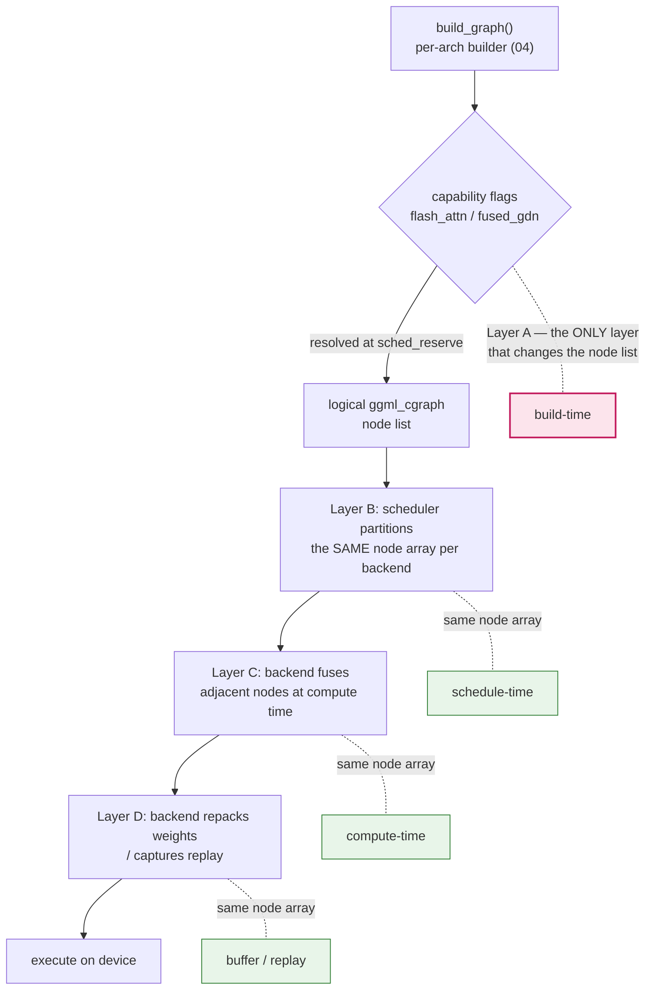
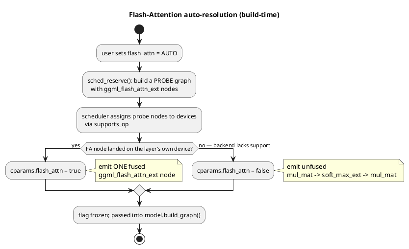
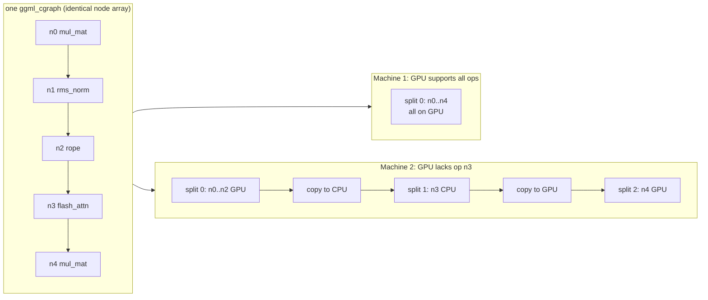
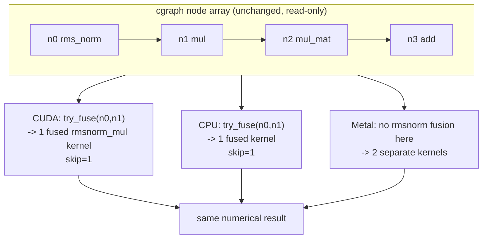
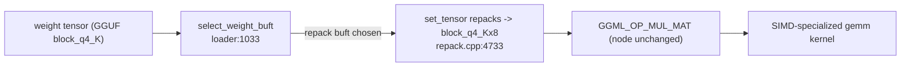
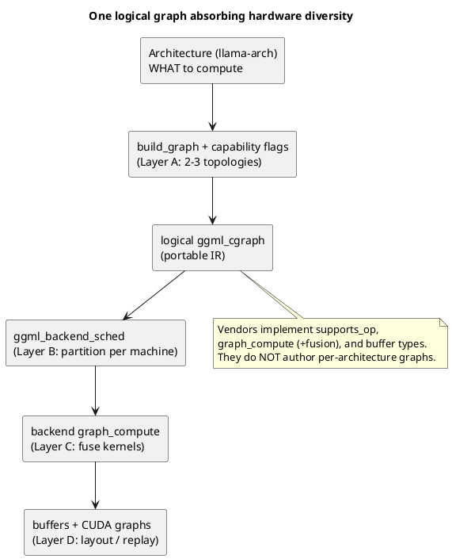

# One graph, many machines: how hardware divergence is handled

A natural objection to the "single logical graph" story in this doc set is: *surely different vendor hardware (NVIDIA, Apple, AMD, Qualcomm, Huawei) needs different ops, different partitioning, and different memory layouts to run fast — so don't they each need a different graph topology?*

They do need all of those things. But llama.cpp does **not** answer that with one hand-written graph per vendor. It treats the `ggml_cgraph` produced by the per-architecture builder ([04-graph-construction.md](04-graph-construction.md)) as a **portable IR**, and pushes hardware specialization into **four distinct layers**. Only the *first* of those layers ever changes the logical node list — and even that one is keyed on **op capability, not vendor identity**, so the number of distinct topologies stays tiny (2–3), not "one per GPU."

This file is the map of those four layers. It is the counterpart to [06-execution-and-scheduling.md](06-execution-and-scheduling.md) §6–7: that file explains the scheduler; this one explains *why the scheduler is enough* to absorb hardware diversity.

---

## The four layers at a glance



| Layer | What diverges by hardware | Changes node list? | Where (verified) |
| --- | --- | --- | --- |
| **A. Build-time capability gating** | A few capability-gated ops (Flash Attention, Gated Delta Net) | **Yes** — 2–3 variants total | `sched_reserve` (src/llama-context.cpp:455) → `build_graph` |
| **B. Schedule-time partitioning** | *Which* backend runs each node; splits; cross-device copies; CPU fallback | No — `nodes[]` immutable | `ggml_backend_sched_split_graph` (ggml/src/ggml-backend.cpp:1014) |
| **C. Compute-time fusion** | *Which* adjacent nodes collapse into one kernel | No — `cgraph` is read-only | `ggml_can_fuse` (ggml/src/ggml-impl.h:699) + each backend |
| **D. Buffer layout + replay** | Weight memory layout; execution capture | No | repack (ggml/src/ggml-cpu/repack.cpp:4733); CUDA Graphs (ggml-cuda.cu:4464) |

The rest of this file walks each layer.

---

## Layer A — build-time capability gating (the only real topology fork)

This is the one place the **logical node list genuinely differs** by hardware. Two op families have a *fused* form and an *unfused* fallback, and the builder picks one based on a capability flag in `cparams`:

1. **Flash Attention** — one fused `ggml_flash_attn_ext` node, or the unfused softmax chain.
2. **Gated Delta Net** — one fused `ggml_gated_delta_net` node, or a ~10-op chain (used by linear-attention models like Qwen3-Next / Kimi-Linear, see `src/models/delta-net-base.cpp:437`).

The fork itself lives in `llm_graph_context::build_attn_mha` (src/llama-graph.cpp:2049):

```cpp
const bool use_flash_attn = cparams.flash_attn && kq_b == nullptr;
if (use_flash_attn) {
    // ... cast k/v to F16 if needed ...
    cur = ggml_flash_attn_ext(ctx0, q, k, v, kq_mask, kq_scale, hparams.f_max_alibi_bias,
                              hparams.attn_soft_cap ? hparams.f_attn_logit_softcapping : 0.0f);   // ONE fused node
} else {
    ggml_tensor * kq = ggml_mul_mat(ctx0, k, q);            // node 1
    ggml_mul_mat_set_prec(kq, GGML_PREC_F32);
    kq = ggml_soft_max_ext(ctx0, kq, kq_mask, kq_scale, hparams.f_max_alibi_bias);  // node 2
    ggml_tensor * kqv = ggml_mul_mat(ctx0, v, kq);          // node 3
}
```
*(src/llama-graph.cpp:2049–2136)*

### Capability-keyed, not vendor-keyed

The crucial subtlety: `cparams.flash_attn` is not set from a vendor name. When the user leaves it on `AUTO`, `llama_context::sched_reserve` **builds a probe graph and looks at where the Flash-Attention node actually lands**. If the FA tensor is scheduled onto a *different* device than the layer it belongs to (which happens when the target backend silently doesn't support that op shape), the flag is switched **off**:

```cpp
if (cparams.auto_fa) {
    auto * gf = graph_reserve(1, n_seqs, n_outputs, mctx.get(), true);   // probe graph
    bool fa_device_mismatch = false;
    for (int i = 0; i < ggml_graph_n_nodes(gf); i++) {
        ggml_tensor * n = ggml_graph_node(gf, i);
        if (n->op != GGML_OP_FLASH_ATTN_EXT) continue;
        ggml_backend_dev_t device_fa = ggml_backend_get_device(
                ggml_backend_sched_get_tensor_backend(sched.get(), n));
        ggml_backend_dev_t device_kv = model.dev_layer(/*il from tensor name*/);
        if (device_fa != device_kv) {            // op got bumped off the layer's device
            fa_device_mismatch = true;           //   "usually due to missing support"
            break;
        }
    }
    cparams.flash_attn = !fa_device_mismatch;    // resolve the flag
    cparams.auto_fa = false;
}
```
*(src/llama-context.cpp:455–492; the analogous `auto_fgdn` block for Gated Delta Net follows at :495)*

So the gate is **"does *this* device actually support `flash_attn_ext`?"** — never "is this NVIDIA?". Consequences:

- An NVIDIA GPU and an AMD GPU that *both* support FA get the **same** topology.
- Two NVIDIA GPUs of different generations can get **different** topologies.
- The number of possible node-list topologies is **2–3 total**, decoupled from the number of vendors.



Everything below this line keeps the node list **fixed**.

---

## Layer B — schedule-time partitioning (same nodes, different machine map)

This is the layer that most directly answers *"partitioning for optimization corresponding to each hardware."* `ggml_backend_sched_split_graph` (ggml/src/ggml-backend.cpp:1014) takes the finished `ggml_cgraph` and **never edits `graph->nodes[]`**. Instead it builds a *parallel* per-node backend assignment:

```cpp
for (int i = 0; i < graph->n_nodes; i++) {
    struct ggml_tensor * node = graph->nodes[i];
    int * node_backend_id = &tensor_backend_id(node);
    if (*node_backend_id == -1) {                                    // not user-pinned
        *node_backend_id = ggml_backend_sched_backend_id_from_cur(sched, node);  // pick a backend
    }
    // ...
}
```
*(ggml/src/ggml-backend.cpp:1045)*

`ggml_backend_sched_backend_id_from_cur` consults each backend's `ggml_backend_supports_op` (ggml/src/ggml-backend.cpp:455) plus weight-buffer location and backend priority. From that assignment the scheduler:

- groups consecutive same-backend nodes into **splits** (`sched->splits[]`), each a lightweight `ggml_graph_view` over a slice of the original `nodes[]` (no copying — ggml/src/ggml.c:7144);
- inserts **cross-device copy** tensors where a split's input lives on another backend (ggml/src/ggml-backend.cpp:1350), rewriting `node->src[j]` to point at the local copy;
- **falls back to CPU** for any op no accelerator supports;
- optionally **offloads** CPU-resident ops onto an accelerator when `op_offload` is set.

The node *list* is identical on every machine; the **partition** is what differs:



Same five nodes; Machine 1 runs them as one GPU split, Machine 2 as three splits with two device copies — produced automatically from `supports_op`, with zero changes to the graph.

---

## Layer C — compute-time kernel fusion (same graph, different kernels)

Each backend's `graph_compute` walks `cgraph->nodes[]` and **pattern-matches consecutive ops at execution time**, dispatching a single combined kernel when it recognizes a fusible run. The matcher, `ggml_can_fuse` (ggml/src/ggml-impl.h:699), takes a `const ggml_cgraph *` — a read-only contract; the graph is never mutated. Each backend returns a **skip count** and the loop jumps ahead:

```cpp
// CPU (ggml/src/ggml-cpu/ggml-cpu.c:3055)
const int n_fused = ggml_cpu_try_fuse_ops(cgraph, node_n, &params, cplan);
if (n_fused > 0) { node_n += n_fused; }            // skip the fused nodes
else            { ggml_compute_forward(&params, node); }
```

```cpp
// CUDA (ggml/src/ggml-cuda/ggml-cuda.cu:4379)
int nodes_to_skip = ggml_cuda_try_fuse(cuda_ctx, cgraph, i);
if (nodes_to_skip != 0) { i += nodes_to_skip; continue; }
```

Because fusion is local to each backend, **different vendors collapse different node groups**:

| Backend | Example fused patterns | Source |
| --- | --- | --- |
| CUDA (NVIDIA) | top-k MoE, `RMS_NORM`+`MUL`(+`ADD`), RoPE | ggml-cuda.cu:3834 |
| Vulkan (cross-vendor) | `RMS_NORM`+`MUL`+`ROPE`+`VIEW`+`SET_ROWS`, `MUL_MAT`+`ADD` | ggml-vulkan.cpp:15479 |
| Metal (Apple) | `MUL`/`ADD` chains | ggml-metal-common.cpp:415 |
| CPU | `RMS_NORM`+`MUL` | ggml-cpu.c:2979 |



The graph is the *contract*; fusion is each vendor's private optimization of how to execute that contract.

> Note: Metal temporarily records fused groups during compile and then **un-fuses** the node array back to its original form afterward (ggml-metal-common.cpp:444), so even a backend that reasons about fused groups leaves `nodes[]` as it found it.

---

## Layer D — buffer layout and execution capture

The last layer specializes **data and replay**, not structure. The op node (e.g. `GGML_OP_MUL_MAT`) is untouched; what changes is the bytes it reads and how the kernel stream is launched.

### Weight repacking via extra buffer types (CPU)

At load time, `select_weight_buft` (src/llama-model-loader.cpp:1033) picks, for each weight, the first buffer type that supports it — which may be a CPU **repack** buffer type. Assigning a tensor there makes `set_tensor` transform the quantized weight into a SIMD-interleaved layout (`block_q8_0x4/x8/x16`, `block_q4_Kx8`, AMX tiles, …) tuned to the host's vector width:

```cpp
static void ggml_backend_cpu_repack_buffer_set_tensor(ggml_backend_buffer_t buffer, struct ggml_tensor * tensor,
                                                       const void * data, size_t offset, size_t size) {
    auto tensor_traits = (ggml::cpu::repack::tensor_traits_base *) tensor->extra;
    auto OK            = tensor_traits->repack(tensor, data, size);   // reorder weight bytes at LOAD time
    GGML_ASSERT(OK == 0);
}
```
*(ggml/src/ggml-cpu/repack.cpp:4733)*

The `GGML_OP_MUL_MAT` node is identical; only the weight's in-memory layout and the chosen gemm/gemv kernel differ. This happens once, at load, so there is no per-decode graph mutation.

### CUDA Graphs (NVIDIA)

For the static decode topology, the CUDA backend captures the entire kernel sequence into a replayable `cudaGraph_t` after warmup and relaunches it each step (`ggml_backend_cuda_graph_compute`, ggml-cuda.cu:4464), eliminating per-kernel launch overhead. Again: it captures the execution of the *existing* `cgraph`; it does not change the node list.



---

## Putting it together



The mental model to keep:

> There is **one logical graph per capability profile** — 2–3 variants gated by `flash_attn` / `fused_gdn`, **not one per vendor**. That graph is **partitioned** per machine by the scheduler (Layer B), **fused** differently by each backend at compute time (Layer C), and fed by **hardware-optimal weight layouts and replay capture** (Layer D). The "different topology per hardware" you might expect is expressed as *partition + fusion + layout* around a near-invariant IR — never as N separately maintained model graphs.

This is exactly why adding a new backend to llama.cpp means implementing `supports_op`, `graph_compute`, and buffer types — and **not** touching `src/llama-arch.cpp` or any of the 130+ `src/models/*.cpp` builders.

---

## Key takeaways

- **Hardware divergence is layered across four levels; only build-time gating changes the node list.** The other three (partition, fusion, layout) keep `cgraph->nodes[]` byte-for-byte identical.
- **Build-time forks are capability-keyed, not vendor-keyed.** `cparams.flash_attn` / `fused_gdn` are resolved by a *probe graph* in `sched_reserve` (src/llama-context.cpp:455) that checks whether the fused op actually lands on the right device — so two GPUs from the same vendor can differ, and two different vendors can match. Total topologies: 2–3.
- **Partitioning is the scheduler's job, on a fixed node list.** `ggml_backend_sched_split_graph` (ggml/src/ggml-backend.cpp:1014) assigns nodes via `supports_op`, inserts splits + cross-device copies, and falls back to CPU — producing a hardware-specific *partition* without editing the graph.
- **Fusion is compute-time and read-only.** Each backend pattern-matches consecutive nodes via `ggml_can_fuse` (ggml/src/ggml-impl.h:699) and dispatches combined kernels, skipping fused nodes — different vendors fuse different patterns over the same graph.
- **Layout and replay specialize data, not structure.** CPU weight repacking into SIMD-interleaved buffer types (ggml/src/ggml-cpu/repack.cpp:4733) and CUDA Graphs capture (ggml-cuda.cu:4464) leave the op nodes unchanged.
- **Adding a backend never touches the architecture layer** — vendors implement `supports_op` / `graph_compute` / buffer types, and the shared graph from [04-graph-construction.md](04-graph-construction.md) flows through unchanged.

See [06-execution-and-scheduling.md](06-execution-and-scheduling.md) for the scheduler and decode loop, [04-graph-construction.md](04-graph-construction.md) for how the logical graph is built, and [05-ggml-cgraph.md](05-ggml-cgraph.md) for what a `ggml_cgraph` node list actually is.
