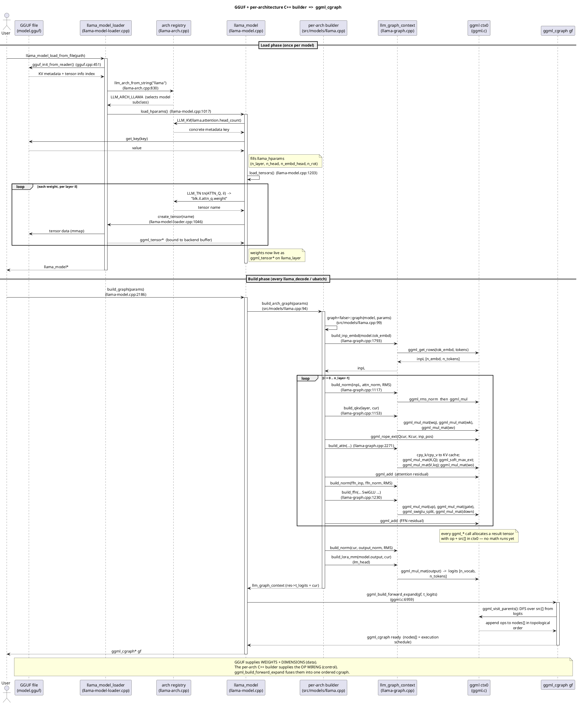
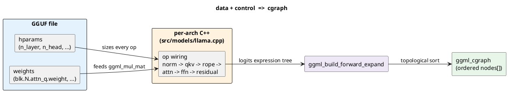

# Sequence: GGUF + per-architecture C++ ⇒ ggml_cgraph

A single sequence diagram tracing the whole progression: the **GGUF file** supplies *weights and dimensions* (data), the **per-architecture C++ builder** (`src/models/llama.cpp`) supplies the *op wiring* (control), and `ggml_build_forward_expand` fuses them into one ordered `ggml_cgraph`. All call sites are cited to source. See [04-graph-construction.md](04-graph-construction.md) and [05-ggml-cgraph.md](05-ggml-cgraph.md) for the prose.

## Full sequence (load phase + build phase)

## The essence in one picture

## How to read it

- **Load phase** runs once: the loader parses GGUF, the `general.architecture` key picks `LLM_ARCH_LLAMA`, `load_hparams` reads dimensions through `LLM_KV` keys, and `load_tensors` binds each GGUF tensor (named via `LLM_TN`) to a `ggml_tensor*` field on `llama_layer`.
- **Build phase** runs every `llama_decode`: the per-architecture builder walks `n_layer` blocks, calling `llm_graph_context` helpers that chain `ggml_*` ops over the loaded weights. Each `ggml_*` call only *allocates* a tagged tensor (`op` + `src[]`) in `ctx0` — no arithmetic happens.
- **The fuse point** is `ggml_build_forward_expand(gf, t_logits)`: it depth-first walks `src[]` back from the logits tensor and appends every reachable op to `gf->nodes[]` in topological (execution) order. That node array *is* the computation graph.

> Mental model: **GGUF = data, per-arch C++ = control, `ggml_build_forward_expand` = the combiner** that turns the expression tree into an ordered `ggml_cgraph`.

See [03-hparams-and-tensors.md](03-hparams-and-tensors.md) for the load phase, [04-graph-construction.md](04-graph-construction.md) for the build phase, and [06-execution-and-scheduling.md](06-execution-and-scheduling.md) for what happens to the finished graph.
