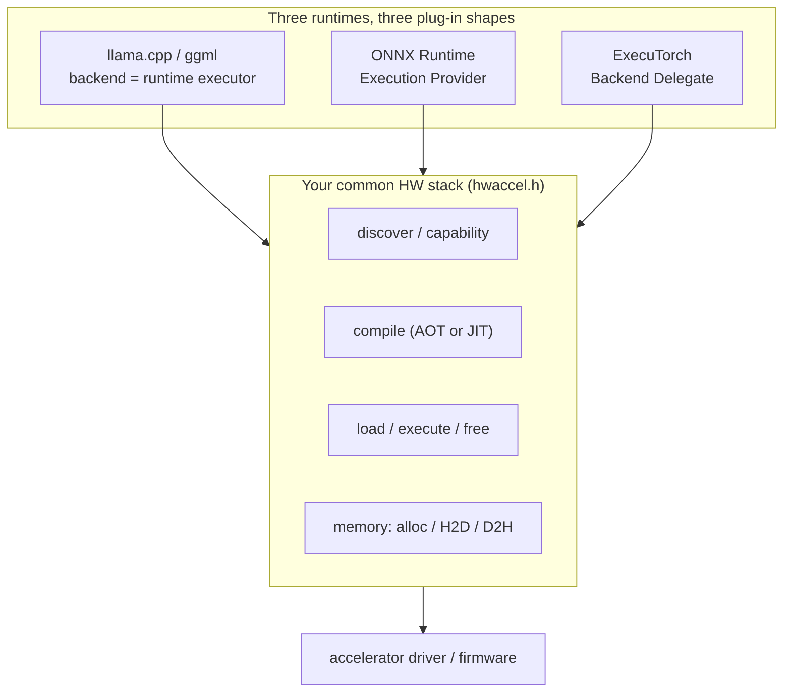
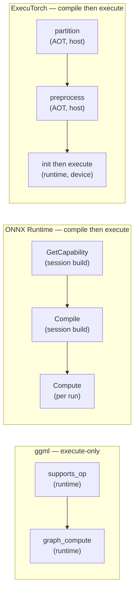
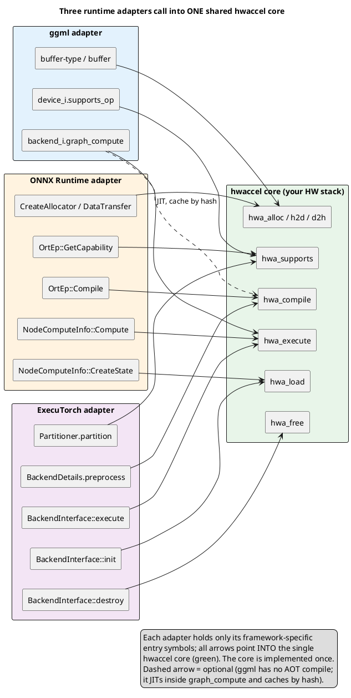

# Abstracting one HW accelerator across llama.cpp, ONNX Runtime & ExecuTorch

Goal: build **one** hardware-accelerator software stack and plug it into three open ML runtimes — llama.cpp (ggml), ONNX Runtime, and ExecuTorch — without writing the accelerator three times. This doc maps each runtime's *backend entry-point API*, compares them, and proposes a single common abstraction (`hwaccel.h`) with thin per-runtime adapters.

The central finding: the three differ less in *what* a backend does than in *when* it does it. ggml is **execute-only** (it hands you the live graph at runtime); ONNX Runtime and ExecuTorch are **compile-then-execute** (a partition decision + a lowering step that emits a blob, run later). Design your stack as the *superset* and the differences become adapter glue.

> Sourcing & confidence: the ggml signatures are read from this repo (file:line cited). The ONNX Runtime **plugin-EP** path and the ExecuTorch interface were read verbatim from current `main`-branch headers (high confidence). ONNX Runtime's **classic `IExecutionProvider`** C++ signatures drift between releases — treat them as approximate and pin to your target tag. Plugin-EP and ExecuTorch are evolving; pin to the versions you build against.

---

## The shape of the problem



Each runtime is a **thin adapter** that translates its own vtable into calls on your core. The rest of this doc fills in the three adapters' entry points and the core they share.

---

## 1. llama.cpp / ggml — the "backend"

**Model:** a *backend registry* exposes one or more *devices*; a device inits a *backend instance* that executes a whole `ggml_cgraph`. **No compile step** — the graph is built at runtime and the scheduler partitions it by querying `supports_op` (see [08-hardware-divergence.md](08-hardware-divergence.md)).

**Entry point** — expose a registry function; register statically or dynamically:

```c
// static: implemented by your backend, called from ggml-backend-reg.cpp (register_backend)
ggml_backend_reg_t ggml_backend_<name>_reg(void);   // api_version = GGML_BACKEND_API_VERSION (==2)

// dynamic (.so/.dll): export these two, generated by GGML_BACKEND_DL_IMPL(reg_fn)
//   ggml_backend_reg_t ggml_backend_init(void);   // ggml-backend-impl.h:235
//   int                ggml_backend_score(void);  // ggml-backend-impl.h:238  (0 => unsupported)
// loaded by: ggml_backend_load(path)
```

**Vtables you implement** (`ggml/src/ggml-backend-impl.h`):

| Struct | `file:line` | Key function pointers |
|---|---|---|
| `ggml_backend_reg_i` | ggml-backend-impl.h:214 | `get_device_count`, `get_device`, `get_proc_address` (extension lookup) |
| `ggml_backend_device_i` | ggml-backend-impl.h:160 | `init_backend` (:177), **`supports_op`** (:189), `get_buffer_type`, `supports_buft`, `offload_op`, `get_props` |
| `ggml_backend_i` | ggml-backend-impl.h:105 | **`graph_compute(backend, cgraph)`** (:130, required), `set/get_tensor_async`, `synchronize` |
| `ggml_backend_buffer_type_i` | ggml-backend-impl.h:17 | `alloc_buffer`, `get_alignment`, `get_alloc_size`, `is_host` |
| `ggml_backend_buffer_i` | ggml-backend-impl.h:41 | `get_base`, `set_tensor`, `get_tensor`, `cpy_tensor`, `clear` |

**Minimal functional backend:** one `reg` → one `device` → a host-accessible `buffer_type`, `supports_op` returning true for ops you handle, and `graph_compute` that walks `cgraph->nodes[]`. Public API in `ggml/include/ggml-backend.h`.

**Capability is a runtime query.** `ggml_backend_dev_supports_op` is called by `ggml_backend_sched` while partitioning each graph — there is no ahead-of-time compile artifact.

---

## 2. ONNX Runtime — the "Execution Provider (EP)"

Two mechanisms exist. **Prefer the new plugin EP** — it is the officially recommended path since ORT 1.23 and is built on the **stable C ABI**.

### 2a. NEW plugin EP (stable C ABI, out-of-tree) — recommended

**Entry symbols** your shared library exports (`onnxruntime_ep_c_api.h`, since ORT 1.22):

```c
OrtStatus* CreateEpFactories(const char* registered_name, const OrtApiBase* ort_api_base,
                             const OrtLogger* default_logger,
                             OrtEpFactory** factories, size_t max_factories, size_t* num_factories);
OrtStatus* ReleaseEpFactory(OrtEpFactory* factory);
```
The app loads it with `OrtApi::RegisterExecutionProviderLibrary(env, name, path)`; ORT then calls `OrtEpFactory::GetSupportedDevices` to mint `OrtEpDevice`s.

**Vtables (C structs of function pointers):**

| Struct | Key members | Role |
|---|---|---|
| `OrtEpFactory` | `GetSupportedDevices` (call `OrtEpApi::CreateEpDevice`), `CreateEp`, `ReleaseEp`, opt. `CreateAllocator`, `CreateDataTransfer` | advertise HW devices; mint per-session EPs |
| `OrtEp` | **`GetCapability`**, **`Compile`**, opt. `GetKernelRegistry` (1.24+) | per-session provider; partition + lower |
| `OrtNodeComputeInfo` | `CreateState`, **`Compute(state, kernel_context)`**, `ReleaseState` | one per fused subgraph; the actual execute |
| `OrtEpApi` (ORT→you) | `CreateEpDevice`, `EpGraphSupportInfo_AddSingleNode` / `AddNodesToFuse`, `EpDevice_AddAllocatorInfo` | helpers ORT exposes so you avoid internal C++ types |

**Capability/partition:** `OrtEp::GetCapability(ep, graph, support_info)` — call `EpGraphSupportInfo_AddSingleNode(node)` (kernel-based) or `EpGraphSupportInfo_AddNodesToFuse(nodes,…)` (compile-based). **Compile:** `OrtEp::Compile(...)` produces one `OrtNodeComputeInfo` per claimed subgraph (this is where your AOT/JIT compiler runs).

**Memory:** advertise via `EpDevice_AddAllocatorInfo` (`DEFAULT` / `HOST_ACCESSIBLE` / `READ_ONLY`); produce allocators via `OrtEpFactory::CreateAllocator` → standard `OrtAllocator`; cross-device copy via `CreateDataTransfer`. At execute time tensors are reached through `OrtKernelContext`, not raw pointers.

**Minimal compile-based plugin EP:** export `CreateEpFactories`+`ReleaseEpFactory`; `OrtEpFactory`{`GetName`,`GetVendor`,`GetSupportedDevices`,`CreateEp`,`ReleaseEp`}; `OrtEp`{`GetName`,`GetCapability`(AddNodesToFuse),`Compile`,`ReleaseNodeComputeInfos`}; `OrtNodeComputeInfo`{`CreateState`,`Compute`,`ReleaseState`}.

### 2b. CLASSIC in-tree EP (C++, ABI-unstable)

Subclass `onnxruntime::IExecutionProvider` (`core/framework/execution_provider.h`):

```cpp
virtual std::vector<std::unique_ptr<ComputeCapability>>
    GetCapability(const GraphViewer&, const IKernelLookup&, /* + GraphOptimizerRegistry, IResourceAccountant* */) const;
virtual common::Status
    Compile(const std::vector<FusedNodeAndGraph>&, std::vector<NodeComputeInfo>& out);  // create_state / compute / release
virtual std::shared_ptr<KernelRegistry> GetKernelRegistry() const;     // kernel-based EPs
virtual std::vector<AllocatorPtr>       CreatePreferredAllocators();
virtual std::unique_ptr<IDataTransfer>  GetDataTransfer() const;       // H2D/D2H/D2D
```
plus `IExecutionProviderFactory::CreateProvider()`, registered via `SessionOptionsAppendExecutionProvider[_CUDA/...]`. **Note:** this is internal C++ — virtual signatures change between releases (e.g. `GetCapability` gained `GraphOptimizerRegistry`/`IResourceAccountant`; allocators moved from `RegisterAllocator/GetAllocator` to `CreatePreferredAllocators`). Rebuild against each ORT version.

> **EPContext** (`EP-Context-Design`) lets `Compile` emit a precompiled binary serialized back into the ONNX model — the closest ORT has to a true AOT artifact, gated by `ValidateCompiledModelCompatibilityInfo`.

---

## 3. ExecuTorch — the "Backend Delegate"

A **sharp AOT/runtime split** with the `.pte` file as the boundary. The two sides are bound by a **`backend_id` string** that must match exactly.

### 3a. Runtime (C++) — `runtime/backend/interface.h`

```cpp
class BackendInterface {                       // alias: PyTorchBackendInterface
 public:
  virtual ~BackendInterface() = 0;
  virtual bool is_available() const = 0;       // device check before init/execute
  virtual Result<DelegateHandle*>
      init(BackendInitContext& ctx, FreeableBuffer* processed,
           ArrayRef<CompileSpec> compile_specs) const = 0;          // receive the compiled blob
  virtual Error
      execute(BackendExecutionContext& ctx, DelegateHandle* handle,
              Span<EValue*> args) const = 0;                        // run the subgraph
  virtual void destroy(DelegateHandle* handle) const {}            // free per-handle state
  // optional: set_option / get_option
};

struct Backend { const char* name; BackendInterface* backend; };
Error register_backend(const Backend&);        // ET_NODISCARD
```

**Registration** is a file-scope static-init idiom (there is **no** `ET_REGISTER_BACKEND` macro); link the TU with `--whole-archive` so the initializer survives:

```cpp
namespace {
  auto cls = MyBackend();
  Backend backend{"MyBackend", &cls};          // "MyBackend" == AOT backend_id
  static auto ok = register_backend(backend);
}
```

**Memory:** two allocators via the context objects (no device-allocator vtable): `BackendInitContext::get_runtime_allocator()` for state that must survive `init`→`execute`; `BackendExecutionContext::get_temp_allocator()` / `allocate()` for per-call scratch (resets each `execute`). I/O tensors arrive as `Span<EValue*> args` (buffers owned by the runtime). The blob arrives as `FreeableBuffer* processed` (free it after copying what you need); large weights can live out-of-blob via `get_named_data_map()`.

### 3b. Ahead-of-time (Python) — `exir/backend/*.py`

```python
class BackendDetails(ABC):
    @staticmethod
    @abstractmethod
    def preprocess(edge_program: ExportedProgram,
                   compile_specs: List[CompileSpec]) -> PreprocessResult: ...   # lower -> blob

class Partitioner(ABC):
    @abstractmethod
    def partition(self, exported_program: ExportedProgram) -> PartitionResult: ...  # tag claimable nodes
```
`preprocess` returns `PreprocessResult(processed_bytes=…)` — the device binary serialized into the `.pte` and delivered verbatim to `init()`. `partition()` returns `partition_tags: Dict[tag, DelegationSpec(backend_id, compile_specs)]`. **Capability is AOT-only** — there is no runtime `supports_op`; the only runtime gate is `is_available()`.

**Minimal delegate:** AOT — a `BackendDetails.preprocess` + a `Partitioner.partition`; runtime — `BackendInterface`'s three pure-virtuals (`is_available`, `init`, `execute`) + `register_backend`.

---

## Side-by-side comparison



| Concern | ggml | ONNX Runtime (plugin EP) | ExecuTorch |
|---|---|---|---|
| Plug-in unit | backend / device | Execution Provider | Backend Delegate |
| Register entry | `ggml_backend_*_reg()` / `ggml_backend_init` (DL) | export `CreateEpFactories` + `RegisterExecutionProviderLibrary` | `register_backend(Backend{name,…})` |
| Discover device | `get_device(s)` | `OrtEpFactory::GetSupportedDevices` | host-side; runtime `is_available()` |
| **Capability / partition** | `supports_op` — **runtime** | `OrtEp::GetCapability` — **session build** | `Partitioner.partition` — **AOT** |
| **Compile / lower** | *none* | `OrtEp::Compile` → `OrtNodeComputeInfo` | `BackendDetails.preprocess` → blob |
| Compiled artifact | — (opt. EPContext) | `NodeComputeInfo` state (+ opt. EPContext) | `processed_bytes` in `.pte` |
| **Execute** | `graph_compute(cgraph)` | `OrtNodeComputeInfo::Compute(ctx)` | `execute(handle, args)` |
| State init / free | `init_backend` / `free` | `CreateState` / `ReleaseState`, `ReleaseEp` | `init` / `destroy` |
| Memory / alloc | buffer_type + buffer vtables | `CreateAllocator` + `OrtAllocator`; `CreateDataTransfer` | init `runtime_allocator` + exec `temp_allocator` |
| ABI | C structs (stable-ish) | **stable C** (plugin) / unstable C++ (classic) | C++ vtable, in-tree (rebuild per version) |
| Tensor access at execute | `ggml_tensor` data ptr | `OrtKernelContext` | `Span<EValue*> args` |

**The structural difference to design around:** ggml gives you the live graph at op granularity with a runtime capability check; ONNX RT and ExecuTorch want a partition decision + a lowering step that emits a blob, executed later at subgraph granularity. ExecuTorch's partition is AOT-only, ggml's is runtime, ORT's is at session build — **three different times for the same "can you run this?" question.**

---

## The common abstraction: `hwaccel.h`

Make your core API the **superset** `{discover, capability, compile, load, execute, free, memory}`. `compile` runs AOT for ORT/ExecuTorch, or is folded into the first `execute` for ggml.

```c
// hwaccel.h — your stack's stable public API (the three adapters call into this)
typedef struct hwa_device  hwa_device;
typedef struct hwa_program hwa_program;   // a compiled/loaded subgraph (opaque)
typedef struct hwa_buffer  hwa_buffer;

// 1. Discovery + capability
int          hwa_device_count(void);
hwa_device*  hwa_device_get(int i);
void         hwa_device_props(hwa_device*, hwa_props* out);
bool         hwa_supports(hwa_device*, const hwa_node* op);          // pure: partition decision

// 2. Compile: subgraph IR -> opaque, serializable, version-tagged blob
int          hwa_compile(hwa_device*, const hwa_graph* subgraph,
                         const hwa_kv* opts, hwa_blob* out);

// 3. Runtime: load blob -> handle, execute, free
hwa_program* hwa_load(hwa_device*, const void* blob, size_t n);
int          hwa_execute(hwa_program*, hwa_tensor* const* args, int n);
void         hwa_free(hwa_program*);

// 4. Memory
hwa_buffer*  hwa_alloc(hwa_device*, size_t);
void         hwa_h2d(hwa_buffer*, const void* src, size_t);
void         hwa_d2h(void* dst, hwa_buffer*, size_t);
```

Two non-negotiable design constraints, driven directly by the three runtimes:

1. **`hwa_blob` must be serializable and version-tagged.** ExecuTorch ships it inside the `.pte`; ORT's EPContext caches it in the ONNX model. It must survive save/restore and self-validate on load (mirror ORT's `ValidateCompiledModelCompatibilityInfo`).
2. **`hwa_supports` must be pure / side-effect-free.** It is called at three different times (AOT / session-build / runtime); any hidden state will desync the partition decision across runtimes.

### Adapter mapping



| Your core call | ggml | ONNX RT (plugin EP) | ExecuTorch |
|---|---|---|---|
| `hwa_supports` | `device_i.supports_op` | `OrtEp::GetCapability` | `Partitioner.partition` |
| `hwa_compile` | (none — JIT inside `graph_compute`, cache by hash) | `OrtEp::Compile` | `BackendDetails.preprocess` |
| `hwa_load` | (n/a — graph is live) | `OrtNodeComputeInfo::CreateState` | `BackendInterface::init` |
| `hwa_execute` | `backend_i.graph_compute` | `OrtNodeComputeInfo::Compute` | `BackendInterface::execute` |
| `hwa_free` | `backend_i.free` | `ReleaseState` / `ReleaseEp` | `BackendInterface::destroy` |
| `hwa_alloc`/`h2d`/`d2h` | buffer-type / buffer vtables | `CreateAllocator` / `CreateDataTransfer` | init / temp allocators |

### Adapter notes

- **ggml:** implement `graph_compute` as "look up `hwa_compile` result by graph hash (compile on miss), then `hwa_execute`." Map `supports_op`→`hwa_supports` and the buffer vtables→`hwa_alloc`/`hwa_h2d`/`hwa_d2h`. No persistent blob needed — ggml has no AOT phase.
- **ONNX RT (plugin EP):** store the `hwa_blob` from `hwa_compile` inside the `OrtNodeComputeInfo` state created in `CreateState`; run it in `Compute`. Use EPContext if you want the compile cached in the model.
- **ExecuTorch:** the Python `preprocess` runs `hwa_compile` and returns its blob as `processed_bytes`; the C++ `init` runs `hwa_load(processed, …)`. Keep the `backend_id` string identical on both sides.

---

## Sources

**llama.cpp / ggml** (this repo): `ggml/include/ggml-backend.h`; `ggml/src/ggml-backend-impl.h` (`ggml_backend_i`:105, `graph_compute`:130, `ggml_backend_device_i`:160, `supports_op`:189, `ggml_backend_reg_i`:214, DL entry typedefs:235/238/257-267); `ggml/src/ggml-backend-reg.cpp:115-166`.

**ONNX Runtime** (microsoft/onnxruntime, `main`):
- Docs: [add-execution-provider](https://onnxruntime.ai/docs/execution-providers/add-execution-provider.html), [plugin-ep-libraries](https://onnxruntime.ai/docs/execution-providers/plugin-ep-libraries.html) (+ usage / development), [EP-Context-Design](https://onnxruntime.ai/docs/execution-providers/EP-Context-Design.html)
- Headers: `include/onnxruntime/core/session/onnxruntime_ep_c_api.h` (`OrtEp`, `OrtEpFactory`, `OrtEpApi`, `OrtNodeComputeInfo`, `CreateEpFactories`/`ReleaseEpFactory`); `include/onnxruntime/core/session/onnxruntime_c_api.h` (`RegisterExecutionProviderLibrary`, `SessionOptionsAppendExecutionProvider_V2`, `GetEpApi`); `include/onnxruntime/core/framework/execution_provider.h` (classic `IExecutionProvider`); reference EP `onnxruntime/test/autoep/library/example_plugin_ep.cc`

**ExecuTorch** (pytorch/executorch, `main`):
- Headers: `runtime/backend/interface.h` (`BackendInterface`, `Backend`, `CompileSpec`, `register_backend`); `runtime/backend/backend_init_context.h`; `runtime/backend/backend_execution_context.h`
- AOT: `exir/backend/backend_details.py` (`preprocess`, `PreprocessResult`); `exir/backend/partitioner.py` (`partition`, `PartitionResult`, `DelegationSpec`); `exir/backend/backend_api.py` (`to_backend`)
- Docs: pytorch.org/executorch — "Backend Delegate", "Integrating a Backend Delegate into ExecuTorch"

---

## Key takeaways

- **Three plug-in shapes, one accelerator.** ggml = backend registry + `graph_compute`; ONNX RT = Execution Provider (`GetCapability`/`Compile`/`Compute`); ExecuTorch = Backend Delegate (`partition`/`preprocess` AOT + `init`/`execute` runtime).
- **The real axis is *when*, not *what*.** ggml is execute-only at runtime; ORT compiles at session-build; ExecuTorch compiles AOT. Build your stack as the superset (`discover → capability → compile → load → execute → free`) and each runtime is a thin adapter.
- **Prefer ONNX Runtime's plugin EP** (stable C ABI, recommended since 1.23) over the classic in-tree `IExecutionProvider` (unstable C++ ABI, rebuild per release).
- **Two hard constraints on the core:** `hwa_blob` must be serializable + version-tagged (ExecuTorch `.pte`, ORT EPContext); `hwa_supports` must be pure (called at three different times).
- **Entry symbols to export:** ggml → `ggml_backend_<name>_reg` (or `ggml_backend_init`/`ggml_backend_score` for DL); ONNX RT → `CreateEpFactories`/`ReleaseEpFactory`; ExecuTorch → `register_backend(Backend{name,&inst})` via static init (link `--whole-archive`).
- **Pin versions.** ggml + the ORT plugin-EP path + ExecuTorch here are read from current source; ORT's classic C++ EP signatures drift — fix them to your build tag before freezing the adapter interfaces.
