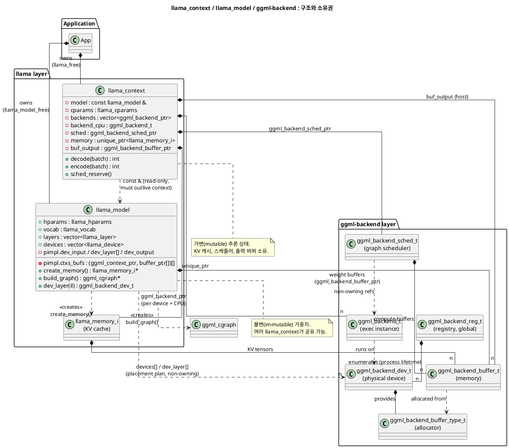
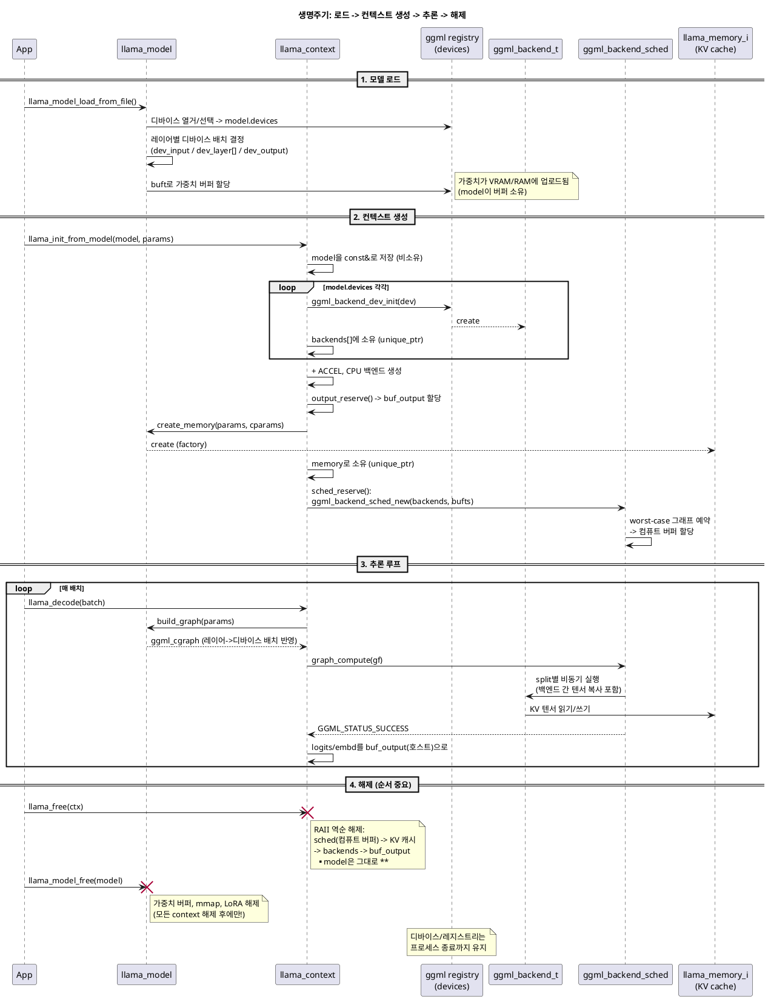
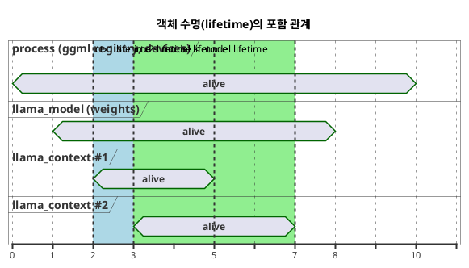

# llama_context / llama_model / ggml-backend: 관계, 소유권, 생명주기

`llama_context`, `llama_model`, ggml-backend 계층이 서로 어떻게 참조하고, 누가 무엇을 소유하며, 어떤 순서로 생성/소멸되는지를 정리한다.

PlantUML 원본:

- [12-class-diagram-ownership.puml](12-class-diagram-ownership.puml) - 구조/소유권 클래스 다이어그램
- [12-sequence-lifecycle.puml](12-sequence-lifecycle.puml) - 생명주기 시퀀스 다이어그램
- [12-object-lifetime.puml](12-object-lifetime.puml) - 객체 수명 타이밍 다이어그램

---

## 1. 전체 구조 개요 (세 개의 계층)

| 계층 | 역할 | 대표 타입 |
|---|---|---|
| **llama_context** | 추론 실행 상태 (KV 캐시, 스케줄러, 출력 버퍼) | `llama_context` |
| **llama_model** | 불변(immutable) 가중치 + 디바이스 배치 정보 | `llama_model` |
| **ggml-backend** | 하드웨어 추상화 (디바이스, 실행 인스턴스, 버퍼, 스케줄러) | `ggml_backend_dev_t`, `ggml_backend_t`, `ggml_backend_buffer_t`, `ggml_backend_sched_t` |

ggml-backend 계층 안에서도 역할이 나뉜다:

- **`ggml_backend_reg_t`** (레지스트리): CUDA, Metal, CPU 등 백엔드 모듈 자체. 프로세스 전역(global)이며 누구도 소유하지 않음.
- **`ggml_backend_dev_t`** (디바이스): 물리 장치 핸들 (예: "CUDA0"). 레지스트리가 소유하는 싱글턴 성격 - llama.cpp는 절대 free하지 않고 참조만 함.
- **`ggml_backend_t`** (백엔드 인스턴스): 디바이스에서 실제로 그래프를 실행하는 "실행 스트림". `ggml_backend_dev_init()`으로 생성되며 **llama_context가 소유**.
- **`ggml_backend_buffer_type_t`** (buft): 메모리 할당자 종류 (VRAM, host-pinned, CPU 등). 디바이스가 소유.
- **`ggml_backend_buffer_t`** (버퍼): 실제 메모리 할당. **할당한 주체가 소유** (가중치는 model, 컴퓨트 버퍼는 sched, KV 캐시는 memory, 출력은 context).
- **`ggml_backend_sched_t`** (스케줄러): 그래프를 백엔드별로 split해서 실행. **llama_context가 소유**.

## 2. 관계 (Relationship) - 누가 누구를 참조하는가

### llama_context -> llama_model: 비소유 const 참조 (읽기 전용 의존)

```cpp
// src/llama-context.h:267
const llama_model & model;
```

- context는 model을 `const &`로만 들고 있어 **가중치를 절대 수정하지 않는다**. 그래서 **하나의 model을 여러 context가 동시에 공유** 가능하다 (예: 서버에서 슬롯마다 context 생성).
- model은 context의 존재를 모른다 (역참조 없음). 단방향 의존이다.

### llama_model -> ggml_backend_dev_t: 비소유 참조 (디바이스 배치 계획)

```cpp
// src/llama-model.h:581
std::vector<llama_device> devices;          // 이 모델이 사용할 디바이스 목록
// pimpl 내부 (src/llama-model.cpp:990~997)
layer_dev dev_input, dev_output;
std::vector<layer_dev> dev_layer;           // 레이어 i -> 어느 디바이스인지
```

- model은 로드 시점에 `-ngl`, `split_mode`, `tensor_split`에 따라 **"레이어 -> 디바이스" 매핑을 결정**하고, 그 디바이스의 buft로 가중치 버퍼를 할당한다.
- 디바이스 핸들 자체는 전역 레지스트리 소유이므로 model은 참조만 한다.

### llama_context -> ggml_backend_t: 소유 (실행 인스턴스 생성)

```cpp
// src/llama-context.cpp:247~272 (생성자)
for (const auto & dev : model.devices) {
    ggml_backend_t backend = ggml_backend_dev_init(dev.dev, nullptr);  // 디바이스마다 인스턴스 생성
    backends.emplace_back(backend);       // ggml_backend_ptr(unique_ptr)로 소유
}
// + ACCEL 백엔드(BLAS 등) + CPU 백엔드 추가
```

핵심: **model은 "어느 디바이스에 무엇이 있는지"(정적 배치)를 알고, context는 그 디바이스들 위에서 "실제 실행 인스턴스"(동적 실행)를 만든다.** 같은 model로 context를 두 개 만들면 CUDA 백엔드 인스턴스도 두 벌 생긴다.

### llama_context -> ggml_backend_sched_t: 소유 (그래프 분할/실행)

```cpp
// src/llama-context.cpp:438 (sched_reserve)
sched.reset(ggml_backend_sched_new(backend_ptrs.data(), backend_buft.data(), ...));
```

- sched는 context가 소유한 backends를 **비소유로 참조**하며, 백엔드별 **컴퓨트 버퍼(중간 활성값 메모리)는 sched가 소유**한다.
- 매 decode마다 `model.build_graph()`가 만든 그래프를 sched가 디바이스별 split으로 나눠 실행한다 - 여기서 model의 레이어 배치와 context의 실행이 만난다.

### model은 팩토리, context는 소유자 (KV 캐시)

```cpp
// src/llama-context.cpp:309
memory.reset(model.create_memory(params_mem, cparams));   // model이 생성, context가 소유
```

KV 캐시 구조(통합 KV, SWA, recurrent state 등)는 아키텍처에 따라 다르므로 **model이 팩토리 메서드로 생성**하지만, KV 캐시는 시퀀스별 상태이므로 **context가 소유**한다. KV 텐서는 `model.dev_layer(il)`이 가리키는 디바이스에 할당된다 (`offload_kqv`).

## 3. 소유권 (Ownership) 정리표

| 소유자 | 소유 대상 | 메커니즘 | 근거 |
|---|---|---|---|
| 애플리케이션 | `llama_model`, `llama_context` | C API (`llama_model_free`, `llama_free`) | 공개 API |
| `llama_model` | 가중치 버퍼 + 텐서 메타 컨텍스트 | `pimpl->ctxs_bufs` (`ggml_context_ptr` + `ggml_backend_buffer_ptr`) | src/llama-model.cpp:985 |
| `llama_model` | mmap/mlock 핸들 | `pimpl->mappings`, `mlock_*` | src/llama-model.cpp:978~982 |
| `llama_model` | 등록된 LoRA 어댑터 | 소멸자에서 `delete lora` | src/llama-model.cpp:1006 |
| `llama_context` | 백엔드 인스턴스 (`ggml_backend_t`) | `std::vector<ggml_backend_ptr> backends` | src/llama-context.h:332 |
| `llama_context` | 스케줄러 | `ggml_backend_sched_ptr sched` | src/llama-context.h:327 |
| `llama_context` | KV 캐시 (memory 모듈) | `std::unique_ptr<llama_memory_i>` | src/llama-context.h:276 |
| `llama_context` | 출력 호스트 버퍼 (logits/embd) | `ggml_backend_buffer_ptr buf_output` | src/llama-context.h:354 |
| `ggml_backend_sched` | 백엔드별 컴퓨트 버퍼 | sched 내부 | ggml-backend |
| ggml 레지스트리 (전역) | `ggml_backend_dev_t`, `ggml_backend_reg_t` | 프로세스 수명 | ggml-backend |
| `llama_context` (비소유) | `llama_model` | `const &` - model이 context보다 오래 살아야 함 | src/llama-context.h:267 |
| `llama_model` (비소유) | `ggml_backend_dev_t` | 배치 계획용 참조만 | src/llama-model.h:581 |

모든 소유는 `ggml/include/ggml-cpp.h`의 RAII 스마트 포인터(`ggml_backend_ptr` = `unique_ptr` + `ggml_backend_free` deleter 등)로 관리되므로, 소멸자 호출만으로 역순 정리가 보장된다.

## 4. 생명주기 (Lifecycle)

1. **프로세스 시작**: ggml 백엔드 레지스트리가 디바이스를 열거 (`ggml_backend_dev_get(i)`). 이들은 전역이며 프로세스 종료까지 산다.
2. **`llama_model_load_from_file()`**: 사용할 디바이스 선정 -> `model->devices` 구성 (src/llama.cpp:143~262) -> GGUF 파싱 -> 레이어별 디바이스/buft 결정 (`dev_input/dev_layer/dev_output`) -> **가중치 버퍼를 각 디바이스에 할당하고 업로드** (mmap 가능 시 mmap). 이후 model은 사실상 불변.
3. **`llama_init_from_model()`** -> `llama_context` 생성자 (src/llama-context.cpp:33):
   - `model.devices`의 각 디바이스에 대해 `ggml_backend_dev_init()` -> 백엔드 인스턴스 생성 (+ ACCEL + CPU)
   - 출력 버퍼 예약 (`output_reserve`)
   - `model.create_memory()` -> KV 캐시 생성
   - `sched_reserve()`: worst-case 그래프를 예약해 **컴퓨트 버퍼를 미리 할당**하고 (`ggml_backend_sched_new`), Flash Attention 자동 판별 등 수행
4. **추론 루프**: `llama_decode()` -> `process_ubatch()` -> `model.build_graph()` (그래프는 매번 model이 생성, 재사용 가능) -> `sched`가 backends에 분산 실행 -> 결과를 `buf_output`(호스트)으로 복사.
   - LoRA 변경, 샘플러 변경 등 그래프 구조가 바뀌면 `sched_reserve()`로 스케줄러 재생성.
5. **`llama_free(ctx)`**: context 소멸 -> sched(컴퓨트 버퍼), KV 캐시, 백엔드 인스턴스, 출력 버퍼가 RAII로 해제. **model과 가중치는 영향 없음** - 다른 context가 계속 사용 가능.
6. **`llama_model_free(model)`**: 가중치 버퍼(VRAM/RAM), mmap, 등록된 LoRA 해제. **반드시 모든 context를 먼저 free해야 함** (context가 dangling 참조를 갖게 되므로).
7. 디바이스/레지스트리는 프로세스 종료 시 정리.

## 5. PlantUML 시각화

### 5-1. 클래스 다이어그램 (구조/소유권/관계)



### 5-2. 시퀀스 다이어그램 (생명주기)



### 5-3. 객체 수명 다이어그램



---

## 핵심 요약

1. **의존 방향은 한쪽**: `llama_context` -> `llama_model` -> `ggml_backend_dev_t` 순으로만 참조하며 역참조는 없다.
2. **model = 정적/공유, context = 동적/독점**: model은 "가중치 + 레이어를 어느 디바이스에 둘지"라는 불변 계획을 소유하고, context는 그 계획 위에서 "백엔드 실행 인스턴스 + 스케줄러 + KV 캐시 + 출력"이라는 가변 실행 상태를 소유한다.
3. **`ggml_backend_dev_t`(디바이스)와 `ggml_backend_t`(실행 인스턴스)를 구분하는 것이 핵심**: 디바이스는 전역 싱글턴(레지스트리 소유), 실행 인스턴스는 context마다 새로 생성/소유된다.
4. **버퍼는 할당한 주체가 소유**: 가중치 버퍼=model, 컴퓨트 버퍼=sched(context 소유), KV 버퍼=memory(context 소유), 출력 버퍼=context.
5. **해제 순서**: context들 먼저 -> model -> (디바이스는 프로세스와 함께). context가 model을 비소유 참조하므로 이 순서를 어기면 dangling reference가 된다. 모든 소유는 `ggml-cpp.h`의 unique_ptr RAII로 자동화되어 있다.
