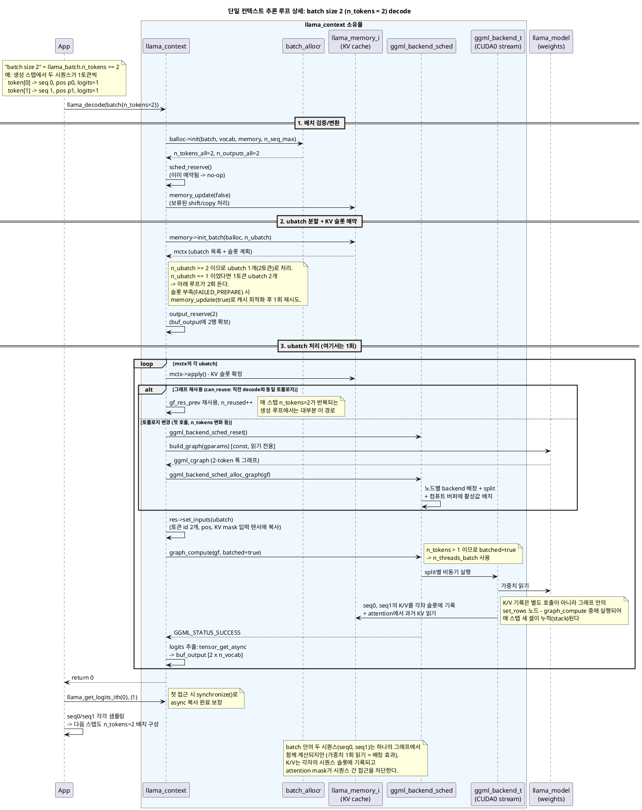
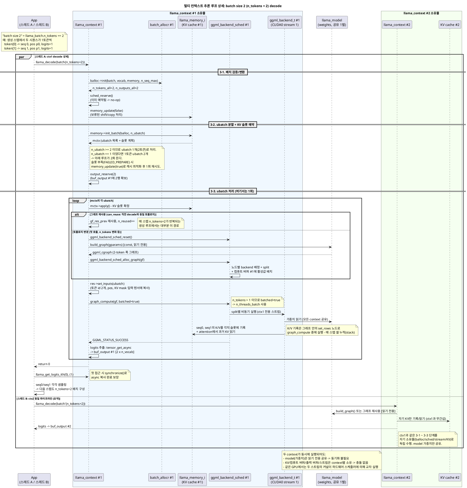
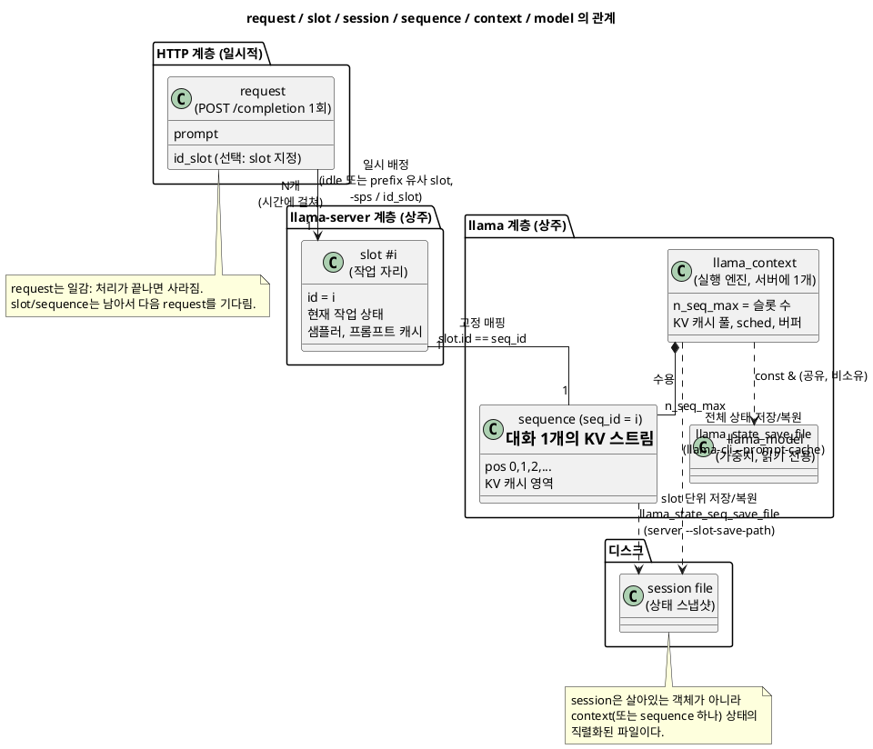
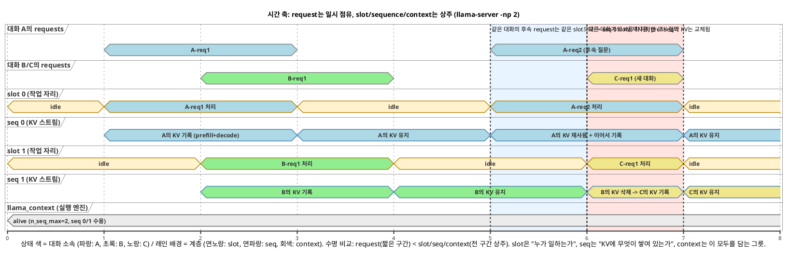

# batch, ubatch, sequence: llama.cpp의 실행 데이터 단위

[12번 문서](12-context-model-backend-ownership.md)가 `llama_context` / `llama_model` / ggml-backend의 **객체 구조**(소유권, 생명주기)를 다룬다면, 이 문서는 그 위에서 **실행 데이터가 흐르는 단위** - batch(논리), ubatch(물리), sequence(대화) - 를 다룬다. 요청이 어떤 단위로 묶이고, 쪼개지고, 격리되는지를 정의하고, 두 개의 대화를 예로 decode 파이프라인 상세까지 따라간 뒤, 이를 실행해 볼 수 있는 번들 도구들(llama-server, llama-parallel, llama-batched 등)의 사용법을 정리한다.

PlantUML 원본:

- [13-sequence-decode-batch2-single-context.puml](13-sequence-decode-batch2-single-context.puml) - batch size 2 decode 상세 시퀀스 다이어그램 (단일 컨텍스트, 기본형)
- [13-sequence-decode-batch2-single-context-detailed.puml](13-sequence-decode-batch2-single-context-detailed.puml) - 위 기본형의 상세 주석판: 두 대화 예제 연동, 함수별 역할 설명, 텐서 shape 흐름, KV 캐시 메모리 레이아웃, 변수 용어 표 포함
- [13-sequence-prefill-2seq-single-context-detailed.puml](13-sequence-prefill-2seq-single-context-detailed.puml) - 상세 주석판의 prefill 편: 서로 다른 두 대화(13토큰)를 한 pass로 prefill하는 과정. causal+seq 격리 mask, get_rows에 의한 13->2 출력 축소, compute-bound vs memory-bound 비교. decode 주석판의 "이전 단계"에 해당
- [13-sequence-decode-batch2-multi-context.puml](13-sequence-decode-batch2-multi-context.puml) - batch size 2 decode 상세 시퀀스 다이어그램 (멀티 컨텍스트)
- [13-request-slot-session-structure.puml](13-request-slot-session-structure.puml) - request/slot/session/sequence/context 구조 다이어그램
- [13-request-slot-timeline.puml](13-request-slot-timeline.puml) - slot 점유 시간 축 다이어그램

---

## 1. 용어 정의: batch vs ubatch

"batch"와 "ubatch"는 prefill/decode라는 단계 구분이 아니라 **논리(logical) 단위 vs 물리(physical) 단위**의 구분이다. 공식 정의는 include/llama.h:338-339:

```c
uint32_t n_batch;   // logical maximum batch size that can be submitted to llama_decode
uint32_t n_ubatch;  // physical maximum batch size
```

### llama_batch (논리 배치)

API 사용자가 `llama_decode()` 한 번에 제출하는 작업 묶음. 최대 크기가 `n_batch`이며, prefill/decode 구분이 없다. 여러 시퀀스의 토큰을 섞어 담을 수 있다 - llama-server가 "슬롯 A의 프롬프트 조각 512토큰 + 슬롯 B의 생성 토큰 1개 + 슬롯 C의 생성 토큰 1개"를 한 batch에 담는 것이 정확히 이 용도다. batch 단위로는 어떤 연산도 일어나지 않는다 (스케줄링/API 경계일 뿐).

### llama_ubatch (물리 마이크로배치)

**그래프 1회 빌드 + `graph_compute()` 1회 실행이 실제로 처리하는 단위** (src/llama-batch.h:15). 최대 크기가 `n_ubatch`이고, 컴퓨트 버퍼(중간 활성값 메모리)와 worst-case 그래프 예약이 모두 이 폭 기준으로 잡힌다. 내부 구조도 단순 토큰 나열이 아니라 `n_seq_tokens x n_seqs`(시퀀스 세트별 토큰 수 x 세트 수)로 정규화되어 있다.

### 관계

```
1 llama_decode(batch) 호출 = 논리 batch 1개
  -> memory->init_batch()가 N개의 ubatch로 분할
  -> ubatch마다 그래프 빌드(또는 재사용) + 실행 1회
```

흔한 통념인 "ubatch는 prefill을 쪼개는 단위"는 결과적으로는 대부분 맞지만 정의가 아니다. **분할은 prefill/decode를 가리지 않고 모든 batch에 항상 적용된다.** decode 스텝은 보통 `n_tokens`(= 활성 시퀀스 수)가 `n_ubatch`보다 작아 ubatch 1개로 끝나기 때문에 분할이 눈에 띄지 않을 뿐이다.

예 (`n_batch=8192`, `n_ubatch=512`):

| 시나리오 | batch 내용 | ubatch 분할 결과 |
|---|---|---|
| prefill | 프롬프트 8192토큰 | 512토큰 x 16개 -> 그래프 실행 16회 |
| decode | 32개 시퀀스가 1토큰씩 (32토큰) | 1개 -> 그래프 실행 1회 |
| 혼합 (서버) | 프롬프트 조각 500토큰 + 생성 토큰 12개 | 512토큰 1개 -> 그래프 실행 1회 |

### 분할 방식은 memory 모듈이 결정

`memory->init_batch()`가 KV 캐시 구조에 따라 세 가지 분할 방법 중 하나를 선택한다 (src/llama-batch.h:102-110):

| 방식 | 동작 | 사용처 |
|---|---|---|
| `split_simple` | 순서대로 최대 `n_ubatch`개씩 자름 | 통합(unified) KV 캐시, 단일 스트림 (src/llama-kv-cache.cpp:644) |
| `split_equal` | 시퀀스 세트들을 같은 길이로 묶어서 자름 | 비통합 KV(시퀀스별 스트림), recurrent/hybrid 모델 |
| `split_seq` | ubatch 하나에 시퀀스 세트 하나만 | recurrent 모델 (src/llama-memory-recurrent.cpp:417) |

`encode()`는 예외적으로 항상 `split_simple(n_tokens)` - 전체 배치를 ubatch 1개로 처리한다 (src/llama-context.cpp:1354). 그래서 non-causal attention에는 `n_ubatch >= n_tokens` 제약이 있다 (src/llama-context.cpp:1702).

### 왜 두 단계로 나누는가

- **`n_batch`가 제한하는 것**: 논리적 제출 크기와 출력 버퍼 (`n_outputs_max`의 기본값 = `n_batch`). 커도 메모리 부담이 작다.
- **`n_ubatch`가 제한하는 것**: 활성값 메모리(컴퓨트 버퍼는 ubatch 폭에 비례)와 그래프 크기. 실제 VRAM 사용량을 좌우한다.
- 그래서 "크게 묶어 제출하되(`n_batch` 크게 -> 스케줄링 효율), 실제 계산은 감당 가능한 조각으로(`n_ubatch`)"가 가능하다. 부수 효과로 멀티 GPU **파이프라인 병렬**(ubatch들이 디바이스 간 파이프라인으로 흐름)도 이 분할이 전제다.
- `cparams.n_ubatch = min(n_batch, n_ubatch)`로 항상 `n_ubatch <= n_batch`가 강제된다 (src/llama-context.cpp:184).

요약: **batch = "무엇을 함께 제출할지"의 논리 단위 (prefill/decode 혼합 가능), ubatch = "한 번의 그래프 실행이 감당할 물리 단위" (모든 batch가 항상 이 단위로 분할되며, prefill에서 분할이 두드러질 뿐).**

---

## 2. 예제로 보는 context vs sequence와 논리/물리 배치

일상적으로 쓰는 "컨텍스트"(대화 문맥)와 llama.cpp의 `llama_context`(C++ 객체)는 다른 것이다. 두 개의 독립적인 질문을 예로 정리한다:

- 대화 1: `"what is capital of france?"`
- 대화 2: `"who is best soccer player?"`

### 용어 대응

| 용어 | 정체 | 이 예시에서 |
|---|---|---|
| **sequence** (`llama_seq_id`) | 독립적인 토큰 스트림 하나 = 대화 하나. 자기만의 위치(pos 0,1,2...)와 KV 캐시 영역을 가짐 | 대화 1 = seq 0, 대화 2 = seq 1 |
| **`llama_context`** | 실행 엔진 객체 (KV 캐시 풀 + 스케줄러 + 버퍼). **최대 `n_seq_max`개의 sequence를 동시에 수용하는 그릇** | 보통 1개면 충분 - 두 대화 모두 이 안에서 처리 |
| **context window** (`n_ctx`) | 용량(토큰 수). sequence들이 나눠 씀 (`n_ctx_seq = n_ctx / n_seq_max`, src/llama-context.cpp:209) | 두 대화가 쓸 수 있는 토큰 예산 |

일상어의 "컨텍스트 2개"는 llama.cpp 용어로는 대부분 **"llama_context 1개 안의 sequence 2개"**다. llama-server의 슬롯이 정확히 sequence에 해당한다.

### 시나리오 A (일반적): context 1개, sequence 2개

토큰화 결과를 seq 0 = 7토큰, seq 1 = 6토큰이라 하자 (실제 개수는 토크나이저에 따라 다름).

**1단계 - prefill: 논리 batch 1개에 두 대화를 함께 담는다** (`n_tokens = 13`):

| i | token | seq_id | pos | logits |
|---|---|---|---|---|
| 0 | "what" | **0** | 0 | 0 |
| 1 | "is" | **0** | 1 | 0 |
| ... | ... | **0** | ... | 0 |
| 6 | "?" | **0** | 6 | **1** |
| 7 | "who" | **1** | 0 | 0 |
| 8 | "is" | **1** | 1 | 0 |
| ... | ... | **1** | ... | 0 |
| 12 | "?" | **1** | 5 | **1** |

**pos가 seq마다 0부터 다시 시작**한다. batch는 "두 대화를 한 번에 제출한다"는 논리적 묶음일 뿐, 두 질문이 이어진 하나의 문장이 되는 것이 아니다.

**2단계 - 물리 배치(ubatch)로 분할**:

- `n_ubatch = 512`(기본)라면: 13 <= 512이므로 **ubatch 1개** -> 그래프 1회 실행으로 두 질문을 동시에 계산. 가중치를 한 번만 읽으면서 13토큰을 다 처리하는 것이 배칭의 이득이다.
- `n_ubatch = 8`이라면: `split_simple`이 [i=0..7] 8토큰, [i=8..12] 5토큰의 **ubatch 2개**로 잘라 그래프를 2회 실행한다. 두 번째 ubatch가 seq 1의 나머지를 처리해도 결과는 동일하다.

**3단계 - 격리 보장**: 같은 그래프 안에서 함께 계산돼도 seq 0의 K/V는 KV 캐시의 seq 0 슬롯에, seq 1의 K/V는 seq 1 슬롯에 기록되고, **attention mask가 seq_id 기준으로 교차 접근을 차단**한다. "france" 토큰이 "soccer" 토큰을 attend할 수 없으므로, 수학적으로는 두 질문을 따로 돌린 것과 같은 결과가 나온다.

**4단계 - decode: 매 스텝이 batch size 2**: prefill 후 logits 2행(각 seq의 마지막 토큰 위치)을 샘플링해서

```
batch = { token[0]: seq0의 새 토큰 (pos 7),
          token[1]: seq1의 새 토큰 (pos 6) }   // n_tokens = 2
```

이것이 [3장](#3-decode-상세-batch-size-2가-처리되는-과정)의 상황이다. 2 <= n_ubatch이므로 항상 ubatch 1개 -> 그래프 1회로 두 대화가 동시에 한 토큰씩 전진한다. 한쪽 답이 먼저 끝나면 다음 스텝부터 batch는 n_tokens=1이 된다.

### 시나리오 B (비교): llama_context를 2개 만드는 경우

ctx1에 대화 1(그 안에서는 seq 0), ctx2에 대화 2(역시 자기 seq 0)를 담는 방법:

- `llama_decode()`가 **각 context마다 따로** 호출되고 그래프도 각각 실행된다. **두 질문이 하나의 batch로 묶이는 일은 없다** - batch는 context 내부의 개념이기 때문이다.
- 대신 KV 캐시, 컴퓨트 버퍼, 출력 버퍼가 context마다 별도로 생기고(메모리 증가), 스레드 2개로 병렬 실행이 가능하다 ([12번 문서 5-3절](12-context-model-backend-ownership.md#5-3-시퀀스-다이어그램-멀티-컨텍스트-하나의-model을-여러-context가-공유) 참고).

### 선택 기준

- 같은 설정으로 많은 대화를 효율적으로 다중화 -> **시나리오 A (sequence)**: 배칭 효과, 메모리 절약
- 완전한 격리, 서로 다른 `n_ctx`/cparams, 스레드 병렬 -> **시나리오 B (context)**

---

## 3. decode 상세: batch size 2가 처리되는 과정

"batch size 2"는 `llama_batch.n_tokens == 2`를 뜻한다. 전형적인 예는 생성 스텝에서 두 시퀀스가 각각 1토큰씩 넣는 경우다 (`token[0]` -> seq 0, `token[1]` -> seq 1, 둘 다 `logits=1`) - 바로 [2장](#2-예제로-보는-context-vs-sequence와-논리물리-배치) 예제의 4단계 상황이다. 다이어그램은 두 가지다: 먼저 **단일 컨텍스트 기본형**으로 decode 내부를 보고, 이어서 **멀티 컨텍스트 확장형**(context 2개가 model을 공유, ctx1 상세 + ctx2 요약)으로 확장한다.

`llama_context::decode()` (src/llama-context.cpp:1632) 내부에서 batch 하나가 처리되는 단계:

1. **배치 검증/변환**: `balloc->init()` (src/llama-context.cpp:1683) -> `n_tokens_all=2`, `n_outputs_all=2` 산출. `sched_reserve()`는 이미 예약돼 있으면 no-op.
2. **ubatch 분할 + KV 슬롯 예약**: `memory->init_batch(*balloc, n_ubatch)` (src/llama-context.cpp:1723)가 batch를 ubatch들로 쪼개고 KV 슬롯을 계획한 `mctx`를 돌려준다. `n_ubatch >= 2`이면 2토큰짜리 ubatch 1개, `n_ubatch == 1`이면 1토큰 ubatch 2개가 되어 처리 루프가 2회 돈다. 슬롯 부족(`FAILED_PREPARE`) 시 `memory_update(true)`로 캐시 최적화 후 1회 재시도.
3. **ubatch 처리 루프** (`process_ubatch`, src/llama-context.cpp:1257):
   - `mctx->apply()`로 KV 슬롯 확정
   - **그래프 재사용 판정** (`can_reuse`, src/llama-context.cpp:1271): 직전 decode와 토폴로지가 같으면 `gf_res_prev`를 재사용(`n_reused++`). 매 스텝 n_tokens=2가 반복되는 생성 루프에서는 대부분 이 경로를 탄다. 토폴로지가 바뀌었으면 `sched_reset` -> `model.build_graph()` -> `sched_alloc_graph`.
   - `res->set_inputs(ubatch)`: 토큰 id 2개, pos, KV mask를 입력 텐서로 복사
   - `graph_compute(gf, batched=true)`: `n_tokens > 1`이므로 batched=true -> `n_threads_batch` 사용. sched가 split별로 백엔드(자기 전용 스트림)에 비동기 실행.
   - logits 추출: `ggml_backend_tensor_get_async`로 `buf_output`에 2행(`2 x n_vocab`) 복사
4. **App에서 결과 사용**: `llama_get_logits_ith(0)`, `(1)` - 첫 접근 시 `synchronize()`로 async 복사 완료를 보장. seq0/seq1 각각 샘플링해서 다음 스텝의 2토큰 배치를 다시 구성.

### 단일 컨텍스트 (기본형)

더 깊이 파고들고 싶다면 [상세 주석판](13-sequence-decode-batch2-single-context-detailed.puml)을 참고하라 - 2장의 두 대화 예제를 그대로 이어받아, 모든 함수 호출의 역할(sched_reserve가 왜 no-op인지, init_batch가 KV 셀을 어떻게 찾는지), 단계별 텐서 shape(`[n_embd, 2]` -> `[n_vocab, 2]`), KV 캐시의 메모리 레이아웃(`[n_embd_k_gqa, kv_size, n_stream]`, 셀 배치도), 변수 용어 표까지 주석으로 담았다. 그 "이전 단계"인 [prefill 상세 주석판](13-sequence-prefill-2seq-single-context-detailed.puml)은 빈 KV에서 시작해 두 프롬프트 13토큰이 한 pass로 prefill되는 과정(causal+seq 격리 mask, 출력 2행만 계산)을 같은 형식으로 다룬다 - 이런 배칭을 실제로 수행하는 실행체는 llama-parallel/llama-server다.



### 멀티 컨텍스트 (확장형)

멀티 컨텍스트 관점에서 중요한 점:

- ctx2도 같은 1~4 단계를 **자기 소유물(balloc, sched, 컴퓨트 버퍼, 스트림, KV, 출력 버퍼)로 독립 수행**하며, 공유하는 것은 model 가중치(읽기 전용)뿐이다.
- 같은 GPU에서 두 context가 동시에 돌면 각자의 backend 인스턴스(스트림)에 커널이 제출되고, 하드웨어 스케줄러가 이를 교차 실행한다. 소프트웨어 레벨 동기화는 필요 없다.
- batch 안의 두 시퀀스(seq0, seq1)는 **하나의 그래프에서 함께 계산**되지만 (가중치를 1회만 읽는 배칭 효과), K/V는 각자의 시퀀스 슬롯에 기록되고 attention mask가 시퀀스 간 접근을 차단한다.



---

## 4. 1 context + multi-sequence를 실행하는 도구들

번들 실행 파일 중 "llama_context 1개 + sequence 여러 개"를 실제로 돌려볼 수 있는 것은 `llama-server`, `llama-parallel`, `llama-batched`, `llama-batched-bench` 4개다. `llama-cli`, `llama-simple`은 단일 sequence 전용이다.

| Executable | 1 ctx + multi-seq | sequence의 의미 |
|---|---|---|
| **llama-server** | O | HTTP 슬롯 = sequence (실서비스용) |
| **llama-parallel** | O | 가상 클라이언트 = sequence (서빙 시뮬레이션) |
| **llama-batched** | O | 같은 프롬프트에서 N개 이어쓰기 생성 |
| **llama-batched-bench** | O | 배치 디코딩 성능 벤치마크 |
| llama-cli | X | 대화 1개, seq 0만 사용 |
| llama-simple / simple-chat | X | `llama_batch_get_one()`으로 seq 0만 사용 (examples/simple/simple.cpp:149) |

공통 스위치는 **`-np` (`--parallel`)** 다. 이 값이 `n_parallel` -> `llama_context_params.n_seq_max`로 전달되어 "context 1개 안의 sequence 수"가 된다 (common/arg.cpp:2159~2173).

### llama-server - 실서비스에서 슬롯 병렬 처리

```bash
llama-server -m model.gguf -c 16384 -np 4
```

슬롯 4개 = sequence 4개. 동시에 들어온 HTTP 요청이 각 슬롯(seq_id)에 배정되어 하나의 batch로 묶여 decode된다. `-c 16384`면 슬롯당 `n_ctx_seq = 4096`. `--kv-unified`를 켜면 슬롯들이 KV 예산을 공유한다 (tools/server/README.md).

### llama-parallel - 서빙 시뮬레이션

```bash
llama-parallel -m model.gguf -np 8 -ns 128 --top-k 1 -pps --junk 10 -c 16384
```

`-np 8`: 동시 클라이언트(sequence) 8개, `-ns 128`: 총 요청 128개, `-pps`: 시스템 프롬프트를 모든 sequence가 공유(한 번만 prefill). [2장](#2-예제로-보는-context-vs-sequence와-논리물리-배치)에서 다룬 "여러 대화가 한 batch에 섞여 들어가는" 동작을 가장 직접적으로 관찰할 수 있는 예제다 (examples/parallel).

### llama-batched - 한 프롬프트에서 N개 생성

```bash
llama-batched -m model.gguf -p "Hello my name is" -np 4 --kv-unified
```

**하나의 공유 프롬프트**에서 N개의 생성을 갈라낸다: prefill 시 프롬프트의 각 토큰을 `seq_ids = [0..N-1]` **전부에 태깅**해 1회만 계산하고(복사 없는 prefix 공유, examples/batched/batched.cpp:122~130; KV를 seq_cp로 복사하던 옛 방식은 주석 처리됨, batched.cpp:156~160), 이후 매 스텝 `n_tokens=N` batch로 N개 시퀀스가 동시에 생성된다. `llama_batch`에 seq_id를 직접 채우는 가장 작은 교과서 코드다.

[3장](#3-decode-상세-batch-size-2가-처리되는-과정)의 batch size 2 다이어그램과의 관계에는 주의가 필요하다: **decode 스텝 구간은 정확히 일치**하지만(seq당 1토큰, logits=1, EOG 시 batch 축소까지), **prefill 전제가 다르다**. 3장 상세 주석판은 "서로 다른 두 프롬프트가 각자 prefill된 상태"(2장 예제)를 가정하는 반면, llama-batched는 공유 프롬프트 1개다. 첫 스텝의 샘플링도 다르다 - llama-batched는 모든 seq가 같은 logits 행(공유 프롬프트의 마지막 토큰)에서 샘플링하고 샘플러 시드 차이로 스트림이 갈라진다.

### llama-batched-bench - 성능 측정

```bash
llama-batched-bench -m model.gguf -c 16384 -b 2048 -ub 512 -ngl 99 \
    -npp 128,256,512 -ntg 128,256 -npl 1,2,4,8,16,32
```

`-npl` = 동시 sequence 수를 1~32로 바꿔가며 PP(prefill)/TG(generation) 처리량을 측정한다. sequence 수에 따른 배칭 효율 변화를 수치로 보고 싶을 때 사용한다 (tools/batched-bench).

### 서로 다른 대화들의 prefill을 한 pass로 배칭하는 도구

"-np N으로 N개 sequence를 돌린다"는 점은 위 도구들이 같지만, **서로 다른 프롬프트들의 prefill이 하나의 batch(한 pass)에 함께 담기는지**는 도구마다 다르다:

| Executable | 서로 다른 대화의 prefill이 한 pass에? |
|---|---|
| **llama-parallel** | **O** - 이 시나리오의 최소 재현체 |
| **llama-server** | **O** - 실서비스 버전 (동시 도착한 요청들의 프롬프트 조각을 한 batch에 packing) |
| llama-batched | X - 프롬프트가 하나뿐 (모든 seq가 공유 태깅) |
| llama-batched-bench | 부분적 - 시퀀스별 독립 KV로 prefill을 배칭하지만 프롬프트 **내용**이 같아 "서로 다른 대화"는 아님 |

llama-parallel의 메커니즘 (examples/parallel/parallel.cpp): 메인 루프의 매 반복에서 하나의 `llama_batch`에 (1) **진행 중인 클라이언트들의 생성 토큰** 1개씩(parallel.cpp:299)과 (2) **새로 시작하는 클라이언트들의 프롬프트 전체**를 각자의 seq_id로(parallel.cpp:351~353) 함께 담는다. 같은 반복에서 클라이언트 2명이 시작하면 서로 다른 두 프롬프트가 한 batch에 나란히 들어간다 - [2장](#2-예제로-보는-context-vs-sequence와-논리물리-배치) 예제(13토큰 한 batch)와 [prefill 상세 주석판](13-sequence-prefill-2seq-single-context-detailed.puml)이 정확히 이 상황이다. 이후 `n_batch` 단위 chunk로 `llama_decode`가 호출되고(parallel.cpp:385~) 내부에서 다시 ubatch로 쪼개진다.

```bash
llama-parallel -m model.gguf -np 2 -ns 2 -c 8192
# continuous batching(기본 활성)으로 두 클라이언트가 같은 반복에서 시작하면
# 서로 다른 프롬프트 2개가 한 batch로 prefill됨
```

캐비앳: llama-server는 스케줄링 정책(대기 요청 수, n_batch 여유, defer 정책)에 따라 프롬프트 처리가 여러 반복으로 나뉠 수 있어 "항상 한 pass"가 보장되지는 않는다. 결정적으로 재현·관찰하려면 llama-parallel이 쉽다 (클라이언트 시작 로그와 batch 크기가 같이 찍힘).

### 참고: speculative / lookahead

`llama-speculative`, `llama-lookahead`도 내부적으로 한 context에서 여러 seq_id를 쓰지만, 독립 대화가 아니라 하나의 대화에 대한 draft 분기용이라 "multi-sequence 서빙"과는 목적이 다르다.

---

## 5. 용어 관계: request / slot / session / sequence / context

서버 관점에서 자주 혼동되는 다섯 용어의 정확한 정의와 관계. 흔한 오해인 "session == context", "slot == sequence == request" 중 **등식이 성립하는 것은 slot == sequence 하나뿐**이다.

### 정의

| 용어 | 계층 | 수명 | 정의 |
|---|---|---|---|
| **request** | HTTP | 초 단위 (일시적) | `POST /completion` 1회. 처리가 끝나면 사라지는 일감. `id_slot`으로 특정 slot을 지정할 수도 있다 |
| **slot** | llama-server | 서버 수명 (상주) | 상주하는 작업 자리. `slot.id = i`가 부여되고 (tools/server/server-context.cpp:1072) 현재 작업/샘플러/프롬프트 캐시 상태를 가짐 |
| **sequence** | llama | 서버 수명 (상주) | 대화 1개의 KV 스트림 (`llama_seq_id`). slot과 1:1 고정 매핑 - `slot.id`가 그대로 `seq_id`로 쓰인다 (server-context.cpp:1523) |
| **context** (`llama_context`) | llama | 서버 수명 | 실행 엔진. 서버에 1개이며 `n_seq_max`(= 슬롯 수)개의 sequence를 수용 |
| **session** | 디스크 | 프로세스보다 김 | **살아있는 객체가 아니라 상태 스냅샷 파일**. context 전체(`llama_state_save_file`, llama-cli `--prompt-cache`) 또는 sequence 하나(`llama_state_seq_save_file`, server `--slot-save-path`)를 직렬화한 것 (include/llama.h:773~828, 옛 이름 `llama_save_session_file`은 deprecated) |

### 관계 요약

- **request -> slot: 일시 배정 (N:1, 시간에 걸쳐)**. slot은 여러 request를 순차 처리하며, request가 끝나도 slot(과 그 KV)은 남는다. 같은 대화의 후속 request는 prefix가 겹치는 slot에 재배정되어 KV를 재사용한다 (`-sps, --slot-prompt-similarity` 또는 `id_slot` 명시).
- **slot == sequence: 1:1 고정**. slot은 sequence에 서버 스케줄링 상태를 덧붙인 래퍼다.
- **context ⊃ sequence: 수용 (1:N)**. `-np N`이 곧 `n_seq_max`.
- **context/sequence -> session: 직렬화**. 웹 서비스 용어의 "세션(사용자 대화)"을 뜻한다면 그것은 context가 아니라 **sequence**에 대응한다.

```
request (HTTP 1회, 일시적)
   --[배정: idle slot 또는 prefix가 비슷한 slot]-->
slot (서버의 상주 작업 자리)  ==1:1==  sequence (KV 스트림, 대화)
   --[N개 수용]-->
llama_context (실행 엔진, 서버에 1개)
   --[공유]-->
llama_model (가중치)

session file = context 상태(또는 slot/sequence 하나의 상태)의 디스크 스냅샷
```

### session : sequence = 1:1인가?

"session은 sequence당 KV를 하나 담으니 1:1"이라는 이해는 **내용물 기준으로만 맞고, 관계의 성격까지 1:1로 보면 틀리다**. 두 가지를 구분해야 한다.

**첫째, session에는 두 가지 종류(granularity)가 있다** (include/llama.h, src/llama-context.h:145~176):

| 종류 | API | 담는 내용 | sequence와의 관계 |
|---|---|---|---|
| **context 전체 session** | `llama_state_save_file` (llama-cli `--prompt-cache`) | context의 전체 상태 = **모든 sequence의 KV** + 출력 상태 | **1 : N** (그 context의 seq 전부) |
| **sequence 단위 session** | `llama_state_seq_save_file` (server `--slot-save-path`, `/slots/{id}?action=save`) | **sequence 1개**의 KV 스트림 | 내용물 기준 **1 : 1** |

"session = sequence당 KV 하나"는 sequence 단위 session에만 해당한다. llama-cli `--prompt-cache`가 만드는 session 파일은 context 전체 스냅샷이라 1:1이 아니다.

**둘째, sequence 단위 session이라도 slot==sequence 같은 등식은 아니다.** slot==sequence는 살아있는 두 객체 사이의 고정된 identity(slot.id가 곧 seq_id)지만, session:sequence는 **스냅샷 관계**라서 카디널리티가 시간에 걸쳐 N:M이다:

- **한 sequence -> 여러 session**: 같은 대화를 시점을 달리해 여러 번 저장하면 파일이 여러 개 생긴다.
- **한 session -> 여러 sequence**: 저장된 파일은 다른 seq_id, 다른 slot, 다른 프로세스의 context에도 복원할 수 있다 (같은 model 필요). 예: 공통 시스템 프롬프트의 KV를 하나 저장해 두고 여러 slot에 복원.
- **수명이 다르다**: sequence가 지워져도(KV 교체) session 파일은 남고, 서버 재시작 후에도 복원할 수 있다.

정리하면: **"sequence 단위 session 파일 하나는 특정 시점의 sequence 하나의 상태를 담는다"(스냅샷 단위 1:1)까지만 맞다.** 비유하자면 slot:sequence가 "좌석과 좌석번호"라면, session:sequence는 "사진과 피사체"다 - 사진 한 장에 피사체는 하나지만, 같은 피사체를 여러 번 찍을 수도, 사진을 여러 곳에 복사할 수도 있다.

### 구조 다이어그램



### 시간 축 다이어그램

수명 차이가 핵심이다: request(초 단위) < slot/sequence/context(서버 수명) < session file(프로세스보다 오래 살 수 있음).

slot 레인은 "누가 일하고 있는가"(작업 자리), seq 레인은 "KV에 무엇이 쌓여 있는가"(데이터), context 레인은 이 모두를 담는 그릇을 보여준다. slot이 idle이어도 seq의 KV는 남아 있다는 것이 둘을 분리해서 봐야 하는 이유다.



@5 구간이 서버 프롬프트 캐싱의 요점이다: 대화 A의 후속 request가 같은 slot 0에 배정되면 seq 0의 KV를 재사용해 prefill을 건너뛴다. 반대로 @6처럼 새 대화 C가 slot 1을 차지하면 B의 KV는 밀려나고, B가 다시 오면 재-prefill이 필요하다 (`--cache-idle-slots`가 이 손실을 완화).

---

## 6. 부록: K 벡터, MHA/GQA, 셀(n_ctx) - KV 캐시 크기를 결정하는 세 가지

상세 주석판의 KV 텐서 `[1024, 8192, 1]`을 읽는 데 필요한 배경 개념. (참고: "셀"은 cell, 즉 KV 캐시의 "칸"이다.)

### K 벡터란 무엇인가 - 왜 캐시하는가

attention에서 각 토큰은 레이어마다 세 가지 벡터를 만든다: **Q**(query, "내가 찾는 것"), **K**(key, "나를 찾을 때 쓰는 색인"), **V**(value, "내가 전달할 내용").

핵심: **미래의 모든 토큰이 과거 토큰들의 K와 V를 필요로 한다.** "Paris"를 생성하는 순간 attention은 "what", "is", "capital", ... 모든 과거 토큰의 K/V를 읽는다. 매번 다시 계산하면 낭비이므로 **한 번 계산한 K/V를 저장해 두는 것이 KV 캐시**다. Q는 그 순간만 쓰고 버리므로 캐시하지 않는다.

**"K 벡터 길이"** = 토큰 1개가 레이어 1개에 저장하는 K 데이터의 크기 (숫자 몇 개짜리인가).

### MHA vs GQA - K 벡터 길이를 결정하는 것

attention은 "헤드(head)"라는 병렬 단위 여러 개로 나뉘어 동작하고, 헤드 하나의 차원이 `d_head = 128`이다. **K 벡터 길이 = (K/V 헤드 수) x d_head** 인데, 이 K/V 헤드 수가 아키텍처에 따라 다르다:

```
MHA (Multi-Head Attention): Q 헤드마다 전용 K/V 헤드 1개
  Q헤드: Q1 Q2 Q3 Q4 ... Q32     (32개)
         |  |  |  |      |
  K헤드: K1 K2 K3 K4 ... K32     (32개) -> K 벡터 길이 = 32 x 128 = 4096

GQA (Grouped-Query Attention): Q 헤드 여러 개가 K/V 헤드 1개를 공유
  Q헤드: Q1 Q2 Q3 Q4 | Q5 Q6 Q7 Q8 | ... | Q29..Q32   (32개, 4개씩 그룹)
            \ | | /       \ | | /            \ | /
  K헤드:      K1            K2       ...      K8      (8개) -> 8 x 128 = 1024

MQA (Multi-Query Attention): 전체가 K/V 헤드 1개 공유 (극단)
  K헤드:      K1                                      (1개) -> 1 x 128 = 128
```

| 방식 | Q 헤드 | K/V 헤드 | K 벡터 길이 | KV 캐시 크기 |
|---|---|---|---|---|
| MHA | 32 | 32 | 32x128 = **4096** (n_embd와 우연히 같음) | 기준 |
| **GQA** | 32 | **8** | 8x128 = **1024** | **1/4** |
| MQA | 32 | 1 | 1x128 = 128 | 1/32 |

GQA의 아이디어: "Q는 토큰마다 다양해야 하지만, K/V는 몇 개를 공유해도 품질이 거의 안 떨어진다" -> **KV 캐시 메모리를 1/4로 줄이는 것**이 목적이다. Llama-2-70B 이후 대부분의 모델(Llama 3, Qwen, Mistral 등)이 GQA를 쓴다. 상세 주석판의 ne0=1024가 바로 이것이다 - 모델의 n_embd(4096)가 아니라 **GQA로 축소된 K/V 폭**이다.

**왜 하필 d_head=128, n_head_kv=8인가** - 이 값들은 llama.cpp의 선택이 아니라 모델 설계자의 선택이다 (GGUF 메타데이터로 읽힘):

- **d_head=128** = n_embd(4096) / n_head(32). 헤드당 부분공간의 표현력은 경험적으로 64~128이 최적 구간이고, 2의 거듭제곱이라 GPU 타일/텐서코어/Flash Attention 커널 최적화와 잘 맞는다. Llama/Qwen/Mistral 계열의 사실상 표준이며, 예외도 있다 (Gemma 2는 256, 소형 모델들은 64).
- **n_head_kv=8** = GQA 그룹 크기(Q헤드 4개당 KV헤드 1개)의 경험적 스위트스폿. GQA 논문(Ainslie et al. 2023)의 결론이 "KV 헤드를 1/4로 줄여도 품질 저하가 미미하다"였고, 부수적으로 8-way 텐서 병렬 샤딩(GPU 8장에 KV헤드 1개씩)과 나누어떨어지는 실용적 이유도 있다. Llama-2-70B 이후 Llama/Mistral 계열의 표준값이다.

### 셀(cell)과 n_ctx - 캐시의 "칸"

**셀 = 토큰 1개분의 K/V를 저장하는 자리**다. KV 캐시를 주차장에 비유하면:

```
cache_k_l (레이어 1개, K만):

         <- K 벡터 길이 1024 (칸 하나의 폭) ->
cell 0   [ what 의 K: 숫자 1024개            ]   <- "what"이 주차된 칸
cell 1   [ is   의 K: 숫자 1024개            ]
  ...
cell 6   [ ?    의 K: 숫자 1024개            ]
cell 7   [ who  의 K: 숫자 1024개            ]   <- seq 1의 첫 토큰
  ...
cell 12  [ ?    의 K: 숫자 1024개            ]
cell 13  [ 비어 있음                          ]
  ...
cell 8191[ 비어 있음                          ]   <- 총 n_ctx = 8192칸
```

- **n_ctx = 셀의 총 개수** = 이 context가 기억할 수 있는 토큰 총량. 8192면 모든 sequence의 토큰을 합쳐 8192개까지 저장 가능하고, 넘치면 오래된 것을 지우거나 요청을 거부해야 한다.
- 셀마다 "이 칸은 seq 0의 pos 3" 같은 태그가 붙어 attention mask가 자기 sequence의 칸만 읽게 한다 (unified KV).
- 이 구조가 레이어 수만큼(x32) 반복되고 V도 같은 크기로 있다.

### 전체 크기 공식 (세 개념의 결합)

```
KV 캐시 총량 = (K벡터 길이 + V벡터 길이) x 셀 수 x 레이어 수 x 원소 크기
            = (1024 + 1024)  x  8192  x  32  x  2B(F16)  =  1 GiB
               ^^^^GQA가 결정   ^^n_ctx가 결정
```

KV 캐시를 줄이는 손잡이는 정확히 세 개다: **GQA/MQA**(모델 설계, K벡터 길이 축소), **n_ctx**(런타임 설정, 셀 수 축소), **양자화**(`type_k`를 F16 -> Q8_0 등, 원소 크기 축소).

---

## 핵심 요약

1. **batch = 논리 단위**: `llama_decode()` 1회 제출 묶음. prefill/decode 구분 없이 여러 sequence의 토큰을 혼합할 수 있고, 그 자체로는 연산이 일어나지 않는다.
2. **ubatch = 물리 단위**: 그래프 1회 실행이 처리하는 폭. 컴퓨트 버퍼(VRAM)와 그래프 예약이 이 기준이며, 모든 batch는 항상 ubatch로 분할된다 (prefill에서 두드러질 뿐).
3. **sequence = 대화**: 일상어 "컨텍스트(대화 문맥)"에 해당하는 것은 `llama_context`가 아니라 sequence(`llama_seq_id`)다. `llama_context`는 여러 sequence를 수용하는 실행 엔진이다.
4. **격리는 seq_id로**: 같은 그래프에서 함께 계산돼도 KV 슬롯과 attention mask가 sequence 간 접근을 차단하므로 결과는 개별 실행과 동일하다.
5. **다중화는 sequence로, 격리는 context로**: 배칭 효율이 필요하면 한 context에 여러 sequence, 완전한 격리/개별 설정/스레드 병렬이 필요하면 context를 분리한다.
6. **직접 실행해 보려면**: `-np`(`--parallel`)가 sequence 수를 결정한다. 실서비스는 `llama-server -np N`, 시뮬레이션은 `llama-parallel`, 최소 예제 코드는 `llama-batched`, 벤치마크는 `llama-batched-bench`.
7. **서버 용어 등식은 slot == sequence 하나뿐**: request는 slot에 일시 배정되는 일감이고, session은 context/sequence 상태의 디스크 스냅샷 파일이다. 웹 서비스 의미의 "세션(대화)"은 context가 아니라 sequence에 대응한다. session:sequence는 스냅샷 관계다 - sequence 단위 저장이면 내용물은 1:1이지만, 저장/복원 카디널리티는 N:M이고 context 전체 session(1:N)도 있다.
