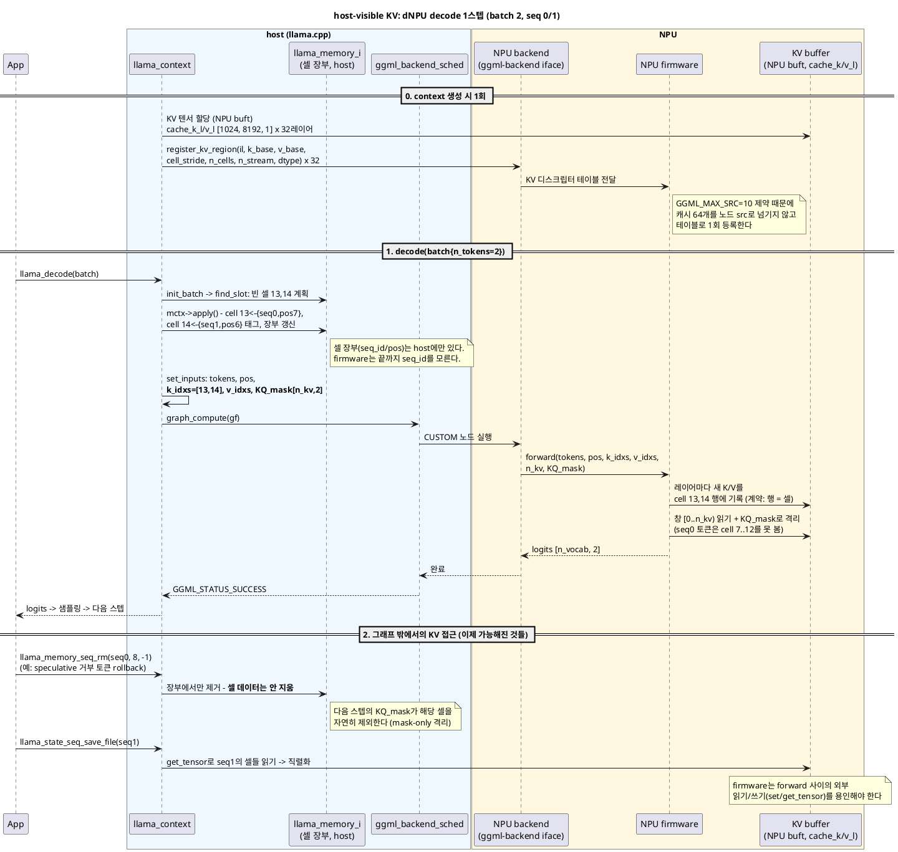
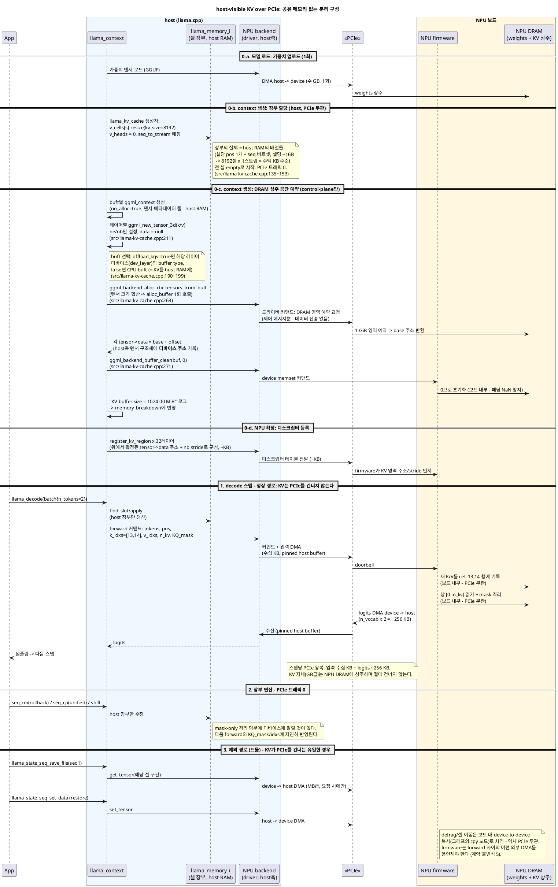

# Host-visible KV: 외부 가속기(NPU)에 llama.cpp KV 캐시를 개방하기

firmware가 내부적으로 관리하던 KV 캐시를 llama.cpp(host)가 관리하는 구조로 전환하는 것 - "host-visible KV" - 의 기술 원리를 다룬다. [12번](12-context-model-backend-ownership.md)(소유권)과 [13번](13-batch-ubatch-and-sequences.md)(실행 단위, KV 셀 모델)의 개념 위에서, 외부 가속기(dNPU) 연동 관점으로 재구성한 문서다. 실행 플랜(마일스톤/체크리스트)은 [00-handoff-npu-backend.md](00-handoff-npu-backend.md) 5절에 있다 - 이 문서는 그 플랜의 "왜"와 "무엇"을 담당한다.

PlantUML 원본:

- [14-host-visible-kv-decode.puml](14-host-visible-kv-decode.puml) - host-visible KV에서의 decode 1스텝 시퀀스 다이어그램
- [14-host-visible-kv-pcie.puml](14-host-visible-kv-pcie.puml) - 공유 메모리 없는 PCIe 분리 구성에서의 데이터 이동 시퀀스 다이어그램

---

## 1. 문제 정의: stateful node

ggml의 그래프 노드는 원칙적으로 **입력과 leaf 텐서의 순수 함수(pure function)**다. 같은 입력이면 같은 출력이고, 상태는 노드 밖(leaf 텐서)에만 존재한다.

firmware가 KV를 내부 관리하는 현재 dNPU 구조에서는 CUSTOM 노드가 이 원칙을 깬다:

```
현재:  logits = custom_node(tokens, pos)          <- 같은 입력, 다른 출력
                       ^ firmware 내부의 숨은 상태(KV)에 의존

목표:  logits = custom_node(tokens, pos, k_idxs, v_idxs, KQ_mask;  cache_k/v[leaf])
                       ^ 상태가 전부 명시적 - 순수 함수로 복귀
```

노드가 상태를 갖는 순간 잃는 것들이 정확히 13번 문서 5장의 기능 목록이다: rollback(`seq_rm`) 불가 -> **speculative decoding 불가**, `seq_cp` 불가 -> 프롬프트 공유 불가, KV 직렬화 불가 -> session save/restore 불가, 셀 장부 없음 -> 멀티 시퀀스 슬롯 관리 불가. **host-visible KV의 본질은 "숨은 상태를 명시적 피연산자로 끌어내 노드를 다시 순수하게 만드는 것"**이다.

## 2. llama.cpp의 KV 그래프 메커니즘

stock llama.cpp에서 KV가 그래프와 만나는 방식이 곧 목표 구조다. 그래프가 참조하는 텐서는 세 부류다:

| 부류 | 데이터 위치 | 매 스텝 host가 채우나? | 예 |
|---|---|---|---|
| **진짜 입력** (`ggml_set_input`, `set_inputs()`가 복사) | 컴퓨트 버퍼 | **O** | `inp_tokens`, `inp_pos`, `KQ_mask`, `inp_out_ids`, **`k_idxs`/`v_idxs`** |
| **영속 leaf** (그래프 밖에서 이미 존재) | 가중치 버퍼 / **KV 버퍼** | X - 포인터 참조 | 가중치, **`cache_k_l`/`cache_v_l`** |
| 계산 노드 | 컴퓨트 버퍼 | X - 그래프가 생산 | Q/K/V, scores, FFN 출력 |

KV 캐시는 **영속이면서 mutable한 leaf**라는 점에서 특별하다 (가중치는 영속 + immutable). 그래프는 이 leaf를 두 방향으로 사용한다:

- **읽기**: attention이 `ggml_view`로 `[d, n_kv]` 창을 잘라 피연산자로 사용. ne1(셀 축) 슬라이스라 zero-copy다 (13번 문서의 "축 선택의 원리" 참고).
- **쓰기**: `ggml_set_rows(cache_k, k_cur, k_idxs)` **노드가 그래프 안에서** 실행되며 캐시를 직접 갱신한다 (src/llama-kv-cache.cpp:1270). "KV update 단계"가 시퀀스 다이어그램에 따로 없는 이유다.

**과거(n_past)는 데이터로 전달되지 않는다.** 과거 K/V는 이미 캐시 leaf 안에 있고, 매 스텝 입력으로 들어가는 것은 메타데이터뿐이다:

- `k_idxs`/`v_idxs` (`build_input_k_idxs`, src/llama-kv-cache.cpp:1294): 새 K/V를 **어느 셀에 쓸지**
- `KQ_mask`: 어느 셀을 **볼 수 있는지** - 옛 API의 `n_past` 파라미터를 대체한 현대적 표현
- view의 `n_kv` 폭: 읽을 창 크기

셀 장부(어느 셀이 어느 seq의 어느 pos인지)는 **host의 `llama_memory_i`에만** 있다. 커널(CPU/CUDA/NPU)은 인덱스와 마스크만 보고, seq_id는 절대 보지 않는다.

## 3. "host-visible"의 정확한 의미와 계약

host-visible KV = 다음 두 가지가 성립하는 상태다:

1. **KV 텐서가 ggml 버퍼(buft)로 할당**되어 host가 주소/내용에 접근 가능 (`set_tensor`/`get_tensor`)
2. **firmware가 외부에서 주입된 KV 영역과 셀 레이아웃 계약을 따름** - 내부 자체 관리를 포기

레이아웃 계약 (stock llama.cpp와 동일, 13번 문서 6장):

```
cache_k_l{il} : [n_embd_k_gqa, kv_size, n_stream]   (ne0 연속 = 셀 1개 = 행 1개)
cache_v_l{il} : [n_embd_v_gqa, kv_size, n_stream]   (v_trans = false, FA식 레이아웃)
타입: 우선 F16 (양자화 KV는 firmware dequant가 필요한 후속 옵션)
```

firmware가 지켜야 할 불변식 (제안이 아니라 의미론적 계약):

1. **mask-only 격리**: `seq_rm`은 host 장부만 고친다 - 셀 데이터는 지워지지 않는다. firmware는 잔존 데이터에 어떤 의미도 부여하면 안 되고, 유효성은 오직 `KQ_mask`와 idxs가 정의한다.
2. **idxs는 비연속일 수 있다** (defrag/재사용 이후) - "꼬리에 append" 가정 금지.
3. **모든 레이어가 같은 셀 인덱스를 쓴다** (장부는 하나, 텐서는 2 x n_layer개).
4. `n_kv`는 패딩된 창이다 - mask로 걸러진 패딩 셀은 결과에 기여하지 않아야 한다.
5. **그래프 밖 접근을 허용해야 한다**: session restore는 `set_tensor`로 KV에 쓰고, save는 `get_tensor`로 읽는다. forward 사이의 외부 쓰기를 firmware가 용인해야 한다.

## 4. Before / After 아키텍처

| | **Before: firmware KV** | **After: host-visible KV** |
|---|---|---|
| 셀 장부 | firmware 내부 (불투명) | host `llama_memory_i` (stock 재사용) |
| forward 입력 | tokens, pos | tokens, pos, **k_idxs, v_idxs, n_kv, KQ_mask** |
| KV 저장소 | firmware 전용 영역 | **NPU buft로 할당된 ggml 버퍼** (host 접근 가능) |
| 노드 성격 | stateful (숨은 상태) | **pure** (상태 = 명시적 leaf) |
| CUSTOM 노드와 캐시의 연결 | 없음 | `register_kv_region` 디스크립터 테이블 (context 생성 시 1회) |
| 가능한 기능 | 단일 대화 E2E | + rollback/speculative, seq_cp, session, 멀티 시퀀스, defrag |

디스크립터 테이블이 필요한 이유: 단일 CUSTOM 노드의 src 슬롯은 **`GGML_MAX_SRC = 10`** (ggml/include/ggml.h:224)인데 캐시 텐서는 2 x n_layer = 64개다. 노드 src로 넘기는 대신 context 초기화 시점에 레이어별 (k_base, v_base, cell_stride, n_cells, n_stream, dtype)를 firmware에 등록해 두고, 그래프에는 idxs/mask만 흘린다. (Phase 2에서 레이어별 개별 노드로 가면 src로 직접 전달하는 표준 형태가 된다.)

## 5. 시퀀스 다이어그램: host-visible KV에서의 decode 1스텝

13번 문서 3장의 decode 상세 주석판과 같은 상황(두 시퀀스, batch 2)을 host-visible KV + dNPU 구성으로 다시 그린 것이다. 차이점: KV 버퍼가 별도 participant로 분리되고, firmware는 장부 없이 idxs/mask만 소비한다.



## 6. PCIe 분리 메모리 구성: "visible"은 "매핑"이 아니다

host와 NPU 사이에 공유 메모리가 없고 모든 데이터가 PCIe로 오가는 구성에서도 host-visible KV는 그대로 성립한다. 핵심은 용어의 정확한 의미다:

> **host-visible = host가 버퍼 API(`set_tensor`/`get_tensor`)로 접근 가능하다는 뜻이지, host 주소공간에 매핑(mmap)된다는 뜻이 아니다.**

이것은 특수 케이스가 아니라 **ggml-backend의 표준 모델**이다. CUDA dGPU가 정확히 이 구성으로 동작한다: KV는 VRAM에 상주하고, host는 `cudaMemcpy`(= 버퍼 iface의 set/get_tensor)로만 접근하며, 정상 decode 경로에서 KV는 PCIe를 건너지 않는다. dNPU도 같은 자리에 서면 된다.

### 연산별 PCIe 트래픽

| 연산 | PCIe 트래픽 | 빈도 |
|---|---|---|
| 가중치 업로드 | 수 GB | 모델 로드 시 1회 |
| KV 텐서 할당 | **0** (영역 예약만) | context 생성 시 1회 |
| `register_kv_region` | ~KB (디스크립터) | context 생성 시 1회 |
| decode 입력 (tokens/pos/idxs/**KQ_mask**) | 수십 KB | 매 스텝 |
| logits 회수 | n_vocab x n_outputs x 4B (토큰당 ~128 KB) | 매 스텝 |
| **attention의 KV 읽기/쓰기** | **0 (보드 내부)** | - |
| `seq_rm`/`seq_cp`(unified)/shift (장부 연산) | **0** | - |
| defrag 셀 이동 | **0** (device-to-device 복사) | 드묾 |
| session save/restore | 시퀀스 KV 크기 (MB급) | 요청 시에만 |

표가 보여주는 설계의 핵심: **정상 상태(steady-state) decode에서 GB급 KV는 절대 PCIe를 건너지 않는다.** 매 스텝 오가는 것은 메타데이터(입력)와 logits뿐이고, 이것이 2장의 "과거는 데이터로 전달되지 않는다" 원칙의 물리적 배당이다. mask-only 격리 덕분에 `seq_rm` 같은 장부 연산은 디바이스에 알릴 필요조차 없다 - 다음 forward의 mask/idxs에 자연히 반영된다.

### 성능 고려사항

- **왕복 지연**: 스텝당 PCIe 왕복이 고정 비용으로 붙는다 (수십 us). decode는 지연에 민감하므로 입력들을 **커맨드 하나로 묶어** 1왕복으로 만들고, **pinned host buffer**를 쓴다 - llama.cpp가 CPU 중간 버퍼에 디바이스의 host buffer type을 쓰는 기존 관행(`ggml_backend_dev_host_buffer_type`, src/llama-context.cpp:324~330)과 같은 패턴이다.
- **KQ_mask 크기**: `[n_kv, n_tokens]` F32라서 n_kv=8192, 2토큰이면 스텝당 64 KB - n_kv가 커지면 입력 전송의 지배 항이 된다. 최적화 옵션은 mask를 F16으로 보내거나, 시퀀스별 유효 구간 서술자만 보내 device 측에서 mask를 생성하는 것이다. 단 후자는 stock 의미론과의 동일성 검증(parity 테스트)이 반드시 필요한 이탈이다.
- **session save의 부분 읽기**: `get_tensor`는 오프셋/크기 지정이 가능하므로 시퀀스 하나의 셀 구간만 DMA하면 된다 - 전체 KV를 덤프할 필요 없다.

### 시퀀스 다이어그램



## 7. 상주 모델과 KV 조작 메커니즘

### 생성 시점의 실제 과정: 장부 할당과 DRAM 예약

`llama_init_from_model()` -> `llama_context` 생성자 -> `model.create_memory()` -> `llama_kv_cache` 생성자에서 일어나는 일을 코드 순서대로 따라간다 (6장 다이어그램의 0-b/0-c 구간). 먼저 진입점 - `create_memory()`가 생성자에 넘기는 인자들의 실체:

```cpp
// src/llama-model.cpp:2163~2177
res = new llama_kv_cache(
        *this, hparams,
        params.type_k, params.type_v,
        !cparams.flash_attn,      // v_trans: FA가 아닐 때만 V를 전치 저장
        cparams.offload_kqv,      // offload: KV를 디바이스에 둘 것인가
        cparams.kv_unified,       // unified: 스트림 1개 vs seq별 스트림
        cparams.n_ctx_seq,        // kv_size <- n_ctx가 아니라 n_ctx_seq!
        cparams.n_seq_max,
        1,                        // n_pad
        hparams.n_swa, hparams.swa_type,
        filter, nullptr);
```

주의할 인자 하나: `kv_size`로 들어가는 것은 **"스트림 1개의 셀 수" = `n_ctx_seq`**다. unified면 `n_ctx_seq == n_ctx`라 구분이 안 보이지만, 비통합이면 스트림당 `n_ctx/n_seq_max`가 들어간다 (총량은 x n_stream으로 동일).

**1. 멤버 확정과 n_pad 검증** (src/llama-kv-cache.cpp:95~98):

```cpp
model(model), hparams(hparams), v_trans(v_trans),
n_seq_max(n_seq_max), n_stream(unified ? 1 : n_seq_max), n_pad(n_pad), ... {

    GGML_ASSERT(kv_size % n_pad == 0);
```

`n_stream` 결정이 멤버 초기화 리스트에서 일어난다. `n_pad`는 "셀 수가 이 값의 배수여야 한다"는 **버퍼 크기 정렬 요구**인데, 현재는 기본값 1이 전달되므로(llama-model.cpp:2173, 헤더 기본값도 1 - llama-kv-cache.h:237) 이 assert는 사실상 통과 의례다. 혼동 주의: **attention 창의 패딩은 별개**로, `get_n_kv()`가 `max(n_pad, 256)` 단위로 창을 패딩한다(1140행). 즉 "버퍼 정렬(n_pad, 현재 1)"과 "창 패딩(256)"은 다른 메커니즘이다.

**2. 장부 할당 (host RAM)** (src/llama-kv-cache.cpp:135~143):

```cpp
v_heads.resize(n_stream);
for (uint32_t s = 0; s < n_stream; ++s) v_heads[s] = 0;

v_cells.resize(n_stream);
for (uint32_t s = 0; s < n_stream; ++s) v_cells[s].resize(kv_size);
```

`v_heads[s]` = 스트림 s에서 다음 빈 칸 탐색을 시작할 위치(find_slot의 출발점). 셀 하나의 실체는 `llama_kv_cells`의 병렬 배열들이다 (src/llama-kv-cells.h:34~48의 reset()이 필드 전체를 보여준다):

```cpp
pos[i]   = -1;      // 이 칸에 든 토큰의 pos (-1 = 빈 칸)
ext[i].reset();     // M-RoPE용 2D 좌표 (x, y) - 텍스트 모델은 미사용
shift[i] =  0;      // 아직 K에 반영 안 된 누적 K-shift delta
seq[i].reset();     // std::bitset<LLAMA_MAX_SEQ> - 소유 seq 태그들
// + used (사용 중 셀 집합), seq_pos[s] (seq별 pos 집합 - 보조 색인)
```

`seq[i]`가 **비트셋**이라는 것이 seq_cp 공유의 물리적 기반이다 - 한 셀에 여러 seq 태그를 동시에 달 수 있다. 전체 크기는 셀당 ~수십 B x 8192셀 = **수백 KB 수준**(host RAM). PCIe 트래픽 0.

**3. seq_to_stream 매핑 초기화** (src/llama-kv-cache.cpp:145~153):

```cpp
// by default, all sequence ids are mapped to the 0th stream
seq_to_stream.resize(LLAMA_MAX_SEQ, 0);

if (n_stream > 1) {
    seq_to_stream.resize(n_stream, 0);
    for (uint32_t s = 0; s < n_stream; ++s) seq_to_stream[s] = s;
}
```

"seq_id s의 셀 배열이 어느 스트림에 있는가"의 조회표다. unified(n_stream=1)면 모든 seq -> 스트림 0 (한 배열을 나눠 씀), 비통합이면 seq s -> 스트림 s (전용 배열). 이후 find_slot(829행)과 mask 생성(1477행)이 `v_cells[seq_to_stream[seq_id]]` 형태로 이 표를 탄다.

**4. 메타데이터 풀 - buft별 ggml_context** (src/llama-kv-cache.cpp:111~131):

```cpp
ggml_init_params params = {
    /*.mem_size   =*/ size_t(2u*(1 + n_stream)*n_layer*ggml_tensor_overhead()),
    /*.mem_buffer =*/ NULL,
    /*.no_alloc   =*/ true,     // <- 데이터 공간 없이 구조체만
};
ggml_context * ctx = ggml_init(params);
```

`mem_size` 산식을 풀면: (K, V **2**종) x (본체 1 + 스트림 뷰 n_stream = **1+n_stream**개) x **n_layer** x 구조체 오버헤드 - 7단계에서 만들 텐서/뷰의 개수를 정확히 예산한 것이다. `no_alloc=true`가 "ne/nb 메타데이터만, 데이터는 나중에" 모드의 스위치다.

**5. 레이어 순회 - 필터와 폭 계산** (src/llama-kv-cache.cpp:163~188):

```cpp
for (uint32_t il = 0; il < n_layer; il++) {
    if (!hparams.has_kv(il))    continue;   // attention KV가 없는 레이어 제외
    if (filter && !filter(il))  continue;   // 호출측이 준 레이어 필터

    const uint32_t n_embd_k_gqa =            hparams.n_embd_k_gqa(il);
    const uint32_t n_embd_v_gqa = !v_trans ? hparams.n_embd_v_gqa(il)
                                           : hparams.n_embd_v_gqa_max();
```

`has_kv(il)=false`인 레이어는 하이브리드 모델의 recurrent/linear-attention 층처럼 KV 캐시가 필요 없는 층이다. `filter`는 iSWA 구성이 "SWA 층 캐시"와 "full 층 캐시"를 **같은 생성자로 두 번** 만들 때 층을 가르는 데 쓰인다. v_trans(비-FA)면 V 폭을 레이어 최대값으로 패딩한다(가변 V 폭 모델 대응).

**6. 레이어별 buft 선택** (src/llama-kv-cache.cpp:190~199):

```cpp
ggml_backend_buffer_type_t buft = ggml_backend_cpu_buffer_type();

if (offload) {
    auto * dev = model.dev_layer(il);
    buft = ggml_backend_dev_buffer_type(dev);
}
```

`--no-kv-offload`(offload_kqv=false)로 KV를 host RAM에 두는 경로가 바로 이 분기다. offload=true면 **그 레이어가 배치된 디바이스**(model의 dev_layer 계획 - 12번 문서)의 buffer type을 따른다. 멀티 GPU 분할이면 KV도 레이어 단위로 나뉘어 배치되는 이유다.

**7. 텐서 메타 생성 + 스트림 뷰 + 레이어 등록** (src/llama-kv-cache.cpp:208~227):

```cpp
const bool has_k = true;
const bool has_v = !is_mla;      // MLA(DeepSeek)는 V 텐서 자체가 없음

ggml_tensor * k = ggml_new_tensor_3d(ctx, type_k, n_embd_k_gqa, kv_size, n_stream);
ggml_tensor * v = ggml_new_tensor_3d(ctx, type_v, n_embd_v_gqa, kv_size, n_stream);

ggml_format_name(k, "cache_k_l%d", il);      // "cache_k_l0", "cache_k_l1", ...

for (uint32_t s = 0; s < n_stream; ++s) {    // 스트림별 2D 뷰
    k_stream.push_back(ggml_view_2d(ctx, k, n_embd_k_gqa, kv_size,
                                    k->nb[1], s*k->nb[2]));
    ...
}

map_layer_ids[il] = layers.size();           // 모델 레이어 id -> 캐시 내부 인덱스
layers.push_back({ il, k, v, k_stream, v_stream, });
```

이 시점의 텐서는 ne/nb만 있고 `data = null`이다(no_alloc). `k_stream[s]` 뷰는 나중에 **stream 간 seq_cp의 복사 단위**가 된다 (`ggml_backend_tensor_copy(layer.k_stream[ssrc], layer.k_stream[sdst])`, 774행). `map_layer_ids`는 5단계 필터로 빠진 레이어가 있어도 "모델 레이어 번호 -> layers[] 인덱스"를 맞추기 위한 압축 색인이다.

**8. 레이어 reuse (해당 모델만)** (src/llama-kv-cache.cpp:230~251):

```cpp
if (reuse) {
    for (uint32_t il = 0; il < n_layer; il++) {
        const int32_t il_reuse = reuse(il);
        if (il_reuse < 0) continue;
        map_layer_ids[il] = map_layer_ids[il_reuse];  // 텐서 공유
    }
}
```

cross-layer KV 공유 아키텍처(일부 레이어가 다른 레이어의 K/V를 재사용) 지원 - 텐서를 새로 만들지 않고 **색인만 같은 곳을 가리키게** 한다.

**9. 버퍼 할당(= DRAM 예약) + 클리어 + 로그** (src/llama-kv-cache.cpp:254~283):

```cpp
// allocate tensors and initialize the buffers to avoid NaNs in the padding
for (auto & [buft, ctx] : ctx_map) {
    ggml_backend_buffer_t buf;
    if (hparams.no_alloc) {
        buf = ggml_backend_buft_alloc_buffer(buft, /*size =*/ 0);  // 더미
        for (t : ctx의 모든 텐서) t->buffer = buf;  // sched의 재할당 방지
    } else {
        buf = ggml_backend_alloc_ctx_tensors_from_buft(ctx.get(), buft);
    }

    LLAMA_LOG_INFO("%s: %10s KV buffer size = %8.2f MiB\n", ...);
    ggml_backend_buffer_clear(buf, 0);
}
```

`ggml_backend_alloc_ctx_tensors_from_buft`가 하는 일: 그 buft 소속 텐서들(K/V x 레이어)의 크기를 합산 -> `buft->alloc_buffer` **1회** 호출 -> 반환된 base 주소로 각 `tensor->data = base + offset` 기록. NPU 구현에서 alloc_buffer가 "드라이버에 DRAM 영역 예약 요청"이고 **제어 메시지만 오간다** - host측 텐서 구조체가 **디바이스 주소**를 담게 되는 순간이다. `buffer_clear(buf, 0)`는 패딩 영역의 NaN 방지용 초기화(254행 주석)로, NPU에서는 device memset 커맨드다 - GB급 0 데이터를 PCIe로 보내는 것이 아니다. `hparams.no_alloc` 분기는 가중치 없이 크기만 계산하는 dry-run 경로다(257~261). 마지막으로 buft별 크기 로그(269)와 K/V 합산 로그(279~282)가 `memory_breakdown()`에 잡히는 값을 남긴다.

**10. (NPU 확장) 디스크립터 등록**: 9에서 확정된 `tensor->data` 주소와 `nb` stride로 `register_kv_region` 테이블을 구성해 firmware에 1회 전달한다.

### 이 할당을 결정하는 정보의 출처: GGUF 메타데이터 vs 런타임 설정

장부와 텐서는 필요한 정보의 출처가 다르고, **GGUF의 텐서 영역(가중치 데이터)은 둘 다에 전혀 필요 없다**:

| 할당 대상 | 필요한 정보 | 출처 |
|---|---|---|
| **장부** (`v_cells`) | `kv_size`(= n_ctx), `n_seq_max`, `kv_unified` | **전부 런타임 cparams** (`-c`, `-np`) - 모델 정보 불필요. 셀은 "빈 칸 N개"일 뿐이라 모델이 뭔지 몰라도 만들 수 있다 |
| **KV 텐서 shape** (DRAM 예약) | 레이어 수, 레이어별 n_head_kv/d_head, 레이어별 KV 유무, SWA 윈도우, MLA 여부 | **hparams = GGUF의 메타데이터 KV pair** |
| GGUF **텐서 영역** (가중치) | - | **불필요** |

생성자 코드가 이를 증명한다: 장부는 생성자 파라미터(`kv_size, n_seq_max, unified`)만으로 만들어지고(2단계), 텐서 쪽은 `hparams.has_kv(il)`(164), `hparams.n_embd_k_gqa(il)`(187), `hparams.is_mla()`(161) 등 **hparams 조회뿐** - 가중치 텐서를 들여다보는 코드는 한 줄도 없다.

KV 텐서 차원과 GGUF 메타데이터 키의 대응:

| 차원 | 결정하는 키 |
|---|---|
| 레이어 수 (텐서 몇 쌍) | `llama.block_count` |
| ne0 = n_embd_k_gqa | `llama.attention.head_count_kv` (레이어별 배열 가능) x `llama.attention.key_length` (없으면 n_embd/n_head) |
| V 폭 | `llama.attention.value_length` |
| SWA 레이어의 kv_size | `llama.attention.sliding_window` |
| MLA 특례 (V 텐서 생략 등) | deepseek 계열 `kv_lora_rank` 등 |
| K-shift 가능 여부 | rope 타입 키 |
| **ne1 = kv_size** | GGUF에 없음 - 런타임 `-c` |
| **ne2 = n_stream** | GGUF에 없음 - 런타임 `-np`/`kv_unified` |

개념 정리: **KV 캐시 텐서는 GGUF 파일 안에 존재하지 않는다.** GGUF의 텐서는 가중치뿐이고, `cache_k_l/v_l`은 메타데이터로부터 계산되어 로드 시점에 새로 만들어지는 런타임 산물이다. `hparams.no_alloc` dry-run이 가중치를 한 바이트도 읽지 않고 KV 크기를 보고할 수 있는 것(위 참고)이 이 분리의 실증이다.

**dNPU 함의**: KV 사이징과 장부 구축에는 constructor ELF도 weight_info도 필요 없다 - GGUF 메타데이터 키만 정확하면 된다. 뒤집으면, **GGUF의 attention 관련 키들이 ELF 안의 실제 topology와 일치하는 것이 KV 계약의 전제**다. n_head_kv나 key_length가 어긋나면 host가 예약한 행 폭과 firmware가 기대하는 레이아웃이 조용히 어긋난다 - 2절/핸드오프에서 권장한 "topology 해시를 GGUF kv에 넣고 load 시 교차 검증"이 KV 관점에서도 필수인 이유다.

### 무엇이 어디에 사는가

| 위치 | 있는 것 | 없는 것 |
|---|---|---|
| **Host RAM** | (a) `llama_kv_cells` **장부**: 셀별 pos, seq_id 비트셋, used 카운트, head 위치 (b) `ggml_tensor` 구조체 자체 - ne/nb 메타데이터 (`data` 포인터는 **NPU 주소**를 가리킴) (c) 서버라면 슬롯별 **토큰 id 리스트** 사본 (prefix 매칭용) | **KV 데이터는 한 바이트도 없음** - "비어 있는 미러 텐서"조차 없다 |
| **NPU VRAM** | `cache_k_l/v_l` 실데이터 - context 생성 시 **전체 크기(n_ctx분)를 선할당** | 장부 (firmware는 seq_id를 모름) |

흔한 오해 두 가지의 교정:

- **"host가 필요시 get_tensor로 일부를 가져온다"** - 맞지만 그 "필요시"는 **session save 때뿐**이다. 일상 추론 경로에서 host는 KV 데이터를 절대 읽지 않고, save 시에도 임시 버퍼로 DMA해 직렬화한 뒤 사본을 유지하지 않는다.
- **"스텝별로 stack된다"** - 할당이 자라는 것이 아니라 **선할당된 셀에 행을 기록**하는 것이다. VRAM 사용량은 context 생성 순간 고정이고, 스텝마다 변하는 것은 "채워진 셀 수"라는 장부상의 상태뿐이다.

### 구현 레이아웃 노트: 장부의 실제 자료구조는 SoA다

이 문서의 장부 그림들은 "cell i의 레코드 = {pos, seq}"라는 **AoS(array of structs) 논리 뷰**로 그려져 있다. 실제 `llama_kv_cells`의 구현은 **SoA(struct of arrays)** - 필드별 병렬 배열이다 (src/llama-kv-cells.h:458~499):

```cpp
bool has_shift = false;
std::set<uint32_t>              used;                    // 462: 사용 중 셀 "집합" (카운트 아님)
std::vector<llama_pos>          pos;                     // 464: pos[i] = 셀 i의 위치 (-1 = 빈 칸)
std::vector<llama_kv_cell_ext>  ext;                     // 467: M-RoPE 2D 좌표
std::vector<llama_pos>          shift;                   // 484: 미적용 K-shift 누적분
std::vector<seq_set_t>          seq;                     // 489: 셀당 bitset<LLAMA_MAX_SEQ>
std::map<llama_pos, int>        seq_pos[LLAMA_MAX_SEQ];  // 499: seq별 pos -> 등장 횟수
```

담긴 정보는 논리 뷰와 동일하고 **접근 방향만 전치**된 것이다 - mask 생성처럼 한 필드만 훑는 스캔이 많아 캐시 효율상 SoA가 유리하다. 다만 세부적으로 정확히 해 둘 것 세 가지:

1. **`used`는 카운트가 아니라 `std::set<uint32_t>`** (사용 셀 인덱스 집합)이다. 아래 예제의 `used = {0..8}` 표기가 정확한 형태고, 개수가 필요하면 `used.size()`다.
2. **`seq_pos`는 "pos 집합"이 아니라 `map<pos, count>`**다 - 495행 주석이 이유를 밝힌다: "같은 seq에서 같은 pos가 두 번 이상 나올 수 있다". `seq_pos_min/max` 조회를 O(log n)으로 만드는 보조 색인이다.
3. **`v_heads`는 장부(상태)의 일부가 아니다** - 헤더 주석(src/llama-kv-cache.h:263~264)이 명시한다: "not part of the KV state, only used to speed-up find_slot". session save에도 저장되지 않는 순수 탐색 힌트이며, 예제 그림에 head를 함께 그린 것은 편의상이다.

**모델과의 접촉면도 여기서 확인해 둘 가치가 있다**: 모델 코드(build_arch_graph)는 이 클래스를 직접 호출하지 않는다. 접촉은 `llm_graph_context::build_attn` 안의 5개 호출 - `cpy_k/cpy_v`(set_rows 쓰기 노드 삽입, src/llama-graph.cpp:2309~2310), `get_k/get_v`(창 view, 2316~2317), `build_attn_inp_kv()`(idxs/mask 입력 준비) - 이 전부다. 셀/장부/find_slot은 모델에게 완전히 불투명하며, dNPU Phase 2(개별 op)가 재현해야 할 계약이 바로 이 5개 호출의 의미론이다.

### 조작별 분해: "장부 편집 + (필요시) 디바이스 작업"

모든 KV 조작은 이 공식으로 분해된다:

| 조작 | 장부 작업 (host) | 디바이스 작업 | PCIe |
|---|---|---|---|
| **reuse** (프롬프트 재사용) | 새 요청의 토큰 리스트를 슬롯의 토큰 리스트와 비교 -> 공통 prefix의 셀 유지, **suffix만 decode** | 없음 | 0 |
| **sharing** (`seq_cp`, unified) | 셀의 seq 비트셋에 태그 추가 | 없음 (복사 자체가 없음) | 0 |
| sharing (비통합, stream 간) | 장부 복사 | **stream 통째 device-to-device 복사** (`ggml_backend_tensor_copy`, src/llama-kv-cache.cpp:774) | 0 |
| **rewind** (`seq_rm(seq, p0, -1)`) | 해당 pos 구간 태그 제거 -> 셀 free | 없음 - 데이터는 그대로, 다음 KQ_mask가 제외 | 0 |
| **remove/clear/keep** | 장부만 | 없음 | 0 |
| **shift** (`seq_add`, context shift) | pos에 delta 반영, `has_shift` 마킹 | **K-shift 그래프 실행** | 0 |
| **save/restore** | 장부(셀 메타데이터) 직렬화 | `get_tensor`/`set_tensor` | **MB급 DMA** (유일) |

K-shift가 디바이스 작업이 필요한 유일한 "연산성" 조작인 이유: K는 RoPE(위치 회전)가 **구워진 채로** 캐시에 저장된다. pos를 delta만큼 옮기면 저장된 K의 회전각이 틀어지므로, `build_graph_shift`(src/llama-kv-cache.cpp:798)가 캐시 안의 K 행들에 RoPE 재회전을 적용하는 그래프를 만들어 디바이스에서 실행한다 (`memory_update` 경로, src/llama-kv-cache.cpp:783~812). V는 위치 정보가 없어 무관하다.

### 조작 <-> 실행 옵션 매핑: 각 조작을 발동시키는 도구들

위 표의 조작들이 실제로 어느 실행 파일의 어느 옵션으로 발동되는지의 대응표다 (옵션 정의는 common/arg.cpp에서 확인). **API 열**은 응용이 호출하는 include/llama.h 공개 함수 - 옵션은 결국 이 API 호출로 번역된다(장부 조작은 `llama_memory_*`, 상태 덤프는 `llama_state_*`). 마지막 열은 8장의 **dNPU 요구사항 등급** - A(장부만, firmware 작업 0) / B(K-shift 커널) / C(device blit) / D(get/set_tensor DMA) / E(dequant).

| 조작 | Executable + 옵션 | API (llama.h) | 내부에서 일어나는 일 | dNPU 등급 |
|---|---|---|---|---|
| **reuse** | **llama-server** - 자동 prefix 매칭 + `-sps, --slot-prompt-similarity S`(슬롯 배정 유사도 기준, arg.cpp:3246) + `--cache-idle-slots` | `llama_memory_seq_rm` (분기점 이후만 제거) | 슬롯의 토큰 리스트와 비교해 공통 prefix 셀 유지, suffix만 decode | **A** |
| reuse 확장 (중간 청크) | **llama-server** `--cache-reuse N` (arg.cpp:3059 - 설명문이 "reusing ... **via KV shifting**") | `llama_memory_seq_rm` + `llama_memory_seq_add` | 청크를 seq_add로 밀어서 재사용 -> shift와 결합된 재사용 | **B** (shift 의존) |
| **sharing** (`seq_cp`, unified) | **llama-parallel** `-pps` | `llama_memory_seq_cp` | 시스템 프롬프트를 seq 0에 1회 prefill 후 `llama_memory_seq_cp(mem, 0, i, -1, -1)`로 전 클라이언트 공유 (examples/parallel/parallel.cpp:280, 309, 469) | **A** |
| sharing 유사 효과 | **llama-batched** `--kv-unified` | API 불필요 - `llama_batch`의 seq_id 다중 태깅 + `llama_decode` | seq_cp가 아니라 prefill 시 모든 seq 동시 태깅 (13번 문서 4장) | **A** |
| sharing (비통합 stream copy) | 직접 옵션 없음 - `-kvu` 없이 운용 중 seq_cp 발생 시 내부 자동 | `llama_memory_seq_cp` (내부에서 blit로 번역) | `ggml_backend_tensor_copy` (device-to-device) | **C** |
| **rewind** (rollback) | **llama-server / llama-speculative** `-md, --model-draft` + `--draft-max/--draft-min` (arg.cpp:3640, 3785) | `llama_memory_seq_rm(mem, s, n_keep, -1)` | 거부된 draft 토큰을 seq_rm으로 제거 - 아래 E1 시나리오 | **A** |
| | llama-server 자동 동작 | `llama_memory_seq_rm` | 슬롯 프롬프트가 중간부터 달라지면 분기점 이후 seq_rm | **A** |
| **remove/clear/keep** | **llama-server** HTTP `POST /slots/{id}?action=erase`; 새 요청의 슬롯 점유 시 자동 | `llama_memory_seq_rm(mem, s, -1, -1)`, 전체는 `llama_memory_clear` | 장부만 정리 | **A** |
| | **llama-cli** `--keep N` (arg.cpp:1312) | `llama_memory_seq_rm`(중간 구간) + `llama_memory_seq_add`(나머지) | context shift 때 앞 N토큰 보존 - "중간 seq_rm + 나머지 shift" 조합 | **B** (shift 의존) |
| **shift** (context shift) | **llama-cli/server** `--context-shift` / `--no-context-shift` (arg.cpp:1369) | `llama_memory_seq_add(mem, s, p0, p1, delta)` | 장부 pos 갱신 + K-shift 그래프 실행 | **B** |
| shift 파생 (self-extend, `seq_div`) | **llama-passkey/cli** `-gan, --grp-attn-n` + `-gaw` (arg.cpp:2015) | `llama_memory_seq_div` (+ `seq_add`) | pos 나눗셈 - 역시 K-shift 계열 | **B** |
| **save/restore** (context 전체) | **llama-cli** `--prompt-cache FNAME` / `--prompt-cache-all` / `--prompt-cache-ro` (arg.cpp:1496~1510) | `llama_state_save_file` / `llama_state_load_file` | `llama_state_save_file` | **D** |
| save/restore (seq 단위) | **llama-server** `--slot-save-path PATH` + HTTP `POST /slots/{id}?action=save\|restore` (arg.cpp:3091) | `llama_state_seq_save_file` / `llama_state_seq_load_file` | `llama_state_seq_save_file` - 유일한 MB급 DMA | **D** |
| save/restore (체크포인트) | **llama-server** `-ctxcp, --ctx-checkpoints N` | `llama_state_seq_get_data_ext` / `set_data_ext` + `LLAMA_STATE_SEQ_FLAGS_PARTIAL_ONLY` (파일이 아닌 메모리 버퍼로) | SWA/recurrent용 부분 스냅샷 (15번 문서 5장) | **D** |
| save/restore (검증 도구) | **llama-save-load-state** (예제 exe) | `llama_state_get_data` / `llama_state_set_data` (+ seq 변형) | save -> restore -> 재decode 일치 검증 - **dNPU M4.3 검증에 그대로 사용 가능** | **D** |

API 열에서 읽히는 규칙성: **A/B/C 행은 전부 `llama_memory_*`**(장부 조작 - 데이터는 그대로, B/C만 파생 장치 작업 수반)이고, **D 행은 전부 `llama_state_*`**(상태 덤프 - 데이터 자체를 꺼내고 넣음)다. 즉 API 접두사가 곧 "장부 계열 vs DMA 계열"의 경계선이다. `llama_state_*`의 파일 계열(`*_save_file/load_file`)과 버퍼 계열(`*_get_data/set_data`)은 목적지만 다르고(디스크 vs 메모리) 내부 경로는 동일하다.

등급별로 다시 읽으면 단계적 검증 경로가 된다: **A 행들은 visible KV 계약(idxs/mask)만으로 즉시 켜지고**, B 행들은 firmware의 K-shift 커맨드 1개가 추가된 뒤에, C/D 행들은 buft의 `cpy_tensor`/`get·set_tensor` 구현 뒤에 순서대로 열린다.

전체 지형을 바꾸는 설정 옵션들 (조작은 아니지만 위 동작 방식을 결정): `-kvu/--kv-unified`(unified vs stream), `-nkvo/--no-kv-offload`(KV를 host RAM에 - 생성 과정 6단계의 분기), `-ctk/-ctv`(KV 양자화), `--swa-full`(15번 문서), `-c`(n_ctx), `-np`(n_seq_max).

**dNPU 검증 관점**: 이 표가 곧 기능별 스모크 테스트 명령표다 - rewind 검증은 `llama-speculative -md`, save/restore는 `llama-save-load-state`, shift는 `llama-cli --context-shift`로 각각 E2E 확인이 된다.

### 행별 상세 예제: "내부에서 일어나는 일"을 그림으로

공통 설정(읽기 쉽게 축소): `n_ctx = 8셀`, seq 0 하나, 토큰을 `t0 t1 t2 ...`로 표기. 장부는 `셀번호: [pos, 토큰]` 형식으로 그린다. K/V 바이트는 특별히 언급하지 않는 한 **한 번도 움직이지 않는다**.

**reuse - 공통 prefix만 남기고 분기점 이후 삭제 (A)**

요청 1 `"A B C D"` 처리 후, 요청 2 `"A B C X Y"`가 같은 슬롯에 오면:

```
처리 전 장부:  c0:[0,A] c1:[1,B] c2:[2,C] c3:[3,D]
서버: 토큰 리스트 비교 -> 공통 prefix = A B C (3토큰)
API:  llama_memory_seq_rm(mem, 0, 3, -1)      // pos 3 이후만 제거
처리 후 장부:  c0:[0,A] c1:[1,B] c2:[2,C] c3:비어있음(D 바이트는 잔존)
이후: X Y 두 토큰만 decode (A B C의 K/V 재계산 0)
```

D의 K/V 바이트는 c3에 그대로 남지만 태그가 없으므로 다음 스텝 mask가 -inf로 가린다. device 통신 0.

**rewind (speculative) - 거부된 draft만 잘라내기 (A)**

draft 모델이 t4~t7 4토큰을 제안, target 검증에서 t4 t5만 수락:

```
검증 직후 장부:  ... c4:[4,t4] c5:[5,t5] c6:[6,t6] c7:[7,t7]
API:  llama_memory_seq_rm(mem, 0, 6, -1)      // 수락 지점 이후 제거
결과 장부:      ... c4:[4,t4] c5:[5,t5] c6,c7:비어있음
```

t6 t7의 K/V 바이트는 잔존하지만 보이지 않고, 다음 decode의 새 토큰이 c6부터 덮어쓴다.

**shift (context shift) - 유일하게 "장부 + 데이터"가 함께 바뀌는 계열 (B)**

문제 상황: 8셀이 가득 찼는데 생성을 계속해야 한다. "오래된 것을 지우기만" 하면 안 되나? 안 된다 - 지우기만 하면 다음 토큰의 pos가 8, 9, 10... 으로 **계속 증가**해서 결국 n_ctx_train(모델이 학습한 pos 범위)을 넘는다. context shift의 목표는 **오래된 토큰을 버리면서 남은 토큰들의 pos를 앞으로 당겨 pos 공간 자체를 재활용**하는 것이다.

예제: t0~t7로 가득 찬 상태에서 앞 4토큰을 버린다(n_discard=4):

```
0단계 장부:  c0:[0,t0] c1:[1,t1] c2:[2,t2] c3:[3,t3] c4:[4,t4] c5:[5,t5] c6:[6,t6] c7:[7,t7]

1단계 (장부): llama_memory_seq_rm(mem, 0, 0, 4)     -> t0~t3 태그 제거
2단계 (장부): llama_memory_seq_add(mem, 0, 4, 8, -4) -> t4~t7의 pos를 4~7에서 0~3으로

2단계 후 장부: c4:[0,t4] c5:[1,t5] c6:[2,t6] c7:[3,t7]   (셀 위치는 안 바뀜! pos만 바뀜)
```

여기까지는 장부 조작뿐인데, **문제가 하나 남는다**: 캐시된 K 바이트에는 옛 pos의 RoPE 회전이 구워져 있다.

```
c4의 K 바이트 = R(θ·4) · k_raw     <- pos 4일 때 저장된 것
새 장부가 말하는 pos = 0             -> 필요한 값은 R(θ·0) · k_raw
```

3단계(device)가 이 불일치를 해소한다. `build_graph_shift`(src/llama-kv-cache.cpp:798)가 각 셀에 **delta만큼의 추가 회전**을 적용하는 그래프를 실행한다:

```
R(θ·(-4)) · [R(θ·4) · k_raw] = R(θ·0) · k_raw     <- 회전의 가법성
```

원본 `k_raw`를 몰라도 보정이 되는 이유가 이 가법성이다. V는 pos와 무관하므로 건드리지 않는다. 최종 결과: 다음 토큰은 pos 4에 앉고, 모델 입장에서는 "t4가 문장의 시작"인 세계가 된다.

**이것이 B등급의 정의다**: A행들은 장부(pos/태그)만 바뀌지만, shift 계열은 장부의 pos 변경이 **캐시된 K 바이트의 회전각 재계산**을 강제한다. dNPU라면 "셀 집합 X에 delta d 회전을 적용하라"는 firmware 커맨드 1개가 필요해지는 지점이다.

**--keep N - shift의 변형: 앞부분은 남기고 중간만 버리기 (B)**

시스템 프롬프트(t0 t1)는 보존하고 싶을 때. `--keep 2`, n_discard=4:

```
전:  c0:[0,t0] c1:[1,t1] | c2:[2,t2] ... c5:[5,t5] | c6:[6,t6] c7:[7,t7]
     보존(keep=2)          버림(4개)                  당겨올 구간

1단계: seq_rm(0, 2, 6)        -> t2~t5 제거
2단계: seq_add(0, 6, 8, -4)   -> t6,t7: pos 6,7 -> 2,3  (+ K-shift 회전 -4)

후:  c0:[0,t0] c1:[1,t1] c6:[2,t6] c7:[3,t7]
```

모델이 보는 문맥은 "t0 t1 t6 t7" - 중간이 통째로 사라졌지만 pos는 연속(0,1,2,3)이라 모델은 눈치채지 못한다.

**shift 파생 (self-extend, -gan/-gaw) - pos 나눗셈으로 컨텍스트 늘리기 (B)**

문제: n_ctx_train=8인 모델로 16토큰을 처리하고 싶다. pos 0~15는 학습 범위 밖이다.

아이디어: **오래된 구간의 pos를 gan으로 나눠 압축**한다(이웃 gan개가 같은 pos를 공유). 최근 창(gaw)만 원래 해상도를 유지한다 - 생성 품질에 중요한 것은 직전 문맥의 정밀한 위치이기 때문.

예제: gan=4, 오래된 12토큰 압축 + 최근 4토큰 유지:

```
전 (pos):  0 1 2 3 4 5 6 7 8 9 10 11 | 12 13 14 15     <- 최대 15, 학습 범위(8) 초과
API: llama_memory_seq_div(mem, 0, 0, 12, 4)             <- 앞 12개 pos를 4로 나눔
     llama_memory_seq_add(mem, 0, 12, 16, -9)           <- 뒤 4개를 이어 붙임
후 (pos):  0 0 0 0 1 1 1 1 2 2  2  2 | 3  4  5  6      <- 최대 6 < 8, 학습 범위 안
```

토큰 4개가 pos 0 하나를 공유한다 - 위치 해상도를 희생해 pos 공간을 4배로 늘린 것이다. 구현 관점에서는 seq_div도 결국 "셀별 pos 변경"이므로, shift와 **같은 K-shift 커널**이 셀별 delta 회전으로 처리한다(delta가 셀마다 다를 뿐). 그래서 같은 B등급이다.

**cache-reuse (중간 청크) - 삭제 + 당기기의 조합 (B)**

이전 프롬프트 `"A B C D E F"`, 새 프롬프트 `"A B E F G"` (중간의 C D가 삭제됨):

```
순수 prefix 매칭이면: A B까지만 재사용, E F G 재계산
--cache-reuse N (N 이하 길이 청크도 매칭):
  1단계: seq_rm(0, 2, 4)        -> C D 제거
  2단계: seq_add(0, 4, 6, -2)   -> E F: pos 4,5 -> 2,3  (+ K-shift)
  3단계: G만 decode
```

E F의 K/V 재계산을 아끼는 대신 K-shift가 필요하다 - 그래서 reuse인데도 B다.

**sharing 비통합 (C) / save-restore (D)** - 이 둘은 데이터 이동 자체가 목적이다: C는 스트림 버퍼 간 같은 오프셋으로의 device 내 blit(`ggml_backend_tensor_copy`), D는 device -> host 덤프(15번 문서 5장의 체크포인트 저장 경로가 상세 예제다). 장부 조작으로는 대체 불가능한 이유: C는 물리적으로 분리된 버퍼라 태그 공유가 불가능하고, D는 프로세스 밖(디스크/다른 프로세스)으로 나가야 하기 때문이다.

### 장부만 조작하면 mask는 어떻게 맞춰지나 - mask는 저장물이 아니라 파생물이다

위 표에서 등급 A 조작들이 "장부만"으로 끝나는 이유는, **KQ_mask가 수정되는 객체가 아니라 매 스텝 장부에서 새로 계산되는 파생물**이기 때문이다:

1. 매 forward의 `set_inputs()` 시점에 host가 `set_input_kq_mask_impl()`(src/llama-kv-cache.cpp:1440)을 실행한다.
2. 이 함수의 입력이 바로 장부다 - `v_cells`(셀별 pos/seq 태그)와 이번 ubatch.
3. 원소별 규칙으로 mask를 처음부터 다시 채운다:

```
mask[cell i][token j] = 0         if 셀 i에 토큰 j의 seq 태그가 있고
                                     AND pos_i <= pos_j (causal)
                                     AND SWA 윈도우 안 (해당 시)
                      = -INFINITY  otherwise
```

4. 완성된 mask가 입력 텐서로 업로드된다 (6장 트래픽 표의 "매 스텝 수십 KB"에 포함되는 이유).

즉 `seq_rm` 후 mask를 갱신하는 전파(propagation) 로직은 존재하지 않는다 - 장부에서 태그가 사라졌으므로 **다음 스텝에 재파생(re-derivation)되는 mask가 자연히 그 셀을 -inf로 내놓을** 뿐이다:

```
장부 (single source of truth, host)
   |  매 스텝 set_inputs에서 재파생
   v
KQ_mask (그 스텝 한정의 스냅샷, 입력 텐서)  ->  forward가 소비 후 폐기
```

이 구조라 mask와 장부가 "어긋날" 수 있는 별도 상태가 애초에 없어 일관성 버그가 원리적으로 불가능하다. 그래프 재사용 경로에서도 `set_inputs`는 매 스텝 다시 실행되므로(재사용되는 것은 토폴로지지 입력값이 아님) mask는 항상 최신 장부를 반영한다.

**dNPU 관점**: firmware는 mask를 "받아서 원소 그대로 적용"만 하면 되고, mask의 생성·최신성은 전적으로 host 책임이다. 검증할 것은 "받은 mask를 정확히 적용하는가" 하나뿐이며, 장부 -> mask 파생의 정확성은 stock llama.cpp 코드가 보장한다.

### 왜 mask만으로 충분한가: score = q·K + mask 의 수학

앞 절이 "mask가 장부에서 재파생된다"는 **메커니즘**이었다면, 이 절은 그것이 device 수정 없이 성립하는 **수학적 근거**다. 핵심은 device의 attention 커널이 이미 mask를 덧셈 항으로 소비하는 표준 연산이라는 것이다 (src/llama-graph.cpp:2126):

```cpp
kq = ggml_mul_mat(ctx0, k, q);                    // score = q · K^T
kq = ggml_soft_max_ext(ctx0, kq, kq_mask, kq_scale, hparams.f_max_alibi_bias);
                                                  // softmax(score * scale + mask)
```

인과 사슬을 끝까지 따라가면:

1. **mask는 device가 계산하는 값이 아니라 host가 매 스텝 채워 넣는 입력 텐서다** (앞 절). device 입장에서는 그저 또 하나의 입력일 뿐이다.
2. device가 실행하는 것은 `softmax(q·Kᵀ·scale + mask)` - 표준 attention 그 자체다. **새 커널이 필요 없다.**
3. mask가 `-inf`인 열 j는 `exp(-inf) = 0`이 되어 softmax 가중치가 정확히 0이 된다. 그 셀의 V가 출력에 기여하는 양도 0이다.
4. 가중치가 0이면 **셀 j의 K/V 실제 바이트가 무엇이든 - 유효한 값이든, 지워진 seq의 잔재든, 쓰레기든 - 결과가 수학적으로 동일**하다. 이것이 3장 불변식 "셀은 절대 0으로 지우지 않는다"의 근거다.

`seq_rm`을 이 사슬로 다시 읽으면:

```
host:      장부에서 셀 5의 seq 태그 제거          (device 통신 0)
다음 스텝: mask 재파생 → mask[·][5] = -inf        (연산상 존재하지 않는 셀)
이후:      find_slot이 셀 5를 빈 칸으로 재배정
           → 새 토큰의 K/V가 set_rows로 그냥 덮어씀  (지우기 단계 없음)
```

즉 "어떤 셀이 보이는가"에 관한 모든 조작(reuse/sharing/rewind/remove - 매핑 표의 A 행 전부)은 device 입장에서 **입력 텐서 값이 달라진 것에 불과**하다.

**단서 1 - 전제조건**: "device 수정 0"은 firmware attention이 host가 준 `KQ_mask`(그리고 `k_idxs`/`v_idxs`)를 실제로 소비하는 상태, 즉 **visible KV 계약이 이미 성립한 이후** 기준이다. Phase-1처럼 firmware가 KV를 내부에서 자체 관리하고 mask 입력을 받지 않는 구조에서는 A등급 조작도 불가능하다. A등급의 정확한 뜻은 "계약 성립 후에는 **추가** firmware 작업이 0"이다.

**단서 2 - mask로 안 되는 것이 B등급의 존재 이유다**: mask가 할 수 있는 일은 셀을 켜고 끄는 이진 선택(0 / -inf)뿐이다. `seq_add`(pos 이동)는 캐시된 K에 이미 구워진(baked) RoPE 회전각을 바꿔야 하는 문제라 K 바이트 자체의 재계산이 필요하다(`build_graph_shift`, src/llama-kv-cache.cpp:798). --context-shift, --keep 같은 행들이 B(K-shift 커널)로 분류된 이유가 이것이다.

### 예제로 보는 상태 전이: single sequence의 prefill -> decode -> rollback

7절의 상주 모델과 조작 메커니즘을 하나의 예제로 관통한다. 각 시점에서 (a) host 장부, (b) 스텝 메타데이터, (c) NPU DRAM 내용의 세 뷰를 나란히 본다.

설정 (읽기 쉽게 축소): `kv_size = 16셀`(실제 8192), 창 패딩 단위 = 8(실제 256), **레이어 2개 표시**(l0/l1 - 나머지 30개도 동일 패턴), seq 0 하나. 프롬프트 = "what is capi tal of france ?" (7토큰). 레이어를 2개 그리는 이유: **장부는 레이어와 무관하게 1개**이고 `k_idxs` 한 벌이 모든 레이어에 공통 적용된다는 것(계약 불변식 3)을 눈으로 확인하기 위해서다.

**T0. context 생성 직후**

```
[leaf 텐서]  cache_k_l0: ne=[1024, 16, 1], data=0xNPU_BASE           <- 이후 영원히 불변
             cache_k_l1: ne=[1024, 16, 1], data=0xNPU_BASE+16MiB     (레이어마다 한 쌍)
[host 장부]  cell :  0   1   2   3   4   5   6   7  ... 15
             pos  : -1  -1  -1  -1  -1  -1  -1  -1  ... -1     (전부 빈 칸)
             seq  :  {} {} {} {} {} {} {} {}  ...  {}
             head = 0, used = {}         <- 장부는 레이어와 무관하게 1개!
[NPU DRAM]   l0   :  0   0   0   0   0   0   0   0  ...  0     (memset 완료)
             l1   :  0   0   0   0   0   0   0   0  ...  0
```

**T1. prefill - `llama_decode(batch{7토큰})`**

```
[메타데이터 - host가 만들어 PCIe로 전송]
  tokens = [what, is, capi, tal, of, france, ?]   pos = [0..6]   logits = [0,0,0,0,0,0,1]
  k_idxs = [0, 1, 2, 3, 4, 5, 6]        <- find_slot이 배정한 셀
  n_kv   = pad(7) = 8
  KQ_mask (행=토큰, 열=cell 0..7):      o=보임, x=차단
    what(p0):   o x x x x x x | x       <- causal: 자기 이전만
    is  (p1):   o o x x x x x | x
    ...
    ?   (p6):   o o o o o o o | x       <- cell 7은 빈 패딩 -> 차단
  n_outputs = 1  (마지막 토큰만 logits)

[host 장부 - apply 후]
  cell :  0    1    2    3    4    5    6    7 ... 15
  pos  :  0    1    2    3    4    5    6   -1 ... -1
  seq  : {0}  {0}  {0}  {0}  {0}  {0}  {0}  {} ... {}
  head = 7, used = {0..6}

[NPU DRAM - forward 후]
  l0 : K0(what) K0(is) K0(capi) K0(tal) K0(of) K0(france) K0(?) | 0 ... 0
  l1 : K1(what) K1(is) K1(capi) K1(tal) K1(of) K1(france) K1(?) | 0 ... 0
       ^-- 레이어마다 set_rows 노드가 하나씩, **같은 셀 번호(k_idxs 공통)**에 기록 (V도 동일)
       (K0과 K1은 값이 다르다 - 레이어마다 입력 hidden state가 다르므로)
[출력]  logits 1행 -> 샘플링 -> "Paris"
```

**T2. decode 스텝 1 - "Paris" (pos 7)**

```
[메타데이터]  tokens=[Paris]  pos=[7]  k_idxs=[7]  n_kv=pad(8)=8
             KQ_mask 1행:  Paris(p7):  o o o o o o o o    <- cell 0..7 전부 보임
[host 장부]  cell 7: pos=7, seq={0}     head = 8, used = {0..7}
[NPU DRAM]   l0: cell 7 = K0(Paris),  l1: cell 7 = K1(Paris)   (cell 0..6은 읽기만 - 불변)
[출력]       logits 1행 -> "is"
```

**T3. decode 스텝 2 - "is" (pos 8)**

```
[메타데이터]  tokens=[is]  pos=[8]  k_idxs=[8]  n_kv=pad(9)=16  <- 패딩 경계(8)를 넘어 16으로 점프!
             KQ_mask 1행:  is(p8):  o o o o o o o o o | x x x x x x x
                                    cell 0..8 보임      cell 9..15 빈 패딩 차단
[host 장부]  cell 8: pos=8, seq={0}     head = 9, used = {0..8}
[NPU DRAM]   l0: cell 8 = K0(is),  l1: cell 8 = K1(is)
```

`n_kv`가 8 -> 16으로 점프하는 것이 창 패딩의 실제 효과다. 풀어서 설명하면:

- **n_kv는 값이 아니라 그래프 안 텐서들의 shape이다**: K view `[d, n_kv]`, KQ_mask `[n_kv, n_tokens]`, scores `[n_kv, ...]`. n_kv가 바뀌면 텐서 모양이 바뀌고, 곧 다른 그래프가 필요하다.
- **패딩이 없다면**: decode는 매 스텝 셀이 1개씩 늘므로 n_kv = 8, 9, 10, ... 매 스텝 shape이 달라져 `can_reuse`가 항상 실패 - **토큰 하나마다 그래프 재빌드 + sched 재할당**을 하게 된다.
- **패딩을 하면**: n_kv를 "사용량을 덮는 다음 패딩 배수"로 잡아 8 -> 16으로 점프시킨 뒤, 사용 셀이 16을 넘을 때까지 **쭉 16으로 고정**한다. 그동안 shape이 동일하므로 재사용 경로(입력만 교체)를 타고, 재빌드는 패딩 경계를 넘는 순간(실값 기준 256토큰에 1회)만 일어난다.
- **늘어난 구간(빈 셀 9..15)은 mask가 -inf로 차단**하므로 softmax 가중치 0 - 결과에 기여하지 못한다. 비용은 빈 셀 몇 개의 헛계산, 이득은 재빌드 1/256. (창 폭이 커널 친화적 배수로 고정되어 일부 백엔드 성능에도 유리 - src/llama-kv-cache.cpp:1138~1139 주석)

비유: 회의 인원이 9명일 때 9인실을 잡으면 10명이 되는 순간 방을 옮겨야 한다. 처음부터 16인실을 잡으면 16명까지 방을 안 바꾸고, 빈 의자는 비워 두면 된다 - "방 옮기기" = 그래프 재빌드, "빈 의자" = mask가 차단하는 패딩 셀.

**T4. rollback - `llama_memory_seq_rm(0, 7, -1)` (생성 2토큰 무르기)**

```
[host 장부]  cell :  0..6            7    8   ... 15
             pos  :  0..6           -1   -1   ... -1     <- 태그만 제거
             seq  : {0}x7            {}   {}  ...  {}
             used = {0..6}  (head는 다음 find_slot이 빈 칸 7부터 재사용)
[NPU DRAM]   l0: cell 7 = K0(Paris), cell 8 = K0(is)   <- 그대로 잔존!
             l1: cell 7 = K1(Paris), cell 8 = K1(is)   <- 그대로 잔존!
[메타데이터]  (이번엔 아무것도 전송 안 됨 - PCIe 트래픽 0)
             장부 태그 제거 1회가 **모든 레이어의 해당 셀을 동시에 무효화**한다
             - 레이어별로 지울 것이 없다 (장부가 1개이므로)
```

여기가 이 예제의 핵심 장면이다: 장부와 DRAM이 의도적으로 **어긋난 상태**가 된다. DRAM에는 K(Paris), K(is)가 남아 있지만 장부에 태그가 없으므로, 다음 스텝의 KQ_mask(장부에서 재파생 - 위 소절)가 cell 7, 8을 차단한다 - 결과는 "그 토큰들이 없던 세계"와 동일하다. 이후 새 토큰이 오면 find_slot이 cell 7을 재배정하고 set_rows가 **그때** 덮어쓴다 (lazy overwrite).

**요약: 무엇이 언제 변하는가**

| 대상 | T0 생성 | T1 prefill | T2/T3 decode | T4 rollback |
|---|---|---|---|---|
| leaf 구조체 (ne/nb/data 주소) | 확정 | **불변** | **불변** | **불변** |
| host 장부 (pos/seq/head/used) | 전부 empty | +7셀 | +1셀/스텝 | **-2셀 (장부만)** |
| 스텝 메타데이터 (idxs/mask/n_kv) | - | idxs 7개, mask 7행 | idxs 1개, mask 1행, n_kv 8->16 | 없음 (전송 0) |
| NPU DRAM 내용 | 0 클리어 | 셀 0..6 기록 | 셀 7, 8 기록 | **불변 (잔존물)** |

읽는 법: **leaf는 절대 안 변하고, DRAM은 늘어나기만 하며(forward 안의 set_rows), 장부만이 양방향(추가/제거)으로 움직인다.** 이 비대칭이 "제어는 장부, 데이터는 append-only"라는 host-visible KV의 운영 모델 그 자체다.

### 예제 확장: 기능별 시나리오 (speculative / seq_cp / session / multi-sequence)

위 예제의 T3 종료 상태(cell 0..8 = seq 0의 "...france ? Paris is", head=9)에서 각 기능이 어떻게 동작하는지 이어서 본다. 네 시나리오는 서로 독립이다 (각각 T3에서 출발).

**E1. speculative decoding - rollback의 실전 사용**

draft(작은 모델 또는 MTP)가 다음 3토큰 "the capital of"를 제안했다고 하자. target 모델은 이를 **폭 3짜리 batch 1회**로 병렬 검증한다:

```
[검증 batch]  tokens=[the, capital, of]  pos=[9,10,11]  k_idxs=[9,10,11]  logits=[1,1,1]
[forward 후]  DRAM: cell 9=K(the), 10=K(capital), 11=K(of)
              logits 3행 <- 각 위치에서 target이 원하는 다음 토큰 확인
[판정]        pos9 "the" 수락, pos10 "capital" 수락, pos11에서 target은 "city"를 원함 -> "of" 거부
[rollback]    llama_memory_seq_rm(0, 11, -1)
              장부: cell 11 -> pos=-1, seq={}     DRAM: K(of) 잔존 (mask가 차단)
[다음 batch]  target이 뽑은 "city"를 pos 11로 decode (find_slot이 cell 11 재배정 -> 덮어씀)
```

포인트: 순차 decode 3회가 **병렬 검증 1회**로 줄고(수락 시 3배 가속), 거부의 비용은 **장부 1셀 해제**뿐이다. T4에서 본 rollback이 speculative의 핵심 원자 연산인 이유다.

**E2. seq_cp - 복사 없는 프롬프트 공유**

시스템 프롬프트가 seq 0의 cell 0..6에 prefill돼 있고, 새 대화 seq 1이 같은 프리픽스에서 시작한다:

```
[호출]        llama_memory_seq_cp(mem, 0, 1, 0, 7)   // pos 0..6 구간
[장부]        cell :  0    1    ...   6      <- 같은 셀에 태그만 추가
              seq  : {0,1} {0,1} ... {0,1}       (seq[i]가 비트셋이라 가능)
[DRAM]        불변 - 물리 K/V는 한 벌 그대로       [PCIe] 0
[이후]        seq 1의 질문 토큰들은 새 셀(9..)에 기록되고,
              seq 1의 mask 행 = cell 0..6(공유 구간) + 자기 셀들만 o
```

포인트: "복사(copy)"라는 이름과 달리 unified KV에서는 **비트셋 태그 추가**가 전부다. N개 슬롯이 같은 시스템 프롬프트를 공유해도 물리 K/V는 한 벌이다.

**E3. session save / restore - 유일하게 KV가 PCIe를 건너는 경로**

```
[save]        llama_state_seq_save_file(ctx, "seq0.bin", 0, ...)
  1. 장부에서 seq 0의 셀 목록을 pos 순으로 수집: [0,1,...,8]
  2. get_tensor로 해당 행들만 DMA: 9셀 x 4KB(K+V) x 32레이어 = ~1.1 MB
  3. 파일 = { 토큰/pos 메타데이터 + pos 순으로 직렬화된 K/V 행들 }
     <- **셀 번호는 저장하지 않는다** (위치 독립적)
[restore]     (다른 context, 심지어 재시작 후라도 - 같은 모델이면)
  1. find_slot이 **새 셀**을 배정 (예: cell 40..48 - 번호가 달라도 무관)
  2. set_tensor로 K/V 행 주입 (host -> device DMA)
  3. 장부에 pos 0..8, seq={0} 태그 재구성
```

포인트: 저장물이 "pos 순 행 데이터"라 **셀 번호에 독립적**이다 - 복원 시 어느 셀에 놓이든 장부와 mask가 의미를 복원한다. 6장 트래픽 표에서 "KV가 PCIe를 건너는 유일한 경우"가 바로 이 MB급 DMA다.

**E4. multi-sequence - 섞인 batch와 mask 격리**

새 대화 seq 1("who is best soccer player ?", 6토큰)이 도착해 한 context에서 두 대화가 함께 돈다:

```
[seq1 prefill] k_idxs=[9..14] -> 장부: cell 9..14 = seq{1}, pos 0..5
[장부]        cell :  0..8         9..14        15...
              소유 :  seq0(9셀)    seq1(6셀)    빈 칸
[공동 decode] batch{2토큰} = [seq0의 다음(pos 9), seq1의 다음(pos 6)]
              k_idxs=[15, 16]
              KQ_mask:
                seq0 토큰 행:  cell 0..8 o, 15 o  | cell 9..14 x  <- seq1 차단
                seq1 토큰 행:  cell 9..14 o, 16 o | cell 0..8  x  <- seq0 차단
[forward]     그래프 1회로 두 대화가 동시에 1토큰씩 전진 (가중치 1회 읽기 공유)
```

포인트: 두 대화의 셀이 물리적으로 이웃해 있어도(9..14 vs 0..8) **mask 행이 서로를 차단**하므로 수학적으로 완전 격리다. firmware는 여기서도 seq_id를 모른다 - dNPU의 남은 관문이 "섞인 ubatch를 받는 batch API"뿐인 이유가 이 그림에 있다 (13번 문서 2장의 두 대화 예제와 같은 상황).

## 8. 기능 전체 목록과 dNPU 지원 등급

| 기능 | API / 옵션 | 요구사항 등급 |
|---|---|---|
| 부분/전체 삭제, rollback | `llama_memory_seq_rm` | **A** (장부만) |
| prefix 공유 | `seq_cp` (unified) | **A** |
| 시퀀스 유지/정리 | `seq_keep`, `clear` | **A** |
| pos 조회 | `seq_pos_min/max` | **A** |
| SWA 자동 프루닝 | (iSWA 캐시 내부) - 윈도우 밖 셀 태그 해제 | **A** |
| 서버 슬롯 prefix 재사용 | `-sps` (토큰 리스트 매칭) | **A** |
| context shift / 청크 재사용 | `seq_add`, 서버 `--cache-reuse` | **B** (K-shift 그래프) |
| self-extend | `seq_div` (pos 나눗셈) | **B** |
| stream 간 복사 | 비통합 `seq_cp` | **C** (device blit) |
| session save/restore, 슬롯 저장 | `llama_state_seq_*`, `--slot-save-path` | **D** (DMA) |
| KV 양자화 | `-ctk/-ctv` | **E** (firmware dequant) |

등급이 곧 firmware 요구사항이고, 단계적 지원이 가능하다:

- **등급 A (장부만)**: forward 계약(idxs + KQ_mask)만 있으면 **firmware 추가 작업 0**으로 전부 동작한다. rollback(-> speculative), 프롬프트 공유, 슬롯 재사용이 여기 속한다는 것이 host-visible KV의 최대 배당이다.
- **등급 B (K-shift)**: firmware에 "캐시 K 행들에 RoPE 재회전" 커맨드 1개가 필요하다. 단일 CUSTOM 노드 구조라면 `k_shift(cell 목록, delta)` 커맨드를 forward와 별도로 추가하는 형태. 미지원 시 `get_can_shift()=false`로 보고하면 shift 계열 기능만 빠지고 나머지는 무관하다.
- **등급 C**: buffer iface의 `cpy_tensor`(device-to-device)로 구현 - PCIe를 건너지 않는다.
- **등급 D**: 이미 buft 요구사항(`get/set_tensor`)에 포함.
- **등급 E**: 후순위 옵션.

멀티 시퀀스 서빙(-np N)은 위 등급 A 기능들 + **batch API의 seq_id 지원**(별도 관문)의 조합이다. visible KV만으로는 완성되지 않지만, 다행히 **firmware는 seq_id를 알 필요가 없다** - host가 seq 정보를 이미 KQ_mask와 idxs에 구워 넣어 주기 때문이다. 즉 batch API 확장의 실체는 "여러 seq의 토큰이 섞인 ubatch를 받아들이는 것"뿐이고, 격리는 mask가 처리한다.

## 9. Defrag: 현재는 없다 - 비연속 idxs가 대체한다

**고전 defrag** (이전 버전의 llama.cpp): 단편화 임계값(`--defrag-thold`)을 넘으면 (1) host가 장부를 스캔해 "흩어진 used 셀을 앞쪽 구멍으로 옮기는" 이동 계획(src셀 -> dst셀)을 수립, (2) 레이어별 K/V 행 복사(cpy) 노드들로 그래프를 만들어 **디바이스에서** 실행, (3) 장부의 pos/seq 태그를 같은 계획대로 이동. 데이터는 디바이스를 떠나지 않는다.

**현재 버전에서는 unified KV의 defrag가 제거되었다.** 근거:

- llama-kv-cache.cpp에 defrag 그래프/계획 코드가 없고, `init_update(lctx, optimize)`의 `optimize` 인자가 `GGML_UNUSED`다 (src/llama-kv-cache.cpp:674~680) - decode의 "cache optimization 재시도"가 unified 캐시에서 실제로 하는 일은 shift/stream-copy뿐이다.
- 제거가 가능해진 이유: `find_slot(ubatch, cont=false)`(src/llama-kv-cache.cpp:824)가 **비연속 셀 배치**를 지원하고 쓰기가 `set_rows` + idxs 기반이라, "구멍 때문에 batch를 놓을 자리가 없다"는 defrag의 존재 이유가 사라졌다. 3장 계약의 "idxs는 비연속일 수 있다"가 바로 defrag를 대체한 메커니즘이다.

**남아 있는 단편화 비용**: `n_kv = pad(used_max_p1)` (src/llama-kv-cache.cpp:1135~1145) - attention 창은 "가장 높은 사용 셀 번호"까지 커버하므로, 높은 번호 셀에 잔존물이 있으면 창이 부풀어 mask/compute가 낭비된다. find_slot이 head부터 낮은 빈 셀을 재사용하는 정책이 이를 자연 완화한다.

**dNPU 함의**: 현 버전 기준으로 defrag용 셀-이동 커널은 **필요 없다** - "비연속 idxs 수용" 계약이 그 역할을 대신한다. 향후 창 압축이 필요해지면 고전 방식(host 계획 + 디바이스 row-copy + 장부 동기 갱신)을 등급 C 커맨드로 추가하면 되고, 역시 PCIe는 건너지 않는다.

## 10. 검증 전략

구현 순서대로 통과해야 할 관문 (상세 절차는 핸드오프 5.2절 M4). PCIe 구성에서는 5번 앞에 "스텝당 PCIe 트래픽이 6장 표와 일치하는지"(특히 KV가 새어 나가지 않는지) 프로파일링을 추가할 것:

1. **logit parity**: 고정 프롬프트에서 CPU backend와 상대 오차 ~1e-2 (F16) 이내
2. **rollback 결정성**: N토큰 decode -> `seq_rm`으로 꼬리 제거 -> 재-decode 결과가 처음부터 다시 돈 것과 완전 일치. **이 테스트 하나가 "노드가 순수해졌는가"를 판정한다**
3. **session 왕복**: save -> 새 context에 restore -> 이어서 decode -> 비교
4. `memory_breakdown()`에 KV가 NPU buft로 잡히는지 확인
5. (batch API 이후) `llama-batched -np 2` -> `llama-parallel` -> llama-server 슬롯

## 핵심 요약

1. **host-visible KV의 본질 = 노드의 순수성 회복**: firmware 안의 숨은 상태를 명시적 leaf 피연산자(cache_k/v_l) + 메타데이터 입력(k_idxs/v_idxs/KQ_mask)으로 끌어낸다.
2. **과거는 데이터로 전달되지 않는다**: 과거 K/V는 leaf 안에 있고, 매 스텝 오가는 것은 "어디에 쓸지(idxs)"와 "무엇을 볼지(mask)"뿐이다. mask가 옛 n_past의 대체다.
3. **셀 장부는 host 독점, firmware는 인덱스만**: seq_id는 firmware에 절대 넘어가지 않는다 - 격리는 mask가 이미 구현한다. 그래서 batch API 확장도 firmware 입장에선 "섞인 ubatch 수용"이 전부다.
4. **계약의 함정 두 가지**: seq_rm은 셀을 지우지 않는다(mask-only 격리), idxs는 비연속일 수 있다(append 가정 금지).
5. **GGML_MAX_SRC=10** 때문에 단일 노드 구조에서는 캐시 64개를 디스크립터 테이블(`register_kv_region`)로 1회 등록하고, 그래프에는 메타데이터만 흘린다.
6. **rollback 결정성 테스트가 성공 판정 기준**: 이것이 통과하면 speculative/seq_cp/session이 원리적으로 전부 열린 것이다.
7. **공유 메모리는 필요 없다 (visible != mapped)**: PCIe 분리 구성에서도 KV는 NPU DRAM에 상주하고, 정상 decode에서 PCIe를 오가는 것은 메타데이터(수십 KB)와 logits뿐이다. CUDA dGPU가 이미 이 모델로 동작한다 - 장부 연산은 트래픽 0, session save/restore만 예외적으로 KV를 DMA한다.
8. **host에는 데이터가 아니라 장부만 산다**: host RAM에는 KV 미러가 없고 `llama_kv_cells` 장부 + 텐서 메타데이터뿐이다. VRAM은 n_ctx분이 선할당되며, "스텝별 stack"은 할당 증가가 아니라 선할당된 셀에 행을 기록하는 것이다.
9. **조작 = 장부 편집 + (필요시) 디바이스 작업**: 대부분(seq_rm/seq_cp/keep/clear/재사용)은 등급 A(장부만, PCIe 0)이고, K-shift(등급 B)만 캐시에 대한 RoPE 재회전 그래프가 필요하다. **defrag는 현재 버전에 없다** - 비연속 idxs 배치가 그 존재 이유를 대체했다.
10. **mask는 저장물이 아니라 파생물**: 매 스텝 `set_inputs`가 장부(v_cells)에서 KQ_mask를 재파생하므로, 장부만 고치면 mask는 "자동으로" 맞는다 - 전파 로직도, 어긋날 수 있는 별도 상태도 없다. firmware의 책임은 받은 mask를 원소 그대로 적용하는 것뿐이다.
