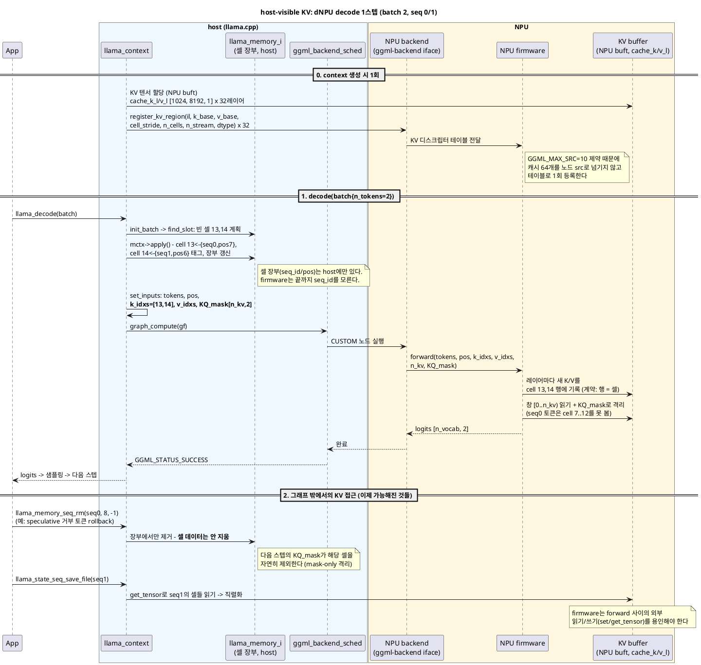

# Host-visible KV: 외부 가속기(NPU)에 llama.cpp KV 캐시를 개방하기

firmware가 내부적으로 관리하던 KV 캐시를 llama.cpp(host)가 관리하는 구조로 전환하는 것 - "host-visible KV" - 의 기술 원리를 다룬다. [12번](12-context-model-backend-ownership.md)(소유권)과 [13번](13-batch-ubatch-and-sequences.md)(실행 단위, KV 셀 모델)의 개념 위에서, 외부 가속기(dNPU) 연동 관점으로 재구성한 문서다. 실행 플랜(마일스톤/체크리스트)은 [00-handoff-npu-backend.md](00-handoff-npu-backend.md) 5절에 있다 - 이 문서는 그 플랜의 "왜"와 "무엇"을 담당한다.

PlantUML 원본:

- [14-host-visible-kv-decode.puml](14-host-visible-kv-decode.puml) - host-visible KV에서의 decode 1스텝 시퀀스 다이어그램

---

## 1. 문제 정의: stateful node

ggml의 그래프 노드는 원칙적으로 **입력과 leaf 텐서의 순수 함수(pure function)**다. 같은 입력이면 같은 출력이고, 상태는 노드 밖(leaf 텐서)에만 존재한다.

firmware가 KV를 내부 관리하는 현재 dNPU 구조에서는 CUSTOM 노드가 이 원칙을 깬다:

```
현재:  logits = custom_node(tokens, pos)          <- 같은 입력, 다른 출력
                       ^ firmware 내부의 숨은 상태(KV)에 의존

목표:  logits = custom_node(tokens, pos, k_idxs, v_idxs, KQ_mask;  cache_k/v[leaf])
                       ^ 상태가 전부 명시적 - 순수 함수로 복귀
```

노드가 상태를 갖는 순간 잃는 것들이 정확히 13번 문서 5장의 기능 목록이다: rollback(`seq_rm`) 불가 -> **speculative decoding 불가**, `seq_cp` 불가 -> 프롬프트 공유 불가, KV 직렬화 불가 -> session save/restore 불가, 셀 장부 없음 -> 멀티 시퀀스 슬롯 관리 불가. **host-visible KV의 본질은 "숨은 상태를 명시적 피연산자로 끌어내 노드를 다시 순수하게 만드는 것"**이다.

## 2. llama.cpp의 KV 그래프 메커니즘

stock llama.cpp에서 KV가 그래프와 만나는 방식이 곧 목표 구조다. 그래프가 참조하는 텐서는 세 부류다:

| 부류 | 데이터 위치 | 매 스텝 host가 채우나? | 예 |
|---|---|---|---|
| **진짜 입력** (`ggml_set_input`, `set_inputs()`가 복사) | 컴퓨트 버퍼 | **O** | `inp_tokens`, `inp_pos`, `KQ_mask`, `inp_out_ids`, **`k_idxs`/`v_idxs`** |
| **영속 leaf** (그래프 밖에서 이미 존재) | 가중치 버퍼 / **KV 버퍼** | X - 포인터 참조 | 가중치, **`cache_k_l`/`cache_v_l`** |
| 계산 노드 | 컴퓨트 버퍼 | X - 그래프가 생산 | Q/K/V, scores, FFN 출력 |

KV 캐시는 **영속이면서 mutable한 leaf**라는 점에서 특별하다 (가중치는 영속 + immutable). 그래프는 이 leaf를 두 방향으로 사용한다:

- **읽기**: attention이 `ggml_view`로 `[d, n_kv]` 창을 잘라 피연산자로 사용. ne1(셀 축) 슬라이스라 zero-copy다 (13번 문서의 "축 선택의 원리" 참고).
- **쓰기**: `ggml_set_rows(cache_k, k_cur, k_idxs)` **노드가 그래프 안에서** 실행되며 캐시를 직접 갱신한다 (src/llama-kv-cache.cpp:1270). "KV update 단계"가 시퀀스 다이어그램에 따로 없는 이유다.

**과거(n_past)는 데이터로 전달되지 않는다.** 과거 K/V는 이미 캐시 leaf 안에 있고, 매 스텝 입력으로 들어가는 것은 메타데이터뿐이다:

- `k_idxs`/`v_idxs` (`build_input_k_idxs`, src/llama-kv-cache.cpp:1294): 새 K/V를 **어느 셀에 쓸지**
- `KQ_mask`: 어느 셀을 **볼 수 있는지** - 옛 API의 `n_past` 파라미터를 대체한 현대적 표현
- view의 `n_kv` 폭: 읽을 창 크기

셀 장부(어느 셀이 어느 seq의 어느 pos인지)는 **host의 `llama_memory_i`에만** 있다. 커널(CPU/CUDA/NPU)은 인덱스와 마스크만 보고, seq_id는 절대 보지 않는다.

## 3. "host-visible"의 정확한 의미와 계약

host-visible KV = 다음 두 가지가 성립하는 상태다:

1. **KV 텐서가 ggml 버퍼(buft)로 할당**되어 host가 주소/내용에 접근 가능 (`set_tensor`/`get_tensor`)
2. **firmware가 외부에서 주입된 KV 영역과 셀 레이아웃 계약을 따름** - 내부 자체 관리를 포기

레이아웃 계약 (stock llama.cpp와 동일, 13번 문서 6장):

```
cache_k_l{il} : [n_embd_k_gqa, kv_size, n_stream]   (ne0 연속 = 셀 1개 = 행 1개)
cache_v_l{il} : [n_embd_v_gqa, kv_size, n_stream]   (v_trans = false, FA식 레이아웃)
타입: 우선 F16 (양자화 KV는 firmware dequant가 필요한 후속 옵션)
```

firmware가 지켜야 할 불변식 (제안이 아니라 의미론적 계약):

1. **mask-only 격리**: `seq_rm`은 host 장부만 고친다 - 셀 데이터는 지워지지 않는다. firmware는 잔존 데이터에 어떤 의미도 부여하면 안 되고, 유효성은 오직 `KQ_mask`와 idxs가 정의한다.
2. **idxs는 비연속일 수 있다** (defrag/재사용 이후) - "꼬리에 append" 가정 금지.
3. **모든 레이어가 같은 셀 인덱스를 쓴다** (장부는 하나, 텐서는 2 x n_layer개).
4. `n_kv`는 패딩된 창이다 - mask로 걸러진 패딩 셀은 결과에 기여하지 않아야 한다.
5. **그래프 밖 접근을 허용해야 한다**: session restore는 `set_tensor`로 KV에 쓰고, save는 `get_tensor`로 읽는다. forward 사이의 외부 쓰기를 firmware가 용인해야 한다.

## 4. Before / After 아키텍처

| | **Before: firmware KV** | **After: host-visible KV** |
|---|---|---|
| 셀 장부 | firmware 내부 (불투명) | host `llama_memory_i` (stock 재사용) |
| forward 입력 | tokens, pos | tokens, pos, **k_idxs, v_idxs, n_kv, KQ_mask** |
| KV 저장소 | firmware 전용 영역 | **NPU buft로 할당된 ggml 버퍼** (host 접근 가능) |
| 노드 성격 | stateful (숨은 상태) | **pure** (상태 = 명시적 leaf) |
| CUSTOM 노드와 캐시의 연결 | 없음 | `register_kv_region` 디스크립터 테이블 (context 생성 시 1회) |
| 가능한 기능 | 단일 대화 E2E | + rollback/speculative, seq_cp, session, 멀티 시퀀스, defrag |

디스크립터 테이블이 필요한 이유: 단일 CUSTOM 노드의 src 슬롯은 **`GGML_MAX_SRC = 10`** (ggml/include/ggml.h:224)인데 캐시 텐서는 2 x n_layer = 64개다. 노드 src로 넘기는 대신 context 초기화 시점에 레이어별 (k_base, v_base, cell_stride, n_cells, n_stream, dtype)를 firmware에 등록해 두고, 그래프에는 idxs/mask만 흘린다. (Phase 2에서 레이어별 개별 노드로 가면 src로 직접 전달하는 표준 형태가 된다.)

## 5. 시퀀스 다이어그램: host-visible KV에서의 decode 1스텝

13번 문서 3장의 decode 상세 주석판과 같은 상황(두 시퀀스, batch 2)을 host-visible KV + dNPU 구성으로 다시 그린 것이다. 차이점: KV 버퍼가 별도 participant로 분리되고, firmware는 장부 없이 idxs/mask만 소비한다.



## 6. 무엇이 열리는가 (기능 해금 목록)

visible KV가 완성되면 13번 문서 5장의 기능들이 **firmware 추가 변경 없이** 열린다:

| 기능 | 의존하는 것 |
|---|---|
| speculative decoding | `seq_rm` rollback (장부 수정 + mask) |
| 프롬프트/시스템 프롬프트 공유 | `seq_cp` (복사 없는 태그 추가) |
| session save/restore, 서버 슬롯 저장 | 버퍼 `get_tensor`/`set_tensor` |
| context shift, defrag | 장부 재배치 + idxs 비연속 계약 |
| 멀티 시퀀스 서빙 (-np N) | 위 전부 + **batch API의 seq_id 지원** (별도 관문) |

마지막 행이 중요하다: visible KV만으로는 멀티 시퀀스가 완성되지 않는다. NPU forward API가 토큰별 seq 소속을 표현할 수 있어야 하는데, 다행히 **firmware는 seq_id를 알 필요가 없다** - host가 seq 정보를 이미 KQ_mask와 idxs에 구워 넣어 주기 때문이다. 즉 batch API 확장의 실체는 "여러 seq의 토큰이 섞인 ubatch를 받아들이는 것"뿐이고, 격리는 mask가 처리한다.

## 7. 검증 전략

구현 순서대로 통과해야 할 관문 (상세 절차는 핸드오프 5.2절 M4):

1. **logit parity**: 고정 프롬프트에서 CPU backend와 상대 오차 ~1e-2 (F16) 이내
2. **rollback 결정성**: N토큰 decode -> `seq_rm`으로 꼬리 제거 -> 재-decode 결과가 처음부터 다시 돈 것과 완전 일치. **이 테스트 하나가 "노드가 순수해졌는가"를 판정한다**
3. **session 왕복**: save -> 새 context에 restore -> 이어서 decode -> 비교
4. `memory_breakdown()`에 KV가 NPU buft로 잡히는지 확인
5. (batch API 이후) `llama-batched -np 2` -> `llama-parallel` -> llama-server 슬롯

## 핵심 요약

1. **host-visible KV의 본질 = 노드의 순수성 회복**: firmware 안의 숨은 상태를 명시적 leaf 피연산자(cache_k/v_l) + 메타데이터 입력(k_idxs/v_idxs/KQ_mask)으로 끌어낸다.
2. **과거는 데이터로 전달되지 않는다**: 과거 K/V는 leaf 안에 있고, 매 스텝 오가는 것은 "어디에 쓸지(idxs)"와 "무엇을 볼지(mask)"뿐이다. mask가 옛 n_past의 대체다.
3. **셀 장부는 host 독점, firmware는 인덱스만**: seq_id는 firmware에 절대 넘어가지 않는다 - 격리는 mask가 이미 구현한다. 그래서 batch API 확장도 firmware 입장에선 "섞인 ubatch 수용"이 전부다.
4. **계약의 함정 두 가지**: seq_rm은 셀을 지우지 않는다(mask-only 격리), idxs는 비연속일 수 있다(append 가정 금지).
5. **GGML_MAX_SRC=10** 때문에 단일 노드 구조에서는 캐시 64개를 디스크립터 테이블(`register_kv_region`)로 1회 등록하고, 그래프에는 메타데이터만 흘린다.
6. **rollback 결정성 테스트가 성공 판정 기준**: 이것이 통과하면 speculative/seq_cp/session이 원리적으로 전부 열린 것이다.
