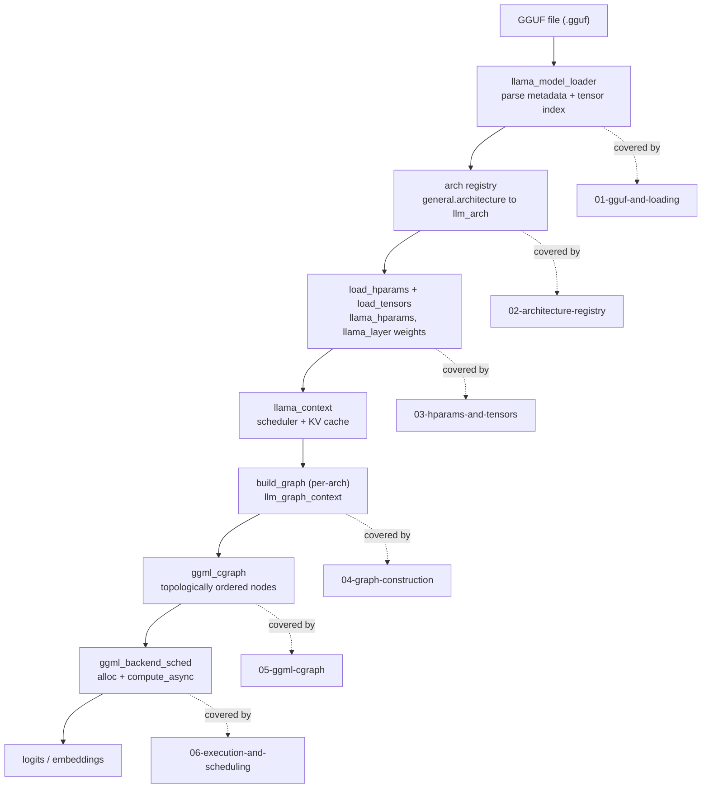
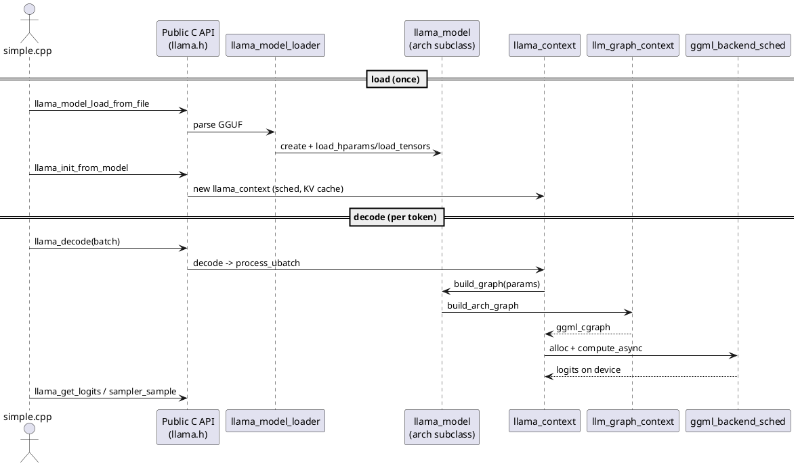

# Building a ggml cgraph from a GGUF file in llama.cpp

This documentation set traces a single, concrete journey: how a `.gguf` file on disk becomes an executable `ggml_cgraph` that produces logits. In llama.cpp, that journey is a pipeline. A GGUF file is parsed by `llama_model_loader` into metadata key/value pairs and a tensor index; the `general.architecture` metadata key selects one of ~140 architecture implementations from a registry; that architecture reads typed hyperparameters into `llama_hparams` and instantiates weight `ggml_tensor`s into backend buffers; at inference time a per-architecture *graph builder* (a `llm_graph_context` subclass) wires those weights together with `ggml_*` operations into a `ggml_cgraph`; the `ggml_backend_sched` allocates that graph across CPU/GPU backends, runs it, and copies logits back to host memory. Nothing computes until the graph runs — the builder only records an expression tree. This README is the index; each stage links to a dedicated chapter below.

---

## The pipeline at a glance

The high-level flow from file bytes to logits. Each box is a pipeline stage that maps to a doc chapter.



The load-time stages (`GGUF` to `load_tensors`) happen once per model. The build-and-run stages (`build_graph` to `logits`) happen every `llama_decode` call — though the graph is often *reused* across calls when the batch topology is unchanged (see [06-execution-and-scheduling.md](06-execution-and-scheduling.md)).

---

## The same flow, one altitude higher

A component-and-lifeline view: the public C API entry points on the left, the internal subsystems they drive on the right. This is the call structure a developer sees when reading `examples/simple/simple.cpp`.



The key insight: `llama_model::build_graph` (src/llama-model.cpp:2186) is called *inside* `llama_context::process_ubatch` (src/llama-context.cpp:1257), once per micro-batch, and immediately handed to the scheduler. The model owns the weights; the context owns the scheduler, KV cache, and the decode loop.

---

## Stage-to-source map

Each pipeline stage, its principal source files, the entry-point symbol, and the chapter that covers it.

| Stage | Entry symbol (`file:line`) | Principal source files | Chapter |
|---|---|---|---|
| Public API + example | `llama_model_load_from_file` (src/llama.cpp:426) | `include/llama.h`, `src/llama.cpp`, `examples/simple/simple.cpp` | [07-simple-example-walkthrough.md](07-simple-example-walkthrough.md) |
| GGUF parse + model load | `llama_model_loader::llama_model_loader` (src/llama-model-loader.cpp:511), `gguf_init_from_reader` (ggml/src/gguf.cpp:451) | `ggml/src/gguf.cpp`, `src/llama-model-loader.cpp`, `src/llama-mmap.cpp` | [01-gguf-and-loading.md](01-gguf-and-loading.md) |
| Architecture registry | `llm_arch_from_string` (src/llama-arch.cpp:830), `LLM_TN_IMPL::str` (src/llama-arch.cpp:799) | `src/llama-arch.h`, `src/llama-arch.cpp` | [02-architecture-registry.md](02-architecture-registry.md) |
| Hparams + tensor loading | `llama_model_base::load_hparams` (src/llama-model.cpp:1017), `load_tensors` (src/llama-model.cpp:1203) | `src/llama-model.cpp`, `src/llama-hparams.h`, `src/models/llama.cpp` | [03-hparams-and-tensors.md](03-hparams-and-tensors.md) |
| Per-arch graph builder | `llama_model::build_graph` (src/llama-model.cpp:2186), `llama_model_llama::build_arch_graph` (src/models/llama.cpp:94) | `src/llama-graph.cpp`, `src/llama-graph.h`, `src/models/llama.cpp` | [04-graph-construction.md](04-graph-construction.md) |
| ggml graph primitives | `ggml_build_forward_expand` (ggml/src/ggml.c:6959), `ggml_visit_parents_graph` (ggml/src/ggml.c:6858) | `ggml/include/ggml.h`, `ggml/src/ggml.c`, `ggml/src/ggml-impl.h` | [05-ggml-cgraph.md](05-ggml-cgraph.md) |
| Execution + scheduling | `llama_context::process_ubatch` (src/llama-context.cpp:1257), `graph_compute` (src/llama-context.cpp:2315) | `src/llama-context.cpp`, `ggml/include/ggml-backend.h` | [06-execution-and-scheduling.md](06-execution-and-scheduling.md) |
| Hardware divergence (cross-cutting) | `ggml_backend_sched_split_graph` (ggml/src/ggml-backend.cpp:1014), `build_attn_mha` FA fork (src/llama-graph.cpp:2049), `ggml_can_fuse` (ggml/src/ggml-impl.h:699) | `ggml/src/ggml-backend.cpp`, `ggml/src/ggml-cpu/*`, `ggml/src/ggml-cuda/*` | [08-hardware-divergence.md](08-hardware-divergence.md) |

---

## Glossary of key types

These seven types recur throughout every chapter. Read them as the "nouns" of the pipeline.

- **`ggml_tensor`** (ggml/include/ggml.h:666) — The atomic unit. A multi-dimensional array (`type`, `ne[4]` dims, `nb[4]` strides, `data` pointer) *plus* a computation tag: an `op` enum and `src[]` pointers to operand tensors. Calling `ggml_add(ctx, a, b)` does not compute — it allocates a result tensor with `op = GGML_OP_ADD` and `src[0]=a, src[1]=b`, building an expression tree lazily. Both model weights and intermediate activations are `ggml_tensor`s. See [05-ggml-cgraph.md](05-ggml-cgraph.md).

- **`ggml_cgraph`** (ggml/src/ggml-impl.h:329) — The computation graph. An ordered list of operation nodes (`nodes[]`) extracted from a tensor expression tree, plus leaf tensors (`leafs[]`) and a `visited_hash_set` for dedup. `ggml_build_forward_expand(gf, output)` (ggml/src/ggml.c:6959) walks the expression tree depth-first and fills `nodes[]` in topological order — this array *is* the execution schedule. See [05-ggml-cgraph.md](05-ggml-cgraph.md).

- **`llama_model_loader`** (src/llama-model-loader.h:31) — The bridge from disk to memory. Holds the parsed `gguf_context` metadata, a `weights_map` from tensor name to `{file_idx, offset, ggml_tensor*}`, the mmaps, and per-buffer-type `ggml_context`s. Exposes typed getters (`get_key`, `get_arr`), validation (`check_tensor_dims`), tensor instantiation (`create_tensor`, src/llama-model-loader.cpp:1046), and bulk data load (`load_all_data`). See [01-gguf-and-loading.md](01-gguf-and-loading.md).

- **`llm_arch`** (src/llama-arch.h:13) — An enum naming ~143 supported architectures (`LLM_ARCH_LLAMA`, `LLM_ARCH_QWEN2`, …). Detected from the GGUF `general.architecture` key via `llm_arch_from_string` (src/llama-arch.cpp:830). Drives two helper structs — `LLM_KV` (formats metadata keys like `llama.attention.head_count`) and `LLM_TN` (formats tensor names like `blk.3.attn_q.weight`) — and selects the model subclass to instantiate. See [02-architecture-registry.md](02-architecture-registry.md).

- **`llama_hparams`** (src/llama-hparams.h:39) — The hyperparameter container: `n_embd`, `n_layer_all`, `n_head_arr`, `n_head_kv_arr`, `n_ff_arr`, rope/yarn params, expert counts, norm epsilons. Populated by `load_hparams` (src/llama-model.cpp:1017) reading GGUF metadata through `LLM_KV` keys. Const after load; the graph builder reads it to size every operation. See [03-hparams-and-tensors.md](03-hparams-and-tensors.md).

- **`llm_graph_context`** (src/llama-graph.h:778) — The graph *builder* context. Holds references to `hparams`, `cparams`, `ubatch`, the scheduler, the `ggml_context ctx0` and `ggml_cgraph gf` being built, and the `llm_graph_result res`. Per-architecture subclasses (e.g. `llama_model_llama::graph`) construct the layer stack in their constructor using helper methods — `build_norm`, `build_qkv`, `build_attn`, `build_ffn`, `build_moe_ffn` — that chain `ggml_*` ops. See [04-graph-construction.md](04-graph-construction.md).

- **`ggml_backend_sched`** (ggml/include/ggml-backend.h) — The backend scheduler. Given a finished `ggml_cgraph`, it assigns each node to a backend (GPU > ACCEL > CPU), splits the graph across devices, allocates tensor buffers (`ggml_backend_sched_alloc_graph`), and runs it (`ggml_backend_sched_graph_compute_async`). Created in `sched_reserve` (src/llama-context.cpp:415) with worst-case sizing. See [06-execution-and-scheduling.md](06-execution-and-scheduling.md).

---

## How a single decode walks the stages

To make the type list concrete, here is the call chain for one `llama_decode`, with each hop annotated by the type it produces. This is the spine that [07-simple-example-walkthrough.md](07-simple-example-walkthrough.md) expands end to end.

```cpp
// src/llama-model.cpp:2186 — the per-arch dispatch at the heart of build_graph
ggml_cgraph * llama_model::build_graph(const llm_graph_params & params) const {
    std::unique_ptr<llm_graph_context> llm = build_arch_graph(params);  // builds the layer stack
    llm->build_pooling(...);   // optional, embedding models
    llm->build_sampling();     // optional, backend sampling
    ...
}
```

```cpp
// src/models/llama.cpp:94 — Llama's build_arch_graph just instantiates the templated builder
std::unique_ptr<llm_graph_context> llama_model_llama::build_arch_graph(const llm_graph_params & params) const {
    return std::make_unique<graph<false>>(*this, params);
}
```

The `graph<false>` constructor (src/models/llama.cpp:99) is where the transformer is actually wired: `build_inp_embd(model.tok_embd)` produces the token embedding tensor, then a loop over `n_layer` builds attention (`build_norm` to `build_qkv` to `ggml_rope_ext` to `build_attn`) and FFN (`build_norm` to `build_ffn`) blocks with residual `ggml_add`s, ending in a final norm and the `lm_head` `ggml_mul_mat`. The output tensor is handed to `ggml_build_forward_expand`, materializing the `ggml_cgraph`.

Walking the stages in execution order:

1. `llama_decode` (src/llama-context.cpp:3930) to `llama_context::decode` (src/llama-context.cpp:1632) — splits the batch into micro-batches via the memory module.
2. `process_ubatch` (src/llama-context.cpp:1257) — checks `res->can_reuse(...)`; if not reusable, calls `model.build_graph`.
3. `build_graph` (src/llama-model.cpp:2186) to `build_arch_graph` (src/models/llama.cpp:94) to `graph<false>::graph` (src/models/llama.cpp:99) — constructs the `ggml_cgraph`.
4. `ggml_backend_sched_alloc_graph` then `res->set_inputs(&ubatch)` then `graph_compute` (src/llama-context.cpp:2315) — allocate, fill inputs, run.
5. `ggml_backend_tensor_get_async` copies `t_logits` to the host buffer; `llama_get_logits` (include/llama.h:999) returns it.

---

## Where to go next

- New to the file format? Start at [01-gguf-and-loading.md](01-gguf-and-loading.md).
- Want the end-to-end runnable story first? Jump to [07-simple-example-walkthrough.md](07-simple-example-walkthrough.md).
- Care only about the math/ops layer? Read [05-ggml-cgraph.md](05-ggml-cgraph.md) and [04-graph-construction.md](04-graph-construction.md).
- Wondering how one graph runs on NVIDIA/Apple/AMD/Qualcomm/Huawei hardware? See [08-hardware-divergence.md](08-hardware-divergence.md).

### Appendix diagrams & cross-runtime notes

- [00-handoff-npu-backend.md](00-handoff-npu-backend.md) — onboarding entry point for external collaborators (NPU backend work): reading order, code entry points, conventions, and a validated one-way git-bundle transfer recipe (Korean).

- [09-sequence-gguf-to-cgraph.wsd](09-sequence-gguf-to-cgraph.wsd) — PlantUML sequence: GGUF + per-arch C++ ⇒ `ggml_cgraph`.
- [10-llama-model-class-diagram.wsd](10-llama-model-class-diagram.wsd) — PlantUML class diagram of `src/llama-model.h`.
- [11-hw-backend-abstraction.md](11-hw-backend-abstraction.md) — abstracting one HW accelerator across **llama.cpp / ggml, ONNX Runtime, and ExecuTorch** backend APIs (entry points, comparison, a common `hwaccel.h`).
- [12-context-model-backend-ownership.md](12-context-model-backend-ownership.md) — `llama_context` / `llama_model` / ggml-backend relationships, ownership, and lifecycle (Korean), with PlantUML sources: [class diagram](12-class-diagram-ownership.puml), [lifecycle sequence](12-sequence-lifecycle.puml), [multi-context lifecycle sequence](12-sequence-lifecycle-multi-context.puml), [object lifetime](12-object-lifetime.puml).
- [13-batch-ubatch-and-sequences.md](13-batch-ubatch-and-sequences.md) — batch (logical) vs ubatch (physical) vs sequence terminology, a worked two-conversation example, a batch-2 decode walkthrough, the multi-sequence executables (llama-server / llama-parallel / llama-batched), request/slot/session/sequence/context terminology, and a KV-cache sizing appendix (K vector, MHA/GQA, cells/n_ctx) (Korean), with PlantUML sources: [single-context batch-2 decode](13-sequence-decode-batch2-single-context.puml), [annotated deep-dive (tensor shapes, KV layout)](13-sequence-decode-batch2-single-context-detailed.puml), [annotated prefill deep-dive (two prompts, one pass)](13-sequence-prefill-2seq-single-context-detailed.puml), [multi-context batch-2 decode](13-sequence-decode-batch2-multi-context.puml), [request-slot-session structure](13-request-slot-session-structure.puml), [slot timeline](13-request-slot-timeline.puml).

---

## Key takeaways

- The pipeline is **GGUF file to loader to arch registry to hparams+tensors to per-arch graph builder to `ggml_cgraph` to backend scheduler to logits** — load stages run once, build/run stages run per `llama_decode`.
- A `ggml_tensor` carries *both* data and a computation tag (`op` + `src[]`); `ggml_*` calls build an expression tree lazily, and `ggml_build_forward_expand` (ggml/src/ggml.c:6959) flattens it into the executable `ggml_cgraph`.
- The `general.architecture` GGUF key, resolved by `llm_arch_from_string` (src/llama-arch.cpp:830), selects one of ~140 model subclasses and drives the `LLM_KV`/`LLM_TN` name formatters used for every metadata and tensor lookup.
- `llama_model` owns weights and `build_graph` (src/llama-model.cpp:2186); `llama_context` owns the scheduler, KV cache, and the decode loop (`process_ubatch`, src/llama-context.cpp:1257).
- Graphs are reused across decode calls when batch topology matches (`can_reuse`), avoiding rebuild cost on the hot path.
